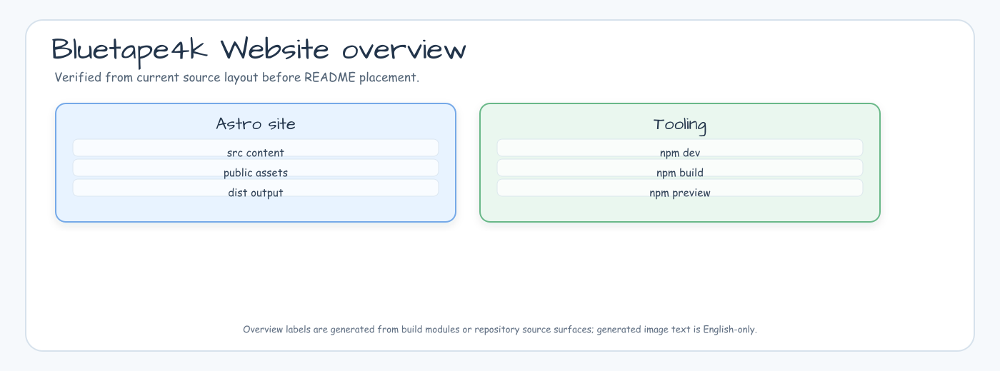
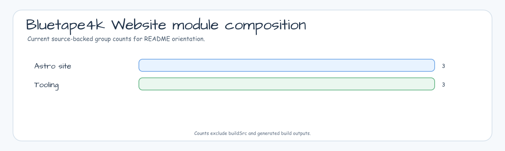

# bluetape4k official website

This repository hosts the official bluetape4k website at <https://bluetape4k.github.io>.

<!-- README_VISUAL_OVERVIEW:START -->
## Overview Diagram



## Module Composition Chart


<!-- README_VISUAL_OVERVIEW:END -->

## Development

```bash
npm install
npm run dev
```

## Analytics

The site includes Plausible Analytics for page-level traffic, including blog paths
under `/blog/` and `/ko/blog/`.

Defaults:

- Domain: `bluetape4k.github.io`
- Script URL: `https://plausible.io/js/script.js`

Override when needed:

```bash
PUBLIC_PLAUSIBLE_DOMAIN=example.com \
PUBLIC_PLAUSIBLE_SCRIPT_URL=https://plausible.example.com/js/script.js \
npm run build
```

## Verification

```bash
npm run build
```
