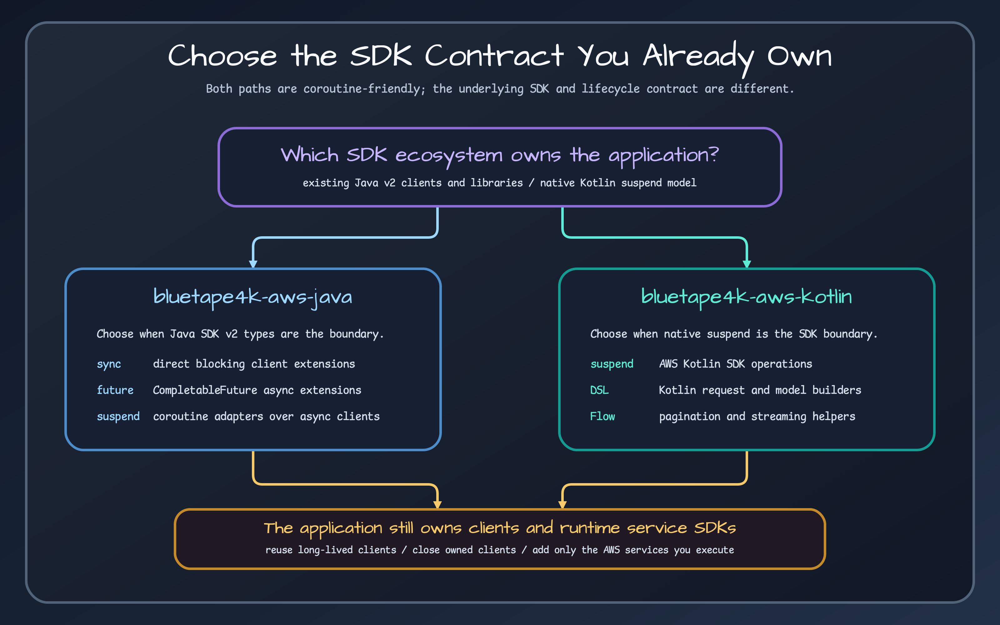

# Choosing AWS SDK for Java v2 or AWS SDK for Kotlin

Both paths support coroutine-based application code, but they reach it differently. Choose by the client model, required AWS feature, and surrounding libraries—not by whether the calling function is marked `suspend`.

## Decision table

| Question | Java SDK v2 path | Kotlin SDK path |
| --- | --- | --- |
| Existing client estate | Best when Java SDK v2 clients are already shared | Best when the service is Kotlin SDK-first |
| Async model | `CompletableFuture` with suspending adapters | Native suspending operations |
| DynamoDB | Standard and enhanced clients, table schemas, coroutine repository | Native client, request DSLs, batch executor |
| S3 transfer | Java transfer manager and async client extensions | Kotlin client object helpers |
| Framework use in this release | Spring Boot integrations primarily build Java SDK clients | Ktor DynamoDB integration uses Kotlin SDK; other Ktor features may use Java SDK clients or Ktor HTTP |
| HTTP transport | AWS Java SDK HTTP client implementations | Smithy Kotlin CRT/OkHttp engines |
| Lifecycle concern | Close sync/async clients and their owned transport | Close clients; close explicitly shared engines separately |

## Choose Java SDK v2 when interoperability leads

Use `bluetape4k-aws-java` when the application already exposes Java SDK clients, needs enhanced DynamoDB APIs, uses the S3 transfer manager, or integrates with Spring Boot auto-configuration in this repository. The library offers three surfaces where supported: direct sync helpers, async `CompletableFuture` extensions, and suspending extensions over async clients.

The suspending surface does not turn a sync client into non-blocking I/O. Use the async client extensions when coroutine cancellation and non-blocking transport are part of the design.

## Choose the Kotlin SDK when the suspend model leads

Use `bluetape4k-aws-kotlin` when AWS SDK for Kotlin is the primary client layer. Its service clients already expose suspending operations; bluetape4k adds request builders, mapping helpers, batch execution, and higher-level flows such as Kinesis records.

The Kotlin SDK path still has resource ownership. A client-managed HTTP engine closes with the client. An explicitly supplied shared engine does not, so the application must close it after all clients.

## Mixing paths deliberately

Some applications legitimately use both. A Ktor service can use the Kotlin SDK DynamoDB plugin and a Java SDK SQS consumer. Treat that as two explicit runtime stacks:

- configure region, credentials, endpoint overrides, retries, and timeouts for each;
- avoid translating models between SDKs in domain code;
- record which component closes each client and engine;
- test both emulator paths independently.

If the same service can be implemented entirely on one SDK, the simpler ownership model usually outweighs small syntax differences.

## Sources

- [Java SDK coroutine support](../../../../aws-java/src/main/kotlin/io/bluetape4k/aws/coroutines/AwsCoroutineSupport.kt)
- [Java SDK DynamoDB coroutine repository](../../../../aws-java/src/main/kotlin/io/bluetape4k/aws/dynamodb/repository/DynamoDbCoroutineRepository.kt)
- [Kotlin SDK DynamoDB client extensions](../../../../aws-kotlin/src/main/kotlin/io/bluetape4k/aws/kotlin/dynamodb/DynamoDbClientExtensions.kt)
- [Kotlin SDK Kinesis flow](../../../../aws-kotlin/src/main/kotlin/io/bluetape4k/aws/kotlin/kinesis/KinesisRecordFlow.kt)
