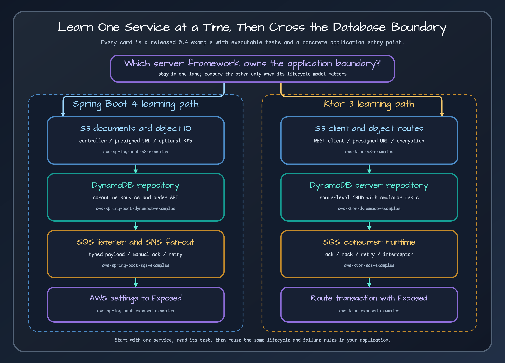

# AWS Service Learning Paths

Learn one complete service path at a time: dependency, client, application boundary, integration test, then operations. The examples below contain runnable code and emulator-backed tests, so they are more useful than copying isolated API calls.

## S3: object lifecycle before advanced features

1. Start with the Java or Kotlin SDK S3 helpers to understand upload, download, listing, copy/move, and delete behavior.
2. Choose the application edge: `S3CoroutinesTemplate`/`S3Operations` in Spring Boot or `S3KtorClient` in Ktor.
3. Run one of the S3 examples and inspect both the HTTP route and the test fixture.
4. Add presigned URLs, multipart transfer, client-side encryption, Access Grants, or S3 Vectors only after the object and ownership path works.

- [Ktor S3 example](../../../../examples/aws-ktor-s3-examples/README.md) covers object routes, presigned URLs, content-type detection, configuration objects, and client-side encryption.
- [Spring Boot S3 example](../../../../examples/aws-spring-boot-s3-examples/README.md) covers WebFlux endpoints, `S3Operations`, `S3CoroutinesTemplate`, presigned URLs, and optional KMS-backed client-side encryption.

Presigning proves request construction, not IAM authorization at execution time. Test the generated request against the intended endpoint and credential model.

## DynamoDB: key model before repository convenience

1. Define partition and sort keys, access patterns, conditional writes, and table naming before selecting repository helpers.
2. Use the Java SDK enhanced repository when enhanced table schemas are part of the design, or the Kotlin SDK/Ktor repository when native suspend clients are the primary path.
3. Test create/read/update/delete and the conditions that prevent lost updates or duplicate writes.
4. Keep table auto-creation restricted to explicitly registered definitions; production schema ownership should remain deliberate.

- [Ktor DynamoDB example](../../../../examples/aws-ktor-dynamodb-examples/README.md) shows plugin configuration, table setup, mapper, repository, routes, and Floci/LocalStack tests.
- [Spring Boot DynamoDB example](../../../../examples/aws-spring-boot-dynamodb-examples/README.md) shows a coroutine repository behind a small REST API and auto-configured clients.

## SQS and SNS: delivery semantics before throughput

1. Choose acknowledgement behavior, visibility timeout, retry/backoff, idempotency key, and redrive policy.
2. For SQS consumers, decide whether success deletes automatically or handlers acknowledge manually.
3. Test handler failure, conversion failure, redelivery, and shutdown with in-flight messages.
4. Add SNS fanout only after the queue consumer contract is observable and idempotent.

- [Ktor SQS example](../../../../examples/aws-ktor-sqs-examples/README.md) demonstrates manual ack/nack, retry-once redelivery, interceptors, and observer events.
- [Spring Boot SQS/SNS example](../../../../examples/aws-spring-boot-sqs-examples/README.md) demonstrates typed listeners, manual acknowledgement, retry/backoff, interceptor events, and SNS-to-SQS fanout.

An emulator can verify API and integration behavior, but it does not prove production IAM, queue policy, throttling, or exactly-once processing. SQS is at-least-once delivery; business handlers must tolerate duplicates.

## Sources

- [S3 Ktor client](../../../../aws-ktor/src/main/kotlin/io/bluetape4k/aws/ktor/s3/S3KtorClient.kt)
- [Spring S3 operations](../../../../aws-spring-boot/src/main/kotlin/io/bluetape4k/aws/spring/s3/S3Operations.kt)
- [Ktor DynamoDB repository](../../../../aws-ktor/src/main/kotlin/io/bluetape4k/aws/ktor/dynamodb/DynamoDbKtorRepository.kt)
- [Spring coroutine DynamoDB repository](../../../../aws-spring-boot/src/main/kotlin/io/bluetape4k/aws/spring/dynamodb/CoroutinesDynamoDbRepository.kt)
- [Ktor SQS runtime](../../../../aws-ktor/src/main/kotlin/io/bluetape4k/aws/ktor/sqs/SqsConsumerRuntime.kt)
