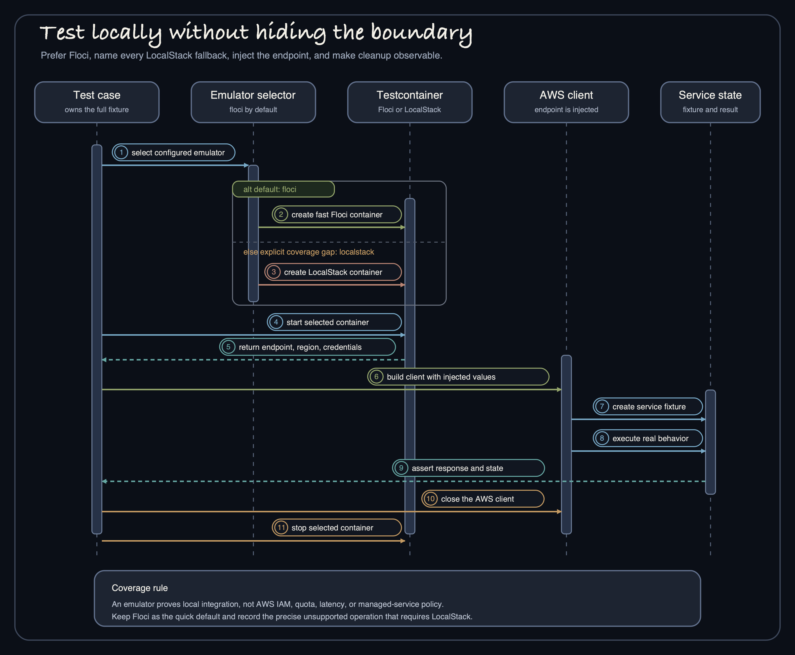

# AWS 연동 테스트와 운영

운영에서 실패할 수 있는 경계를 테스트해야 한다. Request mapping, endpoint와 credential 선택, retry와 ack 동작, client 소유권과 종료 과정이 여기에 해당한다. Mock client는 순수한 위임 로직을 검증할 때 유용하지만 transport, serialization, emulator 호환성이나 lifecycle까지 증명하지는 않는다.



## 검증 단계

| 단계 | 확인할 수 있는 것 | 확인할 수 없는 것 |
| --- | --- | --- |
| Unit/mock test | Request mapping, 분기, 변환, retry 분류 | 실제 SDK transport, endpoint, IAM, lifecycle |
| Floci 통합 테스트 | Testcontainers로 지원되는 AWS API를 빠르게 검증하는 기본 경로 | Floci가 지원하지 않는 operation, AWS 운영 환경의 동작 |
| LocalStack fallback | LocalStack이 지원하는 operation 또는 service 간 연동 | AWS IAM, quota, latency, managed service policy, 완전한 의미 일치 |
| AWS 환경 smoke test | 현재 credential, region, endpoint와 선택한 service가 함께 동작함 | 반복 가능한 장애 복구, 규모나 넓은 policy 범위 |
| Load/resilience test | 명시한 workload와 장애 조건 | 보편적인 처리량이나 비용 결론 |

## 기본은 Floci, LocalStack은 명시적으로

저장소 테스트는 `bluetape4k.aws.emulator` 기본값으로 `floci`를 사용한다. Floci가 지원하는 빠른 경로는 그대로 유지한다. 지원하지 않는 operation이나 여러 service를 묶은 연동 때문에 LocalStack이 필요하면 command에 분명히 적는다.

```bash
./gradlew :bluetape4k-aws-java:test \
  -Dbluetape4k.aws.emulator=localstack

./gradlew :aws-spring-boot-sqs-examples:test \
  -Dbluetape4k.aws.emulator=localstack
```

Emulator가 지원하지 않는다고 assertion을 빼서 통과시키면 안 된다. 지원 범위를 기록하고 mock 또는 fallback 테스트를 그 빈틈에 연결한다. 어느 emulator에서 성공하더라도 운영 IAM과 service limit까지 검증된 것은 아니다.

## Step Functions 증거 {#step-functions-evidence}

Issue #313 Step Functions helper는 미출시/develop 표면입니다. Floci-first selector로 전용
smoke를 먼저 실행한 뒤 LocalStack fallback을 사용합니다.

```bash
./gradlew :bluetape4k-aws-java:test \
  --tests "*Sfn*SmokeTest" \
  -Dbluetape4k.aws.emulator=floci \
  --no-daemon --max-workers=1 --console=plain

./gradlew :bluetape4k-aws-kotlin:test \
  --tests "*Sfn*SmokeTest" \
  -Dbluetape4k.aws.emulator=floci \
  --no-daemon --max-workers=1 --console=plain
```

현재 Floci guard는 정확한
`live integration unverified: Floci does not support Step Functions` 문구와 skipped
test result를 남깁니다. 이 결과는 `UNVERIFIED`이며 live integration PASS가 아닙니다.
Coverage gap을 확인하려면 전용 fixture를 LocalStack에서 순차 실행합니다.

```bash
./gradlew :bluetape4k-aws-java:test \
  --tests "*Sfn*SmokeTest" \
  -Dbluetape4k.aws.emulator=localstack \
  --no-daemon --max-workers=1 --console=plain

./gradlew :bluetape4k-aws-kotlin:test \
  --tests "*Sfn*SmokeTest" \
  -Dbluetape4k.aws.emulator=localstack \
  --no-daemon --max-workers=1 --console=plain
```

LocalStack이 operation을 지원하지 않거나 smoke가 실패하면 test result XML과 함께
`live integration unverified: LocalStack Step Functions smoke failed: <error>`를 기록합니다.
결과를 PASS로 바꾸지 않습니다. Emulator 성공이 증명하는 것은 endpoint와 기본 serialization
호환성뿐이며 AWS IAM resource policy, KMS key policy, service quota, latency와 managed-service
동작까지 증명하지 않습니다. 별도 credential-gated AWS 검증이 생길 때까지 IAM/KMS integration은
`UNVERIFIED`로 유지합니다.

운영 polling에는 호출자 소유 timeout 또는 deadline을 적용하고 helper의 1초 간격 하한을
지킵니다. Account/Region 전체 polling을 현재 [Step Functions service
quota](https://docs.aws.amazon.com/step-functions/latest/dg/service-quotas.html)보다 낮게
제한하며, 같은 execution을 여러 consumer가 관찰하면 `shareIn` 또는 `stateIn`으로 합칩니다.
Collector가 동시에 시작되면 caller 소유 jitter나 rate limiter를 추가합니다. Service, operation,
status, outcome, latency, retry/throttle 횟수와 AWS request ID를 기록하되 ARN, 이름, input,
output, error, cause, trace header와 raw SDK payload는 redaction합니다. Cancellation은
암묵적인 `StopExecution` 없이 collection만 멈추며, service client는 소유자 경계에서 닫고 주입한
HTTP client 또는 engine은 호출자가 닫습니다.

## 필요한 예제만 실행한다

```bash
./gradlew :aws-ktor-s3-examples:test
./gradlew :aws-ktor-dynamodb-examples:test
./gradlew :aws-ktor-sqs-examples:test
./gradlew :aws-ktor-exposed-examples:test

./gradlew :aws-spring-boot-s3-examples:test
./gradlew :aws-spring-boot-dynamodb-examples:test
./gradlew :aws-spring-boot-sqs-examples:test
./gradlew :aws-spring-boot-exposed-examples:test
```

Service 코드에는 실패 조건도 넣는다. SQS 중복 전달, visibility timeout 만료, DynamoDB 조건부 쓰기 실패, S3 일부 전송 실패, 만료된 presigned URL, secret source 장애와 작업 중 shutdown을 검증한다.

## 운영 점검표

- **Credential과 region** — 배포 환경에 맞는 provider chain을 사용한다. Access key, session token, secret payload와 signed header를 log에 남기지 않는다.
- **Retry와 idempotency** — Business effect를 반복해도 안전한 operation만 재시도한다. 중복 가능성이 있는 consumer와 write에는 idempotency key를 전달한다.
- **Timeout** — Connect, request, polling, handler와 shutdown 시간을 service budget에 맞춘다.
- **Readiness** — 필요한 client, queue, table, bucket 또는 database pool이 실제 요청을 처리할 수 있을 때 ready로 전환한다.
- **관측성** — Service, operation, 결과, retry 횟수, latency, queue phase와 low-cardinality resource 식별자를 기록한다. Bucket key, message body, secret name이 사용자 데이터를 드러낼 수 있다면 tag나 log에 넣지 않는다.
- **종료** — Polling을 멈추고 진행 중인 작업을 끝내거나 취소한다. 정해진 범위에서 buffer를 flush한 다음 client와 pool, 명시적으로 공유한 HTTP engine을 닫는다.

## 소유권도 테스트한다

Component가 client를 직접 만들 수도 있고 외부에서 받을 수도 있다면 lifecycle test를 추가한다. 소유한 client는 정확히 한 번 닫히고, 주입받은 client는 열린 채로 남는지 확인한다. Kotlin SDK 공유 engine은 다른 client가 쓰는 동안 유지되고, 모든 client가 멈춘 뒤 애플리케이션이 닫는지도 검증한다.

## 근거 소스

- [Java 모듈 emulator 선택](../../../../aws-java/src/test/kotlin/io/bluetape4k/aws/AbstractAwsTest.kt)
- [Kotlin 모듈 emulator 선택](../../../../aws-kotlin/src/test/kotlin/io/bluetape4k/aws/kotlin/AbstractAwsTest.kt)
- [Kotlin client lifecycle 테스트](../../../../aws-kotlin/src/test/kotlin/io/bluetape4k/aws/kotlin/lifecycle/ClientLifecycleTest.kt)
- [Spring emulator 선택기](../../../../aws-spring-boot/src/test/kotlin/io/bluetape4k/aws/spring/test/AwsSpringBootTestEmulator.kt)
- [Ktor SQS 종료 계약](../../../../aws-ktor/src/main/kotlin/io/bluetape4k/aws/ktor/sqs/SqsConsumerRuntime.kt)
