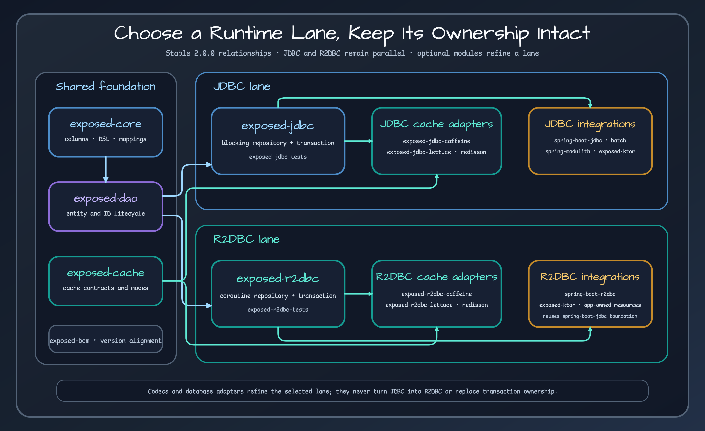

# Exposed Repository Map

The 40 Gradle projects in `bluetape4k-exposed 2.0.0` do not all play the same role. Start from the shared foundation and choose either JDBC or R2DBC. Add caches, codecs, and database adapters only where needed, then select application integrations that match the framework's resource and transaction ownership.

## Read the repository in four layers

1. **Foundation** — `core`, `dao`, `cache`, and `bom` define shared types and module alignment.
2. **Data access** — `jdbc` and `r2dbc` implement different driver and transaction models. An application chooses one as its primary path.
3. **Optional capabilities** — Caffeine, Lettuce, and Redisson caches; JSON, Tink, and measured columns; and database adapters refine the base path.
4. **Application integrations** — Spring Boot, Ktor, Batch, and Spring Modulith connect Exposed to framework-owned resources.

A database adapter does not replace JDBC or R2DBC; it adds dialect or backend-specific behavior after the base path is selected. Caching has the same ordering constraint. Adding it before repository and transaction semantics are clear leaves stale reads and invalidation ownership undefined.

## Release scope

This map contains only modules present in tag `2.0.0`. Snapshot-only modules stay out until a later stable minor establishes a new manual baseline. Use the [module manual](../modules/bluetape4k-exposed-bom.md) for the exact project inventory and source locations.

<!-- release-readme-diagrams:start -->
## Release diagrams {#release-diagrams}

These diagrams are loaded directly from README assets published with the `2.0.0` release and pinned to its immutable commit. They describe this manual's released structure and runtime flows, not later Snapshot changes. Select a preview to open the SVG at the same release commit.

### Bluetape4k Exposed module composition diagram

_Release README: [`README.md`](https://github.com/bluetape4k/bluetape4k-exposed/blob/d632a0bc0662ae616b786f552150a7fabd1cee3e/README.md)_

### Bluetape4k Exposed overview diagram

_Release README: [`README.md`](https://github.com/bluetape4k/bluetape4k-exposed/blob/d632a0bc0662ae616b786f552150a7fabd1cee3e/README.md)_

<!-- release-readme-diagrams:end -->
