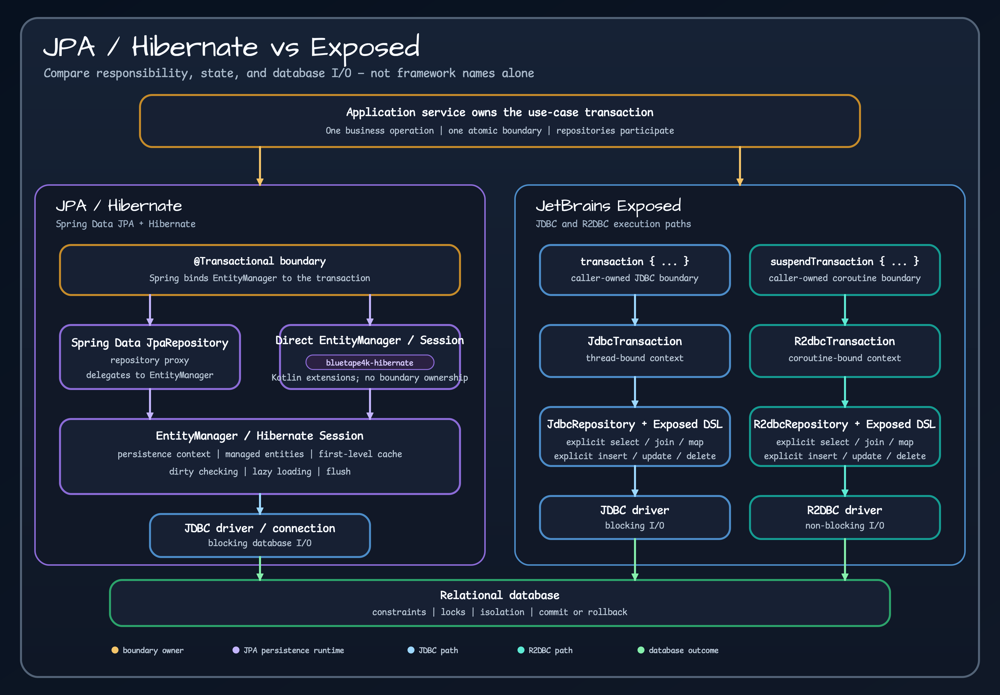

# Hibernate and Exposed

Hibernate and Exposed are not interchangeable syntax layers. They expose different persistence models. Choose the model whose ownership and query style fit the application; avoid turning the decision into a framework ranking.

Read the diagram from top to bottom. The application owns the business transaction. JPA then works through a persistence context and `EntityManager` or `Session`, while Exposed keeps the JDBC or R2DBC transaction path explicit. `bluetape4k-hibernate` supplies optional Kotlin extensions beside the JPA runtime; it does not own the transaction or replace the persistence provider.

## Model comparison

| Concern | Hibernate | Exposed |
| --- | --- | --- |
| Primary model | Entity graph managed by a persistence context | Explicit tables, SQL DSL, DAO, and transaction blocks |
| Change tracking | Dirty checking inside the persistence context | Explicit statement/DAO changes inside an Exposed transaction |
| Relationships | Object associations, proxies, fetch plans | Joins and referenced entities selected explicitly |
| Query style | JPQL/HQL, Criteria, native SQL | Type-safe SQL DSL, DAO queries, custom SQL where needed |
| Unit of work | Session/entity manager commonly owns it | The transaction block or surrounding framework transaction owns it |
| Schema | JPA mapping plus migrations or schema tooling | Exposed table definitions plus migrations or schema tooling |
| Reactive path | Hibernate Reactive has its own session model | Exposed R2DBC uses coroutine transactions and R2DBC drivers |

## When Hibernate is a natural fit

Hibernate is attractive when a rich domain model, object navigation, standardized JPA integration, and persistence-context change tracking are central requirements. It can reduce explicit persistence code for aggregate-oriented CRUD. The trade-off is that proxy loading, flush timing, cascades, and fetch plans become part of correctness and performance reasoning.

## When Exposed is a natural fit

Exposed is attractive when SQL shape, table ownership, joins, batching, and transaction boundaries should remain visible in Kotlin. The DSL works well for query-heavy services and database-specific features. DAO is available when an entity-like interface is useful, but it does not require the application to adopt JPA's persistence-context model.

## Migration and coexistence

Do not rewrite a stable persistence layer only to standardize syntax. Migrate one bounded context or one repository at a time when a concrete reason exists: unsupported SQL, transaction opacity, reactive requirements, operational complexity, or maintenance cost. During coexistence, keep one owner for each table and transaction. Sharing the same `DataSource` does not automatically make two persistence contexts one safe unit of work.

Contract tests should pin observable repository behavior before a migration: ordering, null handling, optimistic concurrency, cascade expectations, transaction rollback, and generated identifiers. Retest query plans against the production database.

## Decision questions

1. Does the team reason primarily from aggregate object graphs or from SQL and tables?
2. Is lazy loading an asset in this application, or an operational risk?
3. Which database-specific features must remain first-class?
4. Who owns the transaction when multiple repositories participate?
5. Does the non-blocking path require a different session or repository model?

Start with [JDBC vs R2DBC](jdbc-vs-r2dbc.md) and [transaction boundaries](transaction-boundaries.md), then build one representative repository before choosing a broad migration.

## Further reading

- [JetBrains Exposed](https://www.jetbrains.com/help/exposed/home.html)
- [Hibernate ORM documentation](https://hibernate.org/orm/documentation/)
- [Exposed workshop](https://github.com/bluetape4k/exposed-workshop)
- [Bluetape4k workshop](https://github.com/bluetape4k/bluetape4k-workshop)
