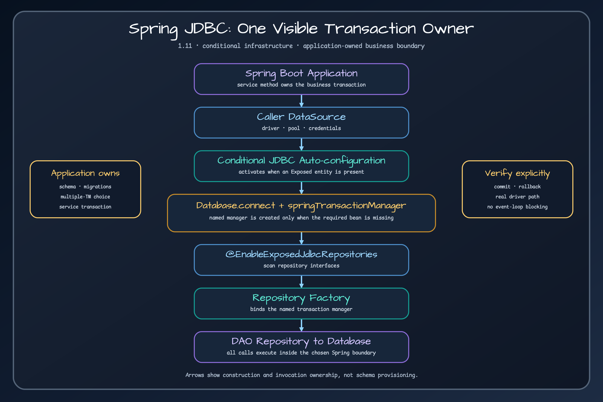

# Spring and Ktor Integration

Choose the integration by deciding who owns infrastructure, transactions, and shutdown. The Spring modules participate in a container-managed application. The Ktor module provides explicit helpers and leaves the database lifecycle with the application.

> Explore activation conditions and ownership in the [Spring Boot Exposed activation visual companion](https://bluetape4k.github.io/visual-companions/bluetape4k-exposed/spring-boot-exposed-activation/).

## Ownership matrix

| Path | Infrastructure owner | Transaction boundary | Repository wiring | Best fit |
| --- | --- | --- | --- | --- |
| Spring Boot JDBC | Spring creates the `DataSource`; this module connects Exposed and supplies the named transaction manager when one is missing | Spring `@Transactional` service boundary | `@EnableExposedJdbcRepositories` and repository factory | Blocking Spring MVC, scheduled work, conventional service transactions |
| Spring Boot R2DBC | Application creates the `ConnectionPool` and `R2dbcDatabase` | Explicit Exposed `suspendTransaction`; repository methods are individually transactional | `@EnableExposedR2dbcRepositories`; thin mapping auto-configuration | Coroutine/WebFlux call chains that remain non-blocking |
| Ktor JDBC | Application creates `Database`, pool, dispatcher, and registry | Exposed JDBC transaction on the caller-supplied blocking dispatcher | Explicit route/service composition | Ktor service with a blocking driver isolated from event-loop threads |
| Ktor R2DBC | Application creates the pool and `R2dbcDatabase` | Exposed `suspendTransaction` | Explicit route/service composition | Ktor service with an end-to-end non-blocking database path |

## Spring JDBC: container-owned transaction participation

The JDBC auto-configuration activates when an Exposed entity is present. It connects Exposed to the application `DataSource` and creates `springTransactionManager` only when the application has not supplied the required bean. Put the business transaction on a Spring-managed service so several repository calls commit or roll back together. If an application has multiple transaction managers, qualify the intended manager and test the real rollback path.

The bundled JDBC demo declares its transaction manager explicitly. Treat that as a valid customization example, not evidence that every application is fully auto-configured.

## Spring R2DBC: deliberately thin integration

The R2DBC auto-configuration supplies mapping support after the JDBC-side configuration is available. It does **not** create a connection pool, an `R2dbcDatabase`, or a Spring reactive transaction manager. Repository implementations use Exposed coroutine transactions internally. A flow-returning method can stream; other methods may materialize their result before returning.

Do not infer multi-call atomicity from a Spring annotation. Wrap related Exposed operations in one explicit `suspendTransaction` when they must share a commit boundary.

## Ktor: explicit lifecycle and failure mapping

The Ktor plugin is intentionally small. The application provides its database objects and blocking dispatcher, installs shared `StatusPages` handling once, and connects readiness and shutdown to its own lifecycle. JDBC helpers rethrow coroutine cancellation and keep blocking work off the event loop. R2DBC helpers call Exposed suspend transactions directly.

This explicit model is useful when hidden framework ownership would make startup, readiness, or shutdown harder to reason about. It also means the application must close pools and registries itself.

## Decision route

1. Choose JDBC or R2DBC from the complete request path, not from the web framework name.
2. Choose Spring when container-managed wiring and transaction interception are part of the design.
3. Choose Ktor when explicit construction and lifecycle ownership are preferable.
4. Prove one commit, one rollback, cancellation, readiness, and shutdown before adding caching or routing.

## Continue learning

- Run the [Spring JDBC demo](../modules/exposed-spring-boot-jdbc-demo.md), [Spring R2DBC demo](../modules/exposed-spring-boot-r2dbc-demo.md), or [Ktor demo](../modules/examples-ktor-exposed-demo.md).
- Use [exposed-workshop](https://github.com/bluetape4k/exposed-workshop) for the JDBC path and [exposed-r2dbc-workshop](https://github.com/bluetape4k/exposed-r2dbc-workshop) for coroutine and reactive exercises.
- Use [bluetape4k-workshop](https://github.com/bluetape4k/bluetape4k-workshop) when the example combines several ecosystem libraries.

## Sources

- [Spring Boot JDBC module](../../../../spring-boot/jdbc/src/main/kotlin/io/bluetape4k/spring/data/exposed/jdbc/config/ExposedSpringDataAutoConfiguration.kt)
- [Spring Boot R2DBC module](../../../../spring-boot/r2dbc/src/main/kotlin/io/bluetape4k/spring/data/exposed/r2dbc/config/ExposedR2dbcSpringDataAutoConfiguration.kt)
- [Ktor module](../../../../ktor/exposed/src/main/kotlin/io/bluetape4k/exposed/ktor/Bluetape4kExposedKtor.kt)
