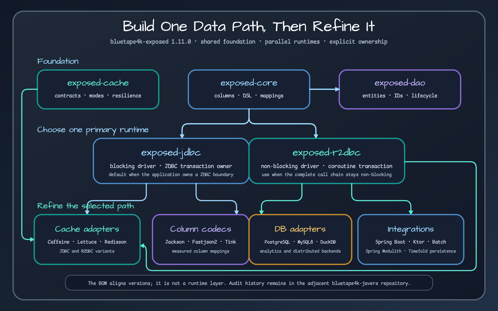

# Bluetape4k Exposed Manual

`bluetape4k-exposed` adds repository patterns, transaction boundaries, caching, database-specific extensions, and application integrations to JetBrains Exposed. This manual starts with decisions rather than a feature catalog: choose JDBC or R2DBC, decide when caching is justified, and place database adapters and Spring Boot or Ktor integrations on the correct data-access path.

## Core capabilities

- **Repository foundations:** [Core](modules/bluetape4k-exposed-core.md), [DAO](modules/bluetape4k-exposed-dao.md), and repository conventions turn Exposed tables and entities into reusable Kotlin data-access components.
- **JDBC and R2DBC:** Choose [JDBC](modules/bluetape4k-exposed-jdbc.md) for blocking transactions or [R2DBC](modules/bluetape4k-exposed-r2dbc.md) for coroutine-first non-blocking access, with separate ownership and cancellation contracts.
- **Transactions and batch work:** The [transaction boundary guide](guides/transaction-boundaries.md) and [batch utilities](modules/bluetape4k-exposed-batch.md) cover composition, batching, and failure behavior.
- **Caching:** The [cache selection guide](guides/cache-selection.md) connects shared cache contracts to Caffeine, Lettuce, and Redisson for JDBC and R2DBC repositories.
- **Database and data-format extensions:** The [database adapter matrix](guides/database-adapter-matrix.md) and [serialization/encryption guide](guides/serialization-and-encryption.md) cover vendor-specific SQL, JSON, measured values, and encrypted columns.
- **Application integration:** [Spring Boot and Ktor](guides/spring-and-ktor.md) modules own configuration, lifecycle, and framework-specific transaction wiring.

## Version baseline

Consumers select the central `io.github.bluetape4k:bluetape4k-dependencies:<version>` BOM version, not the repository release documented here. The technical baseline for this manual is `bluetape4k-exposed 1.12.1`, limited to the 40 Gradle projects present in that stable release.

- Release tag: [`1.12.1`](https://github.com/bluetape4k/bluetape4k-exposed/tree/1.12.1)
- Release commit: [`4cc2cce07087241ec24a597d8464615434ea2b81`](https://github.com/bluetape4k/bluetape4k-exposed/commit/4cc2cce07087241ec24a597d8464615434ea2b81)
- Primary paths: JDBC, R2DBC, cache, database adapters, and application integrations

## Where to start

- Use [Getting started](getting-started.md) for the central BOM and JDBC/R2DBC selection rules.
- Read the [Repository map](architecture/repository-map.md) to see how the stable modules fit together.
- Follow the [Learning path](guides/learning-path.md) for a goal-oriented sequence of examples and workshops.
- Open the [module catalog](modules/bluetape4k-exposed-bom.md) when you need coordinates and release-backed source locations.

## Responsibility boundary

This repository owns the application data path. For object history, change comparison, or JaVers commit metadata, move to [`bluetape4k-javers`](https://github.com/bluetape4k/bluetape4k-javers) instead of overloading persistence repositories. JaVers complements Exposed repositories and caches; it does not replace them.
