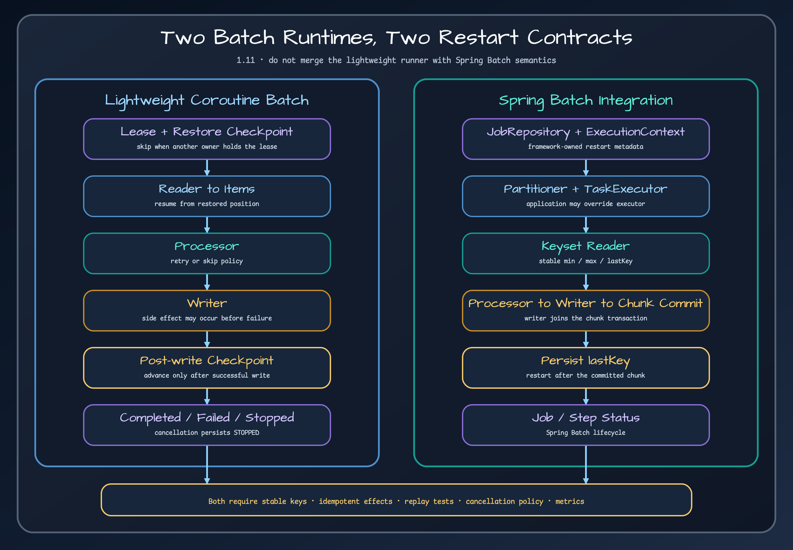

# Exposed Batch Utilities

> A lightweight coroutine batch runtime with explicit leases, checkpoints, retries, skips, and JDBC/R2DBC execution repositories.

## Problem {#problem}

`BatchStepRunner` executes one `BatchStep` as a resumable chunk loop. It claims job and step execution leases, skips a step already marked `COMPLETED` or `COMPLETED_WITH_SKIPS`, opens the reader and writer, restores a non-null checkpoint, and repeatedly reads, processes, writes, and checkpoints chunks. The module supplies its own runtime; it is not a wrapper around Spring Batch.



## When to use it {#when-to-use}

Use it for coroutine applications that need a small batch runtime and can express work as `BatchReader` → optional `BatchProcessor` → `BatchWriter`. Choose a persistent JDBC or R2DBC `BatchJobRepository` when execution must resume after process loss. Use Spring Batch when you need its job repository, step ecosystem, partitioning, scheduling integration, and operator tooling.

## Coordinates {#coordinates}

Import the ecosystem BOM and omit the module version:

```kotlin
dependencies {
    implementation(platform("io.github.bluetape4k:bluetape4k-dependencies:<version>"))
    implementation("io.github.bluetape4k.exposed:bluetape4k-exposed-batch")
}
```

## Core concepts {#concepts}

A job and each step have persisted status, counters, owner, lease expiry, version, and checkpoint. The repository must claim ownership atomically; a failed claim returns a `FAILED` report without opening step resources. A completed step is returned immediately and is never reopened. For an incomplete step, a saved checkpoint is restored before the first read.

Within each chunk, processor exceptions are evaluated by `SkipPolicy`. Accepted outputs are passed to the writer. A successful `writer.write()` is counted immediately, then the runner calls `reader.onChunkCommitted()` and persists `reader.checkpoint()` outside the writer retry/skip boundary. A chunk skipped after writer retries are exhausted does not advance the committed checkpoint. A checkpoint failure therefore reports the already completed write without replaying the chunk in the same run. This ordering defines restart behavior.

## Quick start {#quick-start}

Define a job and step with the batch DSL, provide a reader and writer, choose a chunk size, retry policy, skip policy, commit timeout, and repository, then run the job. Start with `SkipPolicy.NONE` and a writer that is safe to replay. Use `InMemoryBatchJobRepository` only for tests or disposable single-process execution.

```bash
./gradlew \
  :bluetape4k-exposed-batch-core:test \
  :bluetape4k-exposed-batch-jdbc:test \
  :bluetape4k-exposed-batch-r2dbc:test \
  :bluetape4k-exposed-batch:test
```

The child test suites are the executable references for completed-step
short-circuiting, checkpoint restore, retry/skip behavior, cancellation, and
JDBC/R2DBC repository persistence. The compatibility aggregator's `test` task
only checks schema parity and packaging ownership; it does not replace the
child test tasks.

## API by task {#api-by-task}

- Build the definition with `BatchJob`, `BatchStep`, or the DSL builders.
- Implement `BatchReader.open/read/checkpoint/restoreFrom/onChunkCommitted/close`.
- Add a `BatchProcessor` when input and written output differ or items may be filtered.
- Implement `BatchWriter.open/write/close`; `write` receives one accepted chunk.
- Select `SkipPolicy.NONE`, `ALL`, `maxSkips`, or a domain-specific policy.
- Use `ExposedJdbcBatchJobRepository` or `ExposedR2dbcBatchJobRepository` for durable restart state.

## Recommended patterns {#patterns}

Make the writer idempotent with a natural key, upsert, compare-and-set, or processed-item ledger. Keep reader ordering stable and encode enough state in the checkpoint to resume unambiguously. Set lease duration longer than normal chunk latency and bound retry attempts. Treat processor-item skip and writer-chunk skip as different business outcomes: a writer failure skips the entire chunk after retry exhaustion.

## Integrations {#integrations}

`ExposedJdbcBatchJobRepository` persists job, step, lease, counter, status, and checkpoint state through Exposed JDBC. `ExposedR2dbcBatchJobRepository` provides the corresponding suspendable R2DBC path. Matching JDBC/R2DBC readers and writers are available. These repositories support this runtime and are separate from Spring Batch's metadata schema and transaction conventions.

## Configuration {#configuration}

Set chunk size from database statement limits, row size, and measured transaction latency. Configure retry attempts, initial delay, backoff multiplier, maximum delay, skip policy, commit timeout, and lease expiry deliberately. Create the batch tables before using a persistent repository. The application supplies and owns the JDBC `Database` or R2DBC `R2dbcDatabase` and connection pool.

## Failure modes {#failures}

- Another owner holds a valid lease: the claim fails and the runner must not process the step.
- The process dies after a successful write but before checkpoint persistence: the same chunk can replay after restart.
- If a later chunk fails after a successful commit, the runner reports and retains the last successful checkpoint. Completion does not clear the persisted checkpoint when failure handling has no replacement value, so a rerun starts after the last committed key.
- A timed-out write has partial external effects: timeout does not prove rollback; reconcile before retrying.
- Writer retries are exhausted and the skip policy accepts the error: the whole chunk increases `skipCount`; design the policy with that scope in mind.
- Checkpoint is absent: `restoreFrom` is intentionally not called; the reader starts from its initial position.

## Operations {#operations}

Record job/step IDs, owner and lease expiry, status, checkpoint, read/write/skip counts, retry attempts, chunk latency, and timeout errors. Alert on expired `RUNNING` leases and repeated `FAILED`/`STOPPED` recovery. Keep execution history long enough to diagnose replay and partial side effects.

## Testing {#testing}

Run the four module test tasks together:

```bash
./gradlew \
  :bluetape4k-exposed-batch-core:test \
  :bluetape4k-exposed-batch-jdbc:test \
  :bluetape4k-exposed-batch-r2dbc:test \
  :bluetape4k-exposed-batch:test
```

The core task covers completed-step short-circuiting without resource open,
checkpoint behavior, processor skip, writer retry/backoff, cancellation, and
the in-memory repository. The JDBC and R2DBC tasks cover lease contention,
write timeout, crash after write/before checkpoint, and persistent restart.
The aggregator task is limited to schema parity and packaging checks.

Cancellation requires a separate assertion: `CancellationException` is never converted to a normal failure. In a `NonCancellable` cleanup block the runner attempts to persist a `STOPPED` report, then independently closes reader and writer, and finally rethrows cancellation.

## Workshops and learning path {#workshops}

Read [transaction boundaries](../guides/transaction-boundaries.md), then compare this runtime with [Spring Boot Batch integration](bluetape4k-exposed-spring-boot-batch.md). Use the persistent repository tests as the restart contract before adapting a custom reader or writer.

## Limitations {#limitations}

The write/checkpoint boundary is at-least-once, not exactly-once. `InMemoryBatchJobRepository` is not restart-durable and cannot coordinate processes. The runtime is not a scheduler, queue, or Spring Batch replacement. Correct recovery depends on an atomic lease implementation, durable checkpoints, stable reader order, and an idempotent writer.

<!-- release-readme-diagrams:start -->
## Release diagrams {#release-diagrams}

These diagrams are loaded directly from README assets published with the `2.0.0` release and pinned to its immutable commit. They describe this manual's released structure and runtime flows, not later Snapshot changes. Select a preview to open the SVG at the same release commit.

### Batch benchmark comparison map

[](https://github.com/bluetape4k/bluetape4k-exposed/blob/d632a0bc0662ae616b786f552150a7fabd1cee3e/docs/images/readme-diagrams/utils-batch-benchmark-map-01.svg)

_Release README: [`utils/batch/benchmark/README.md`](https://github.com/bluetape4k/bluetape4k-exposed/blob/d632a0bc0662ae616b786f552150a7fabd1cee3e/utils/batch/benchmark/README.md)_

### Batch runtime role map

[](https://github.com/bluetape4k/bluetape4k-exposed/blob/d632a0bc0662ae616b786f552150a7fabd1cee3e/docs/images/readme-diagrams/utils-batch-diagram-01.svg)

_Release README: [`utils/batch/README.md`](https://github.com/bluetape4k/bluetape4k-exposed/blob/d632a0bc0662ae616b786f552150a7fabd1cee3e/utils/batch/README.md)_

### Batch chunk checkpoint flow

[](https://github.com/bluetape4k/bluetape4k-exposed/blob/d632a0bc0662ae616b786f552150a7fabd1cee3e/docs/images/readme-diagrams/utils-batch-sequence-01.svg)

_Release README: [`utils/batch/README.md`](https://github.com/bluetape4k/bluetape4k-exposed/blob/d632a0bc0662ae616b786f552150a7fabd1cee3e/utils/batch/README.md)_

<!-- release-readme-diagrams:end -->

## Sources {#sources}

- [`BatchStepRunner.kt`](../../../../utils/batch/core/src/main/kotlin/io/bluetape4k/batch/core/BatchStepRunner.kt)
- [`BatchStep.kt`](../../../../utils/batch/core/src/main/kotlin/io/bluetape4k/batch/core/BatchStep.kt)
- [`BatchJobRepository.kt`](../../../../utils/batch/core/src/main/kotlin/io/bluetape4k/batch/api/BatchJobRepository.kt)
- [`BatchReader.kt`](../../../../utils/batch/core/src/main/kotlin/io/bluetape4k/batch/api/BatchReader.kt)
- [`BatchWriter.kt`](../../../../utils/batch/core/src/main/kotlin/io/bluetape4k/batch/api/BatchWriter.kt)
- [`SkipPolicy.kt`](../../../../utils/batch/core/src/main/kotlin/io/bluetape4k/batch/api/SkipPolicy.kt)
- [`InMemoryBatchJobRepository.kt`](../../../../utils/batch/core/src/main/kotlin/io/bluetape4k/batch/core/InMemoryBatchJobRepository.kt)
- [`ExposedJdbcBatchJobRepository.kt`](../../../../utils/batch/jdbc/src/main/kotlin/io/bluetape4k/batch/jdbc/ExposedJdbcBatchJobRepository.kt)
- [`ExposedR2dbcBatchJobRepository.kt`](../../../../utils/batch/r2dbc/src/main/kotlin/io/bluetape4k/batch/r2dbc/ExposedR2dbcBatchJobRepository.kt)
