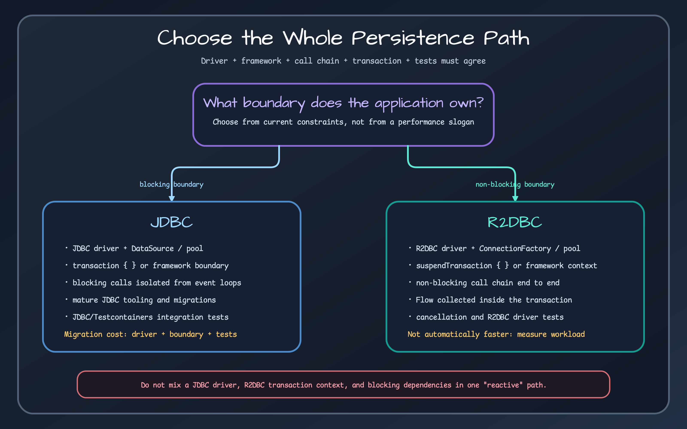

# Exposed JDBC Library

> Blocking JDBC persistence helpers and repository contracts. The caller or framework owns the transaction and connection boundary.



## Problem {#problem}

An application using Exposed JDBC still needs consistent record mapping, CRUD, paging, batch operations, audit updates, soft delete, schema helpers, CTE support, and coroutine isolation for blocking work. This module supplies those conventions without hiding Exposed's JDBC transaction model.

## When to use it {#when-to-use}

Choose JDBC when the database driver, connection pool, framework transaction manager, and application call path are blocking. It is the straightforward production path for Spring JDBC transactions and existing JDBC observability/tooling. A coroutine-based service can still use JDBC if blocking work is isolated on a suitable dispatcher or virtual thread.

## Coordinates {#coordinates}

```kotlin
dependencies {
    implementation(platform("io.github.bluetape4k:bluetape4k-dependencies:<version>"))
    implementation("io.github.bluetape4k.exposed:bluetape4k-exposed-jdbc")
    runtimeOnly("org.postgresql:postgresql") // choose the deployed driver
}
```

## Core concepts {#concepts}

- `JdbcRepository` executes in the current `transaction {}`; it does not open a transaction.
- `ResultRow.toEntity()` should create a detached record before leaving the transaction.
- `findPage` runs count and content queries separately. Snapshot consistency depends on the surrounding transaction and isolation.
- `AuditableJdbcRepository` and `SoftDeletedJdbcRepository` make update semantics explicit.
- `newSuspendedTransaction` support in 1.11 is experimental and remains a blocking JDBC path.

## Quick start {#quick-start}

```kotlin
transaction(database) {
    val actor = repository.findByIdOrNull(42L)
    val page = repository.findPage(pageNumber = 0, pageSize = 20)
}
```

Open the transaction at the service/framework boundary, perform every repository operation inside it, and return detached values.

## API by task {#api-by-task}

| Task | Stable API |
|---|---|
| Read/existence | `findById`, `findByIdOrNull`, `findAll`, `findFirstOrNull`, `existsById` |
| Page | `findPage` |
| Write | `saveAll`, `updateById`, `updateAll`, `deleteById`, batch insert/upsert |
| Audit | `auditedUpdateById`, `auditedUpdateAll` |
| Soft delete | `softDeleteById`, `restoreById`, `findActive`, `findDeleted` |
| SQL/schema | `CteQuery`, `SchemaUtilsExtensions`, `TableExtensions` |
| Blocking coroutine bridge | `newSuspendedTransaction`/virtual-thread helper, with explicit dispatcher ownership |

## Recommended patterns {#patterns}

Put one business use case inside one transaction boundary. Keep repository methods transaction-neutral so several calls can commit or roll back together. Convert DAO entities and rows to records inside the boundary. For pages that require a stable count/content view, select an isolation level that supplies it or redesign the query.

## Integrations {#integrations}

Spring transaction management can own the boundary through the Spring JDBC module. Cache modules wrap repository results but do not replace transaction rules. Database adapters refine dialect behavior. JDBC test support supplies database fixtures.

## Configuration {#configuration}

Configure the `DataSource`, pool limits/timeouts, driver properties, isolation, and Exposed `Database` in the application or framework module. Match pool size to blocking concurrency; coroutine count is not a safe pool-size estimate.

## Failure modes {#failures}

- Calling a repository outside `transaction {}` fails because no JDBC transaction context exists.
- Returning a DAO entity and reading lazy state later crosses the closed boundary.
- Running JDBC on a constrained coroutine event-loop thread blocks unrelated work.
- Assuming `findPage` is one query can expose count/content drift.
- Using generic update methods on an auditable table skips audited update fields.

## Operations {#operations}

Measure pool wait, query duration, transaction duration, timeout/rollback counts, and slow SQL. Attach request/job identity before audited writes. Size batch operations from actual driver and database limits.

## Testing {#testing}

Use `bluetape4k-exposed-jdbc-tests` and Testcontainers for the deployed dialect. Test commit, rollback, isolation-sensitive behavior, batch edge cases, audit fields, soft delete, and mapper behavior. Keep database cleanup deterministic.

## Workshops and learning path {#workshops}

Start with [Transaction ownership](bluetape4k-exposed-jdbc/transaction-ownership.md), continue to [Repository patterns](bluetape4k-exposed-jdbc/repository-patterns.md), then [Operations and testing](bluetape4k-exposed-jdbc/operations-testing.md). The [JDBC/R2DBC guide](../guides/jdbc-vs-r2dbc.md) explains when this path is the better fit.

## Limitations {#limitations}

JDBC remains blocking even when invoked from a suspending function. This library does not provide a driver, pool, automatic transaction, or universal retry policy.

<!-- release-readme-diagrams:start -->
## Release diagrams {#release-diagrams}

These diagrams are loaded directly from README assets published with the `2.0.0` release and pinned to its immutable commit. They describe this manual's released structure and runtime flows, not later Snapshot changes. Select a preview to open the SVG at the same release commit.

### JDBC Architecture Overview diagram

[](https://github.com/bluetape4k/bluetape4k-exposed/blob/d632a0bc0662ae616b786f552150a7fabd1cee3e/docs/images/readme-diagrams/exposed-jdbc-diagram-01.svg)

_Release README: [`exposed/jdbc/README.md`](https://github.com/bluetape4k/bluetape4k-exposed/blob/d632a0bc0662ae616b786f552150a7fabd1cee3e/exposed/jdbc/README.md)_

### Repository Contract Map diagram

[](https://github.com/bluetape4k/bluetape4k-exposed/blob/d632a0bc0662ae616b786f552150a7fabd1cee3e/docs/images/readme-diagrams/exposed-jdbc-diagram-02.svg)

_Release README: [`exposed/jdbc/README.md`](https://github.com/bluetape4k/bluetape4k-exposed/blob/d632a0bc0662ae616b786f552150a7fabd1cee3e/exposed/jdbc/README.md)_

### VirtualThread transaction helper diagram

[](https://github.com/bluetape4k/bluetape4k-exposed/blob/d632a0bc0662ae616b786f552150a7fabd1cee3e/docs/images/readme-diagrams/exposed-jdbc-sequence-01.svg)

_Release README: [`exposed/jdbc/README.md`](https://github.com/bluetape4k/bluetape4k-exposed/blob/d632a0bc0662ae616b786f552150a7fabd1cee3e/exposed/jdbc/README.md)_

### findById — Single record lookup diagram

[](https://github.com/bluetape4k/bluetape4k-exposed/blob/d632a0bc0662ae616b786f552150a7fabd1cee3e/docs/images/readme-diagrams/exposed-jdbc-sequence-02.svg)

_Release README: [`exposed/jdbc/README.md`](https://github.com/bluetape4k/bluetape4k-exposed/blob/d632a0bc0662ae616b786f552150a7fabd1cee3e/exposed/jdbc/README.md)_

### save + findPage — Save then paginate diagram

[](https://github.com/bluetape4k/bluetape4k-exposed/blob/d632a0bc0662ae616b786f552150a7fabd1cee3e/docs/images/readme-diagrams/exposed-jdbc-sequence-03.svg)

_Release README: [`exposed/jdbc/README.md`](https://github.com/bluetape4k/bluetape4k-exposed/blob/d632a0bc0662ae616b786f552150a7fabd1cee3e/exposed/jdbc/README.md)_

### softDeleteById / restoreById — Soft delete and restore diagram

[](https://github.com/bluetape4k/bluetape4k-exposed/blob/d632a0bc0662ae616b786f552150a7fabd1cee3e/docs/images/readme-diagrams/exposed-jdbc-sequence-04.svg)

_Release README: [`exposed/jdbc/README.md`](https://github.com/bluetape4k/bluetape4k-exposed/blob/d632a0bc0662ae616b786f552150a7fabd1cee3e/exposed/jdbc/README.md)_

<!-- release-readme-diagrams:end -->

## Sources {#sources}

- [JDBC build](../../../../exposed/jdbc/build.gradle.kts)
- [JDBC repository](../../../../exposed/jdbc/src/main/kotlin/io/bluetape4k/exposed/jdbc/repository/JdbcRepository.kt)
- [Auditable repository](../../../../exposed/jdbc/src/main/kotlin/io/bluetape4k/exposed/jdbc/repository/AuditableJdbcRepository.kt)
- [Repository tests](../../../../exposed/jdbc/src/test/kotlin/io/bluetape4k/exposed/jdbc/repository/ActorJdbcRepositoryTest.kt)
