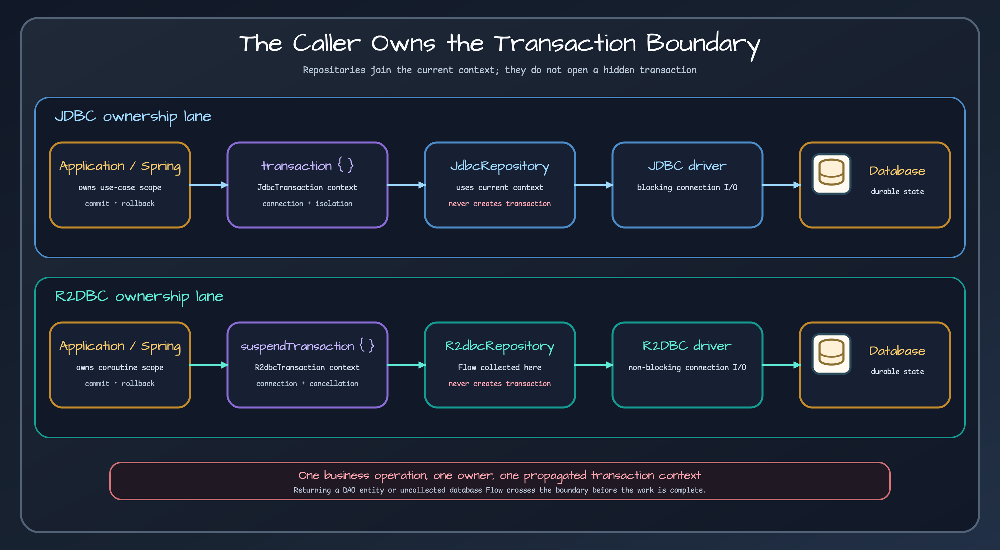

# Exposed R2DBC Library

> Suspending and `Flow`-based persistence helpers for an end-to-end R2DBC path. The caller or framework owns `suspendTransaction` and connection context.



## Problem {#problem}

R2DBC changes more than method signatures: driver access, connection ownership, transaction propagation, cancellation, result collection, Spring integration, and testing all need a non-blocking contract. This module provides repository and DSL helpers while leaving the transaction boundary visible.

## When to use it {#when-to-use}

Choose R2DBC when the driver, framework, transaction manager, and complete request path are non-blocking and the workload benefits from concurrency without dedicating one platform thread per waiting database call. Do not choose it on the assumption that it is automatically faster; latency and throughput depend on the driver, database, pool, query shape, and workload.

## Coordinates {#coordinates}

```kotlin
dependencies {
    implementation(platform("io.github.bluetape4k:bluetape4k-dependencies:<version>"))
    implementation("io.github.bluetape4k.exposed:bluetape4k-exposed-r2dbc")
    runtimeOnly("org.postgresql:r2dbc-postgresql") // select the deployed driver
}
```

## Core concepts {#concepts}

- `R2dbcRepository` runs in the current `suspendTransaction`; it does not open one.
- Single-value operations suspend; multi-row reads return cold `Flow` values.
- Collect a repository `Flow` inside the transaction that owns its connection.
- Cancellation can abort collection, but the driver/database determine how promptly server work stops and resources are released.
- `findPage` performs count and content work separately within the caller's transaction.

## Quick start {#quick-start}

```kotlin
suspendTransaction(db = database) {
    val actors = repository.findAll(limit = 20).toList()
    val page = repository.findPage(pageNumber = 0, pageSize = 20)
}
```

Keep creation and terminal collection of database-backed flows inside the same transaction boundary.

## API by task {#api-by-task}

| Task | Stable API |
|---|---|
| Single read/write | suspending `findById`, `saveAll`, `updateById`, `deleteById` |
| Multi-row read | `findAll`, `findBy`, `findAllByIds` returning `Flow` |
| Page | suspending `findPage` |
| Audit | `auditedUpdateById`, `auditedUpdateAll` |
| Soft delete | suspending writes plus `findActive`/`findDeleted` flows |
| Query helpers | `CteQuery`, `QueryExtensions`, `ReadableExtensions`, table helpers |
| Conflict handling | R2DBC batch insert-on-conflict helpers |

## Recommended patterns {#patterns}

Define one coroutine transaction around one business operation. Do not let a repository open an isolated transaction, because several writes then cannot share rollback. Collect database flows before the boundary closes, convert rows to detached values, and keep blocking libraries off the R2DBC call chain.

## Integrations {#integrations}

Spring R2DBC integration can provide transaction context through the framework module. R2DBC cache variants preserve suspending boundaries but introduce their own client lifecycle and failure semantics. Database adapters must explicitly support the selected R2DBC behavior.

## Configuration {#configuration}

Configure the R2DBC `ConnectionFactory`, pool, driver options, timeouts, and Exposed `R2dbcDatabase` in the application/framework layer. Size the pool from measured database capacity, not coroutine count.

## Failure modes {#failures}

- Collecting a cold database `Flow` after `suspendTransaction` closes loses its transaction/connection context.
- Inserting a blocking codec, cache client, or JDBC call into the path blocks coroutine threads.
- Treating cancellation as guaranteed server-side query termination overstates the contract.
- Mixing Spring and manually opened transaction contexts can split one use case across connections.
- Migrating syntax without replacing the driver and tests leaves a half-blocking system.

## Operations {#operations}

Observe pool acquisition, active connections, transaction/query duration, cancellation, timeout, and error signals. Bound result streams, and confirm driver resource cleanup under cancellation and partial consumption.

## Testing {#testing}

Use `bluetape4k-exposed-r2dbc-tests` with R2DBC drivers and Testcontainers. Test cancellation, rollback, collection within the boundary, pool exhaustion, dialect behavior, and cleanup after failures. A JDBC-only test does not prove the R2DBC path.

## Workshops and learning path {#workshops}

Read [Coroutine transactions](bluetape4k-exposed-r2dbc/coroutine-transactions.md), [Repository patterns](bluetape4k-exposed-r2dbc/repository-patterns.md), and [Cancellation and testing](bluetape4k-exposed-r2dbc/cancellation-and-testing.md). The [JDBC/R2DBC guide](../guides/jdbc-vs-r2dbc.md) includes migration cost and operational trade-offs.

## Limitations {#limitations}

R2DBC is not an automatic performance upgrade and does not make blocking dependencies non-blocking. The library supplies no driver, universal cancellation guarantee, or implicit transaction.

<!-- release-readme-diagrams:start -->
## Release diagrams {#release-diagrams}

These diagrams are loaded directly from README assets published with the `1.12.1` release and pinned to its immutable commit. They describe this manual's released structure and runtime flows, not later Snapshot changes. Select a preview to open the SVG at the same release commit.

### Core R2DBC repository structure diagram

[](https://github.com/bluetape4k/bluetape4k-exposed/blob/4cc2cce07087241ec24a597d8464615434ea2b81/docs/images/readme-diagrams/exposed-r2dbc-diagram-01.svg)

_Release README: [`exposed/r2dbc/README.md`](https://github.com/bluetape4k/bluetape4k-exposed/blob/4cc2cce07087241ec24a597d8464615434ea2b81/exposed/r2dbc/README.md)_

### R2DBC repository capability map

[](https://github.com/bluetape4k/bluetape4k-exposed/blob/4cc2cce07087241ec24a597d8464615434ea2b81/docs/images/readme-diagrams/exposed-r2dbc-diagram-02.svg)

_Release README: [`exposed/r2dbc/README.md`](https://github.com/bluetape4k/bluetape4k-exposed/blob/4cc2cce07087241ec24a597d8464615434ea2b81/exposed/r2dbc/README.md)_

### R2DBC suspend transaction sequence diagram

[](https://github.com/bluetape4k/bluetape4k-exposed/blob/4cc2cce07087241ec24a597d8464615434ea2b81/docs/images/readme-diagrams/exposed-r2dbc-sequence-01.svg)

_Release README: [`exposed/r2dbc/README.md`](https://github.com/bluetape4k/bluetape4k-exposed/blob/4cc2cce07087241ec24a597d8464615434ea2b81/exposed/r2dbc/README.md)_

### R2DBC soft-delete visibility flow diagram

[](https://github.com/bluetape4k/bluetape4k-exposed/blob/4cc2cce07087241ec24a597d8464615434ea2b81/docs/images/readme-diagrams/exposed-r2dbc-sequence-02.svg)

_Release README: [`exposed/r2dbc/README.md`](https://github.com/bluetape4k/bluetape4k-exposed/blob/4cc2cce07087241ec24a597d8464615434ea2b81/exposed/r2dbc/README.md)_

<!-- release-readme-diagrams:end -->

## Sources {#sources}

- [R2DBC build](../../../../exposed/r2dbc/build.gradle.kts)
- [R2DBC repository](../../../../exposed/r2dbc/src/main/kotlin/io/bluetape4k/exposed/r2dbc/repository/R2dbcRepository.kt)
- [Auditable R2DBC repository](../../../../exposed/r2dbc/src/main/kotlin/io/bluetape4k/exposed/r2dbc/repository/AuditableR2dbcRepository.kt)
- [Repository tests](../../../../exposed/r2dbc/src/test/kotlin/io/bluetape4k/exposed/r2dbc/repository/ActorR2dbcRepositoryTest.kt)
