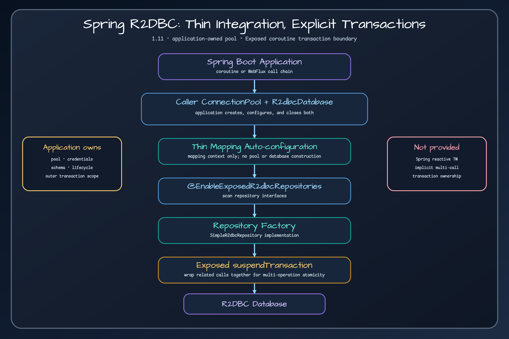

# Exposed Spring Boot R2DBC Integration

> A thin Spring Data repository adapter over an application-owned Exposed R2DBC runtime.

## Problem {#problem}

This module registers Spring Data repository mapping and factories for Exposed R2DBC. Its auto-configuration is deliberately thin: it does **not** create an R2DBC `ConnectionPool`, an Exposed `R2dbcDatabase`, or a Spring reactive transaction manager. The application creates, configures, and closes the pool and `R2dbcDatabase`.



## When to use it {#when-to-use}

Use it when an application already owns a working Exposed R2DBC runtime and wants Spring Data repository interfaces, derived queries, and repository scanning. Use the lower-level `bluetape4k-exposed-r2dbc` API directly when repository proxies add no value or when transaction composition must remain explicit everywhere.

## Coordinates {#coordinates}

Import the ecosystem BOM and omit the module version:

```kotlin
dependencies {
    implementation(platform("io.github.bluetape4k:bluetape4k-dependencies:<version>"))
    implementation("io.github.bluetape4k.exposed:bluetape4k-exposed-spring-boot-r2dbc")
}
```

The R2DBC adapter depends on the backend-neutral `bluetape4k-exposed-spring-boot-common` module for
annotations, mapping metadata, derived-query planning, and sort conversion. It does not depend on the JDBC
Spring Data adapter or `spring-jdbc`; an R2DBC-only runtime therefore stays free of JDBC classes. Use the
common annotation import in repository interfaces:

```kotlin
import io.bluetape4k.spring.data.exposed.common.annotation.Query
```

## Core concepts {#concepts}

`@EnableExposedR2dbcRepositories` discovers repository interfaces and connects them to `ExposedR2dbcRepositoryFactory`. The application must connect its `R2dbcDatabase` before repository calls; the repository factory does not inject or own a database. Individual methods in `SimpleExposedR2dbcRepository` open their own Exposed `suspendTransaction`; this gives one repository call a transaction, not an automatic transaction spanning several calls.

## Quick start {#quick-start}

Create the driver `ConnectionFactory`, wrap it in the application's `ConnectionPool`, and connect an Exposed `R2dbcDatabase` so Exposed has the intended transaction target. Enable repository scanning, call one repository method from a suspend function, and close the pool during application shutdown.

```kotlin
@EnableExposedR2dbcRepositories(basePackageClasses = [MemberRepository::class])
class PersistenceConfiguration
```

The exact pool options, credentials, lifecycle hooks, and `R2dbcDatabase` construction belong to the application, not this auto-configuration.

## API by task {#api-by-task}

- Define a repository by extending `ExposedR2dbcRepository<T, ID>`.
- Enable discovery with `@EnableExposedR2dbcRepositories`.
- Use supported derived-query methods through `PartTreeExposedR2dbcQuery`.
- Use `streamAll()` when rows must be consumed as a true stream.
- Wrap related calls in one explicit outer Exposed `suspendTransaction` when they must commit or roll back together.

## Recommended patterns {#patterns}

Keep pool and `R2dbcDatabase` creation in one application infrastructure component and close them exactly once. Establish the intended Exposed database before using a repository. Prefer one explicit outer `suspendTransaction` for a multi-repository use case; repository calls can then participate in that Exposed transaction instead of relying on a Spring reactive transaction manager that this module does not provide.

## Integrations {#integrations}

The module integrates Spring Data repository discovery with Exposed R2DBC query and repository implementations. Its factory deliberately bypasses Spring Data's transaction interceptor for suspend methods and delegates to the Exposed implementation. It does not bridge Exposed transactions into Spring's `ReactiveTransactionManager`; do not infer Spring `@Transactional` semantics from repository registration alone.

## Configuration {#configuration}

Configure the R2DBC driver, pool limits, acquisition timeout, validation, and shutdown in the owning application. When more than one database exists, select the intended database with an explicit outer `suspendTransaction` or the `database` argument supported by `streamAll()`. Repository package scanning should remain narrow and does not itself select a database.

## Failure modes {#failures}

- Repository startup fails because no `R2dbcDatabase` is available: create and expose the application-owned database before repository registration.
- Two repository calls partially commit: they ran in separate internal `suspendTransaction` blocks; wrap them in one explicit outer `suspendTransaction`.
- Pool connections remain after shutdown: close the application-owned `ConnectionPool`; the auto-configuration does not own it.
- Cancellation becomes an application error: rethrow `CancellationException` after cleanup so the Exposed transaction can unwind and the caller keeps cancellation semantics.
- A `Flow` consumes memory unexpectedly: `streamAll()` and `findAll()` use `channelFlow` for true row streaming, while operations such as `findAllById()` and `saveAll()` may collect results before emission.

## Operations {#operations}

Observe pool acquisition time, active/idle connections, transaction duration, rows consumed, cancellation, and pool shutdown. Distinguish time waiting for a connection from time executing a query. A repository proxy being healthy does not prove the application-owned pool can acquire a connection.

## Testing {#testing}

Test with the same driver and pool type used in production. Verify repository scanning, one-call commit and rollback, explicit multi-call atomicity, cancellation propagation, `streamAll()` incremental consumption, materialized-flow memory behavior, and pool closure. Include a negative test proving that two unwrapped repository calls are not one atomic unit.

## Workshops and learning path {#workshops}

Run the [Spring Boot R2DBC example](exposed-spring-boot-r2dbc-demo.md), then read [JDBC vs R2DBC](../guides/jdbc-vs-r2dbc.md) and [transaction boundaries](../guides/transaction-boundaries.md). The [Exposed R2DBC workshop](https://github.com/bluetape4k/exposed-r2dbc-workshop) develops the same ownership model through larger examples.

## Limitations {#limitations}

This module does not provision connections, manage `R2dbcDatabase` lifecycle, create schema, or supply Spring reactive transaction management. Derived-query support is bounded by the release implementation. A flow-returning method is not necessarily a streaming database cursor; `streamAll()` is the explicit streaming path.

<!-- release-readme-diagrams:start -->
## Release diagrams {#release-diagrams}

These diagrams are loaded directly from README assets published with the `1.12.1` release and pinned to its immutable commit. They describe this manual's released structure and runtime flows, not later Snapshot changes. Select a preview to open the SVG at the same release commit.

### Spring Boot Exposed R2DBC coroutine repository wiring diagram

[](https://github.com/bluetape4k/bluetape4k-exposed/blob/4cc2cce07087241ec24a597d8464615434ea2b81/docs/images/readme-diagrams/spring-boot-exposed-r2dbc-diagram-01.svg)

_Release README: [`spring-boot/r2dbc/README.md`](https://github.com/bluetape4k/bluetape4k-exposed/blob/4cc2cce07087241ec24a597d8464615434ea2b81/spring-boot/r2dbc/README.md)_

### Spring Boot Exposed R2DBC suspend query flow diagram

[](https://github.com/bluetape4k/bluetape4k-exposed/blob/4cc2cce07087241ec24a597d8464615434ea2b81/docs/images/readme-diagrams/spring-boot-exposed-r2dbc-diagram-02.svg)

_Release README: [`spring-boot/r2dbc/README.md`](https://github.com/bluetape4k/bluetape4k-exposed/blob/4cc2cce07087241ec24a597d8464615434ea2b81/spring-boot/r2dbc/README.md)_

<!-- release-readme-diagrams:end -->

## Sources {#sources}

- [`ExposedR2dbcSpringDataAutoConfiguration.kt`](../../../../spring-boot/r2dbc/src/main/kotlin/io/bluetape4k/spring/data/exposed/r2dbc/config/ExposedR2dbcSpringDataAutoConfiguration.kt)
- [`EnableExposedR2dbcRepositories.kt`](../../../../spring-boot/r2dbc/src/main/kotlin/io/bluetape4k/spring/data/exposed/r2dbc/repository/config/EnableExposedR2dbcRepositories.kt)
- [`SimpleExposedR2dbcRepository.kt`](../../../../spring-boot/r2dbc/src/main/kotlin/io/bluetape4k/spring/data/exposed/r2dbc/repository/support/SimpleExposedR2dbcRepository.kt)
- [`PartTreeExposedR2dbcQuery.kt`](../../../../spring-boot/r2dbc/src/main/kotlin/io/bluetape4k/spring/data/exposed/r2dbc/repository/query/PartTreeExposedR2dbcQuery.kt)
