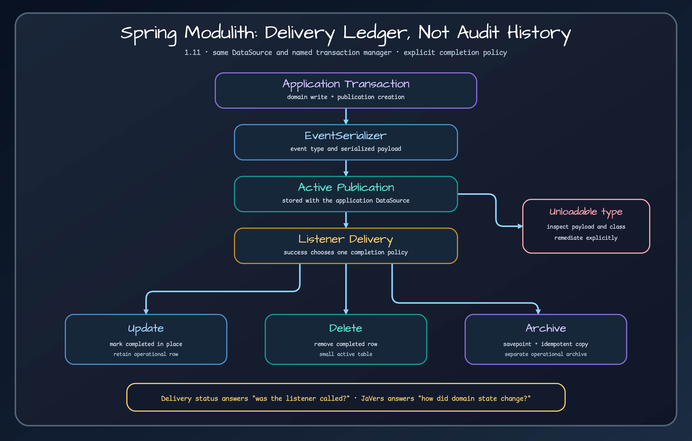

# Exposed Spring Modulith 연동

> Spring Modulith 이벤트 발행 상태를 업무 트랜잭션 안에서 Exposed로 저장하는 JDBC 전달 원장입니다.

## 제공하는 기능 {#problem}

`ExposedEventPublicationRepository`는 Spring Modulith의 `EventPublicationRepository`를 구현합니다. 이벤트, 대상 listener, 직렬화한 payload, 발행 시각, 전달 상태, 시도 횟수, 완료 정보를 기록해 미완료 전달을 찾고 재시도할 수 있게 합니다. 이 테이블은 전달 원장이며 도메인 감사 기록, 엔티티 변경 이력, 객체 diff 저장소가 아닙니다.



## 사용하기 좋은 경우 {#when-to-use}

Spring Modulith 애플리케이션이 업무 데이터를 Exposed JDBC로 저장하고 이벤트 발행 행도 같은 데이터소스와 이름이 지정된 Spring 트랜잭션 관리자에 참여시켜야 할 때 사용하세요. 누가 객체를 바꿨는지, 과거 스냅숏, 변경 diff가 필요하다면 [JaVers](https://github.com/bluetape4k/bluetape4k-javers)를 사용해야 합니다. 발행 완료 행이 답하는 문제와 다릅니다.

## 의존성 좌표 {#coordinates}

생태계 BOM을 가져오면 모듈 버전을 따로 적지 않아도 됩니다.

```kotlin
dependencies {
    implementation(platform("io.github.bluetape4k:bluetape4k-dependencies:<version>"))
    implementation("io.github.bluetape4k.exposed:bluetape4k-exposed-spring-modulith")
}
```

## 핵심 개념 {#concepts}

저장소 클래스는 `springTransactionManager`에 고정되어 있습니다. 자동 설정은 이 이름의 빈이 있고 Spring Modulith 저장소 API와 Exposed JDBC가 클래스 경로에 있으며 `EventSerializer` 빈이 있을 때 동작합니다. 발행 의도와 업무 변경을 원자적으로 커밋하려면 트랜잭션 관리자가 업무 데이터와 같은 `DataSource`를 가리켜야 합니다.

활성 발행은 생성하고 `PROCESSING`, `FAILED`, `RESUBMITTED`로 표시할 수 있으며 상태나 실패 조건으로 목록을 찾거나 이벤트와 대상 조합으로 조회할 수 있습니다. `EventSerializer`가 이벤트를 저장 문자열로 바꾸고 기록된 이벤트 클래스로 다시 만듭니다.

## 빠르게 시작하기 {#quick-start}

Exposed JDBC와 이름이 `springTransactionManager`인 관리자를 구성하고 Spring Modulith `EventSerializer`를 제공한 뒤 발행 테이블 migration을 적용합니다. Spring 관리 업무 트랜잭션에서 애플리케이션 이벤트를 발행하세요. 일반 환경에서는 `initialize-schema`를 끈 상태로 유지하고 listener 완료 전에 발행 행이 보이는지 확인합니다.

```yaml
bluetape4k:
  spring:
    modulith:
      exposed:
        completion-mode: update
        initialize-schema: false
```

## 작업별 API {#api-by-task}

- `create`로 `TargetEventPublication` 하나를 기록합니다.
- `findIncompletePublications*`, `findFailedPublications`, `findByStatus`, `countByStatus`로 복구와 운영 대상을 찾습니다.
- `markProcessing`, `markFailed`, `markResubmitted`로 전달 상태와 시도 횟수를 갱신합니다.
- `markCompleted`는 설정한 `UPDATE`, `DELETE`, `ARCHIVE` 완료 전략을 적용합니다.
- `deletePublications`와 완료 발행 정리 메서드로 보존 정책을 구현합니다.

## 권장 패턴 {#patterns}

도메인 상태를 바꾸는 업무 트랜잭션 안에서 이벤트를 발행하고 전달이 반복될 수 있으므로 listener를 멱등하게 만드세요. 미완료 행이 남아 있는 동안 이벤트 클래스 이름과 직렬화 형식의 호환성을 유지합니다. 실패하거나 오래 미완료인 발행은 조용히 삭제하지 말고 관찰하고 복구하세요. 완료 행 정리는 감사 이력 보존이 아니라 전달 원장 보존 정책입니다.

## 연동 {#integrations}

`ExposedModulithAutoConfiguration`은 활성·archive 테이블 모델을 만들고 다른 `EventPublicationRepository`가 없을 때 저장소를 조건부 등록합니다. 기본 테이블 형태는 Spring Modulith JDBC schema v2를 따릅니다. archive 전략은 완료 행을 archive 테이블에 복사한 뒤 활성 테이블에서 삭제합니다.

## 설정 {#configuration}

`bluetape4k.spring.modulith.exposed` 아래에서 `table-name`, `archive-table-name`, `completion-mode`, `initialize-schema`를 설정합니다. 완료 방식 기본값은 `UPDATE`, 스키마 초기화 기본값은 `false`입니다. 운영에서는 활성·archive 테이블을 Flyway나 Liquibase로 관리하세요. `SchemaUtils` 초기화 기능은 명시적으로 켜는 편의 기능이며 migration 시스템이 아닙니다.

## 실패 유형과 해결 방법 {#failures}

- 저장소 빈이 없음: 이름이 `springTransactionManager`인 빈과 `EventSerializer` 빈을 확인하고 다른 발행 저장소가 우선하지 않았는지 봅니다.
- 업무 데이터만 커밋되고 발행 행이 없음: 저장소와 업무 작업이 서로 다른 데이터소스나 트랜잭션 관리자를 사용하고 있습니다.
- 저장한 발행을 다시 만들 수 없음: 이벤트 클래스가 더 이상 로드되지 않습니다. 호환 클래스를 복원하거나 전달 영향을 판단한 뒤 해당 행을 명시적으로 migration·삭제하세요. 저장소는 식별자, 이벤트 타입, listener가 담긴 `UnloadableEventPublicationException`을 발생시킵니다.
- archive 완료 중 중복 발생: 저장소는 savepoint까지 롤백하고 SQL state `23` 계열 무결성 오류를 동시 archive의 멱등 중복으로 처리해 외부 트랜잭션을 보존합니다.
- 다른 이유로 archive 삽입 실패: 예외를 다시 던지며 활성 행을 삭제하면 안 됩니다.

## 운영 {#operations}

발행 상태별 건수와 체류 시간, 완료 시도 횟수, 마지막 재제출 시각, 가장 오래된 미완료 발행, archive 증가량, 로드할 수 없는 이벤트 실패를 관찰하세요. 재제출 전에 listener 부수 효과를 확인합니다. 완료 행 보존은 별도 정책으로 관리하고 활성 실패 행은 처리해야 할 운영 작업으로 봅니다.

## 테스트 {#testing}

정확한 모듈 테스트 명령은 다음과 같습니다.

```bash
./gradlew :bluetape4k-exposed-spring-modulith:test
```

같은 데이터소스에서 업무 데이터와 발행 행의 원자적 커밋·롤백, serializer 왕복, 활성·완료 조회, 각 완료 방식, 재제출 횟수, 정리, archive savepoint, archive 중복 멱등성, 로드할 수 없는 이벤트 타입 보고, 명시적으로 켜지 않은 스키마 초기화가 동작하지 않는지 검증하세요.

## 학습 경로와 예제 {#workshops}

[JaVers로 감사하기](../guides/audit-with-javers.md)를 읽어 전달 신뢰성과 감사·이력 요구를 구분하세요. 스냅숏과 diff가 필요하면 [bluetape4k JaVers 저장소](https://github.com/bluetape4k/bluetape4k-javers)로 이어 갑니다.

## 제약 사항 {#limitations}

이 저장소는 JDBC 전용이며 이름이 `springTransactionManager`인 관리자에 고정됩니다. broker 전달, 분산 트랜잭션, listener 부수 효과의 exactly-once, 스키마 migration, 도메인 감사 이력을 제공하지 않습니다. 저장한 이벤트 타입은 발행을 완료하거나 명시적으로 복구할 때까지 호환성을 유지해야 합니다.

<!-- release-readme-diagrams:start -->
## 배포본 다이어그램 {#release-diagrams}

아래 그림은 `2.0.0` 배포본의 README 자산을 해당 배포 커밋에서 직접 불러옵니다. 이후 SNAPSHOT이 아니라 이 매뉴얼 버전의 구조와 실행 흐름을 보여 줍니다. 미리보기를 누르면 같은 배포 커밋의 SVG 원본이 열립니다.

### Spring Modulith Exposed JDBC wiring 다이어그램

[](https://github.com/bluetape4k/bluetape4k-exposed/blob/d632a0bc0662ae616b786f552150a7fabd1cee3e/docs/images/readme-diagrams/spring-boot-exposed-spring-modulith-diagram-01.svg)

_배포본 README: [`spring-boot/spring-modulith/README.ko.md`](https://github.com/bluetape4k/bluetape4k-exposed/blob/d632a0bc0662ae616b786f552150a7fabd1cee3e/spring-boot/spring-modulith/README.ko.md)_

### Spring Modulith publication 수명 주기 시퀀스 다이어그램

[](https://github.com/bluetape4k/bluetape4k-exposed/blob/d632a0bc0662ae616b786f552150a7fabd1cee3e/docs/images/readme-diagrams/spring-boot-exposed-spring-modulith-sequence-01.svg)

_배포본 README: [`spring-boot/spring-modulith/README.ko.md`](https://github.com/bluetape4k/bluetape4k-exposed/blob/d632a0bc0662ae616b786f552150a7fabd1cee3e/spring-boot/spring-modulith/README.ko.md)_

<!-- release-readme-diagrams:end -->

## 근거 자료 {#sources}

- [`ExposedEventPublicationRepository.kt`](../../../../spring-boot/spring-modulith/src/main/kotlin/io/bluetape4k/spring/modulith/exposed/ExposedEventPublicationRepository.kt)
- [`ExposedEventPublicationTable.kt`](../../../../spring-boot/spring-modulith/src/main/kotlin/io/bluetape4k/spring/modulith/exposed/ExposedEventPublicationTable.kt)
- [`ExposedModulithAutoConfiguration.kt`](../../../../spring-boot/spring-modulith/src/main/kotlin/io/bluetape4k/spring/modulith/exposed/config/ExposedModulithAutoConfiguration.kt)
- [`ExposedModulithProperties.kt`](../../../../spring-boot/spring-modulith/src/main/kotlin/io/bluetape4k/spring/modulith/exposed/config/ExposedModulithProperties.kt)
