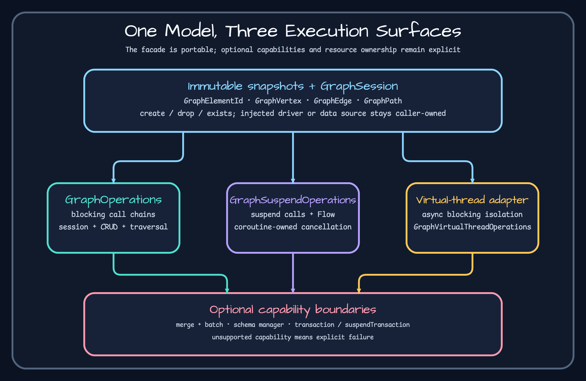

# Core model



`GraphElementId` is a nonblank string value class used across backends. Long and arbitrary driver IDs are normalized, but the value remains opaque to application code. See [`GraphElementId.kt`](https://github.com/bluetape4k/bluetape4k-graph/blob/a405300799b36d4d6edb7267ad07ff34d4ad3afe/graph/graph-core/src/main/kotlin/io/bluetape4k/graph/model/GraphElementId.kt) and its [`tests`](https://github.com/bluetape4k/bluetape4k-graph/blob/a405300799b36d4d6edb7267ad07ff34d4ad3afe/graph/graph-core/src/test/kotlin/io/bluetape4k/graph/model/GraphElementIdTest.kt).

`GraphVertex(id, label, properties)` and `GraphEdge(id, label, startId, endId, properties)` are immutable, serializable snapshots. Property values may be null; supported runtime types still depend on the backend or format. Sources: [`GraphVertex.kt`](https://github.com/bluetape4k/bluetape4k-graph/blob/a405300799b36d4d6edb7267ad07ff34d4ad3afe/graph/graph-core/src/main/kotlin/io/bluetape4k/graph/model/GraphVertex.kt), [`GraphEdge.kt`](https://github.com/bluetape4k/bluetape4k-graph/blob/a405300799b36d4d6edb7267ad07ff34d4ad3afe/graph/graph-core/src/main/kotlin/io/bluetape4k/graph/model/GraphEdge.kt).

`GraphPath` contains alternating `PathStep.VertexStep` and `PathStep.EdgeStep` values for full paths. `vertices`, `edges`, `length`, and `totalWeight` are derived views; a path created only from vertices has no inferred edges. See [`GraphPath.kt`](https://github.com/bluetape4k/bluetape4k-graph/blob/a405300799b36d4d6edb7267ad07ff34d4ad3afe/graph/graph-core/src/main/kotlin/io/bluetape4k/graph/model/GraphPath.kt) and [`GraphPathTest.kt`](https://github.com/bluetape4k/bluetape4k-graph/blob/a405300799b36d4d6edb7267ad07ff34d4ad3afe/graph/graph-core/src/test/kotlin/io/bluetape4k/graph/model/GraphPathTest.kt).

```kotlin
val id = GraphElementId.of("person:42")
val person = GraphVertex(id, "Person", mapOf("name" to "Ada"))
```

Treat returned objects as observations, not live entities. Write changes with repository methods, keep external import IDs separate from backend IDs, and do not parse an ID to recover backend meaning.

## Create, observe, and reject assumptions

```kotlin
TinkerGraphOperations().use { ops ->
    val a: GraphVertex = ops.createVertex("Person", mapOf("name" to "Alice"))
    val b: GraphVertex = ops.createVertex("Person", mapOf("name" to "Bob"))
    val e: GraphEdge = ops.createEdge(a.id, b.id, "KNOWS", mapOf("since" to 2024))
    val p: GraphPath? = ops.shortestPath(a.id, b.id, PathOptions(edgeLabel = "KNOWS", maxDepth = 1))
    check(e.startId == a.id && e.endId == b.id)
    check(p?.length == 1 && p.vertices.map { it.id } == listOf(a.id, b.id))
}
```

Expected: backend-generated IDs are nonblank, the edge direction is preserved, and the path has two vertices/one edge. Repeat with `GraphSuspendOperations`; collection-returning calls become `Flow` where the suspend contract declares it, so materialize them inside the owning coroutine scope. Inject `GraphElementId.of("")`: validation must fail before a backend query. If imported edges cannot resolve vertices, inspect the external-ID map rather than parsing these backend IDs.

## Diagnose invalid identity and paths

```bash
./gradlew :bluetape4k-graph-core:test --tests '*GraphElementIdTest' --tests '*GraphPathTest'
```
