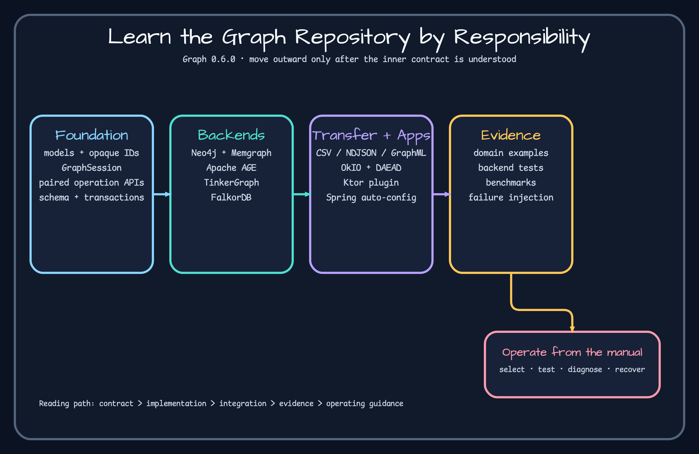

# Repository map

The repository is organized by responsibility, not by one monolithic driver.

| Area | What to learn | Evidence |
|---|---|---|
| `graph/graph-core` | models, repository contracts, schema and algorithms | [`GraphOperations.kt`](https://github.com/bluetape4k/bluetape4k-graph/blob/72c0256e2e1cf61101d29852210e3c827ca93bc0/graph/graph-core/src/main/kotlin/io/bluetape4k/graph/repository/GraphOperations.kt) |
| `graph/graph-*` | backend semantics and adapters | [`Neo4jGraphOperations.kt`](https://github.com/bluetape4k/bluetape4k-graph/blob/72c0256e2e1cf61101d29852210e3c827ca93bc0/graph/graph-neo4j/src/main/kotlin/io/bluetape4k/graph/neo4j/Neo4jGraphOperations.kt) |
| `graph-io/*` | records, formats and bulk transfer | [`GraphBulkImporter.kt`](https://github.com/bluetape4k/bluetape4k-graph/blob/72c0256e2e1cf61101d29852210e3c827ca93bc0/graph-io/core/src/main/kotlin/io/bluetape4k/graph/io/contract/GraphBulkImporter.kt) |
| `ktor`, `spring-boot` | application lifetime integration | [`GraphPlugin.kt`](https://github.com/bluetape4k/bluetape4k-graph/blob/72c0256e2e1cf61101d29852210e3c827ca93bc0/ktor/graph-ktor/src/main/kotlin/io/bluetape4k/graph/ktor/GraphPlugin.kt) |
| `examples` | domain-shaped use and cross-backend tests | [`AbstractCodeGraphTest.kt`](https://github.com/bluetape4k/bluetape4k-graph/blob/72c0256e2e1cf61101d29852210e3c827ca93bc0/examples/code-graph-examples/src/test/kotlin/io/bluetape4k/graph/examples/code/AbstractCodeGraphTest.kt) |
| `benchmark` | workload evidence, not API promises | [`benchmark/README.md`](https://github.com/bluetape4k/bluetape4k-graph/blob/72c0256e2e1cf61101d29852210e3c827ca93bc0/benchmark/README.md) |



Read core contracts before a backend implementation. Then trace one operation from interface to backend test. Example projects are deliberately unpublished; copy their design ideas, not their dependency coordinates or deployment assumptions.

When diagnosing a failure, locate its layer: model validation, repository capability, backend query/transaction, format codec, or application lifecycle. This prevents a driver-specific symptom from being documented as a portable contract.

## Trace one operation through the repository

```bash
rg -n 'fun shortestPath' graph/graph-core graph/graph-neo4j graph/graph-memgraph graph/graph-age graph/graph-tinkerpop graph/graph-falkordb
./gradlew :bluetape4k-graph-core:test --tests '*ShortestPathFallbackTest'
./gradlew :code-graph-examples:test --tests '*TinkerGraphCodeGraphTest'
```

Expected: the contract appears in core, backend implementations or fallbacks supply behavior, and the domain example asserts a concrete path. If core passes but the example fails, inspect schema/data setup. If only one backend fails, inspect its query translation and capability test. If all implementations pass but an application route fails, move outward to framework lifetime and resource ownership.

<!-- release-readme-diagrams:start -->
## Release diagrams {#release-diagrams}

These diagrams are loaded directly from README assets published with the `0.6.0` release and pinned to its immutable commit. They describe this manual's released structure and runtime flows, not later Snapshot changes. Select a preview to open the SVG at the same release commit.

### graph Architecture diagram

[](https://github.com/bluetape4k/bluetape4k-graph/blob/72c0256e2e1cf61101d29852210e3c827ca93bc0/docs/images/readme-diagrams/bluetape4k-graph-architecture-01.svg)

_Release README: [`README.md`](https://github.com/bluetape4k/bluetape4k-graph/blob/72c0256e2e1cf61101d29852210e3c827ca93bc0/README.md)_

### graph Class Structure 2 diagram

[](https://github.com/bluetape4k/bluetape4k-graph/blob/72c0256e2e1cf61101d29852210e3c827ca93bc0/docs/images/readme-diagrams/bluetape4k-graph-class-02.svg)

_Release README: [`README.md`](https://github.com/bluetape4k/bluetape4k-graph/blob/72c0256e2e1cf61101d29852210e3c827ca93bc0/README.md)_

### Backend capability matrix

[](https://github.com/bluetape4k/bluetape4k-graph/blob/72c0256e2e1cf61101d29852210e3c827ca93bc0/docs/images/readme-diagrams/root-readme-backend-capability-matrix-01.svg)

_Release README: [`README.md`](https://github.com/bluetape4k/bluetape4k-graph/blob/72c0256e2e1cf61101d29852210e3c827ca93bc0/README.md)_

### Bluetape4k Graph overview diagram

[](https://github.com/bluetape4k/bluetape4k-graph/blob/72c0256e2e1cf61101d29852210e3c827ca93bc0/docs/images/readme-diagrams/root-readme-overview-01.svg)

_Release README: [`README.md`](https://github.com/bluetape4k/bluetape4k-graph/blob/72c0256e2e1cf61101d29852210e3c827ca93bc0/README.md)_

<!-- release-readme-diagrams:end -->
