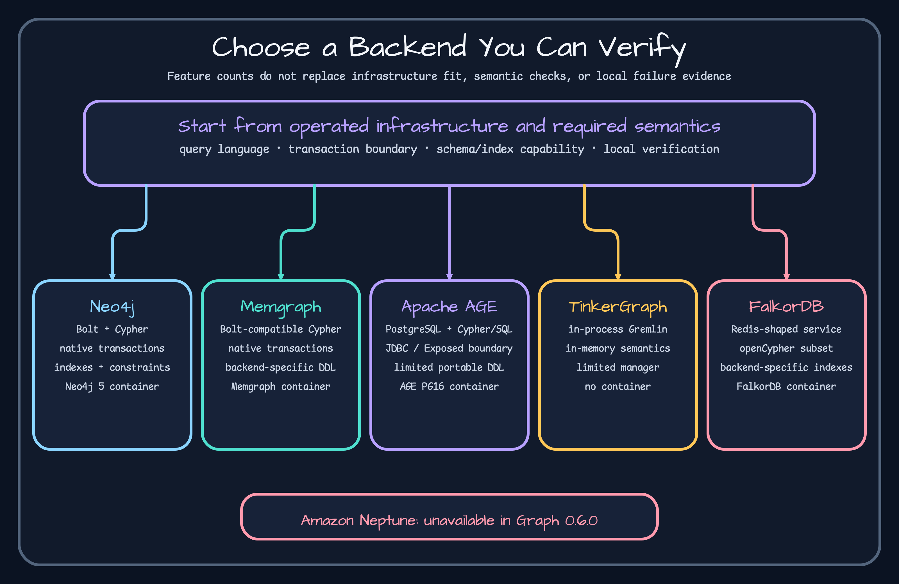

# TinkerPop and TinkerGraph



The 0.6.0 module embeds TinkerGraph and maps the common repository contract onto TinkerPop/Gremlin. It is the fastest local verification path and a useful algorithm/test fixture, but it does not reproduce remote server latency, durability, clustering, or a vendor's transaction model.

Use [`TinkerGraphOperations.kt`](https://github.com/bluetape4k/bluetape4k-graph/blob/72c0256e2e1cf61101d29852210e3c827ca93bc0/graph/graph-tinkerpop/src/main/kotlin/io/bluetape4k/graph/tinkerpop/TinkerGraphOperations.kt) for synchronous work and [`TinkerGraphSuspendOperations.kt`](https://github.com/bluetape4k/bluetape4k-graph/blob/72c0256e2e1cf61101d29852210e3c827ca93bc0/graph/graph-tinkerpop/src/main/kotlin/io/bluetape4k/graph/tinkerpop/TinkerGraphSuspendOperations.kt) for coroutine integration. CRUD/traversal behavior is covered by [`TinkerGraphOperationsTest.kt`](https://github.com/bluetape4k/bluetape4k-graph/blob/72c0256e2e1cf61101d29852210e3c827ca93bc0/graph/graph-tinkerpop/src/test/kotlin/io/bluetape4k/graph/tinkerpop/TinkerGraphOperationsTest.kt); commit and rollback are covered by [`TinkerGraphTransactionTest.kt`](https://github.com/bluetape4k/bluetape4k-graph/blob/72c0256e2e1cf61101d29852210e3c827ca93bc0/graph/graph-tinkerpop/src/test/kotlin/io/bluetape4k/graph/tinkerpop/TinkerGraphTransactionTest.kt).

Prefer it for unit tests, tutorials, and a first graph model. Before moving to another backend, rerun merge, batch, schema, transaction, property-type, and traversal tests there. An in-memory pass proves domain logic, not infrastructure readiness.

## Run and observe the in-memory boundary

```kotlin
dependencies {
    implementation(platform("io.github.bluetape4k:bluetape4k-dependencies:<ecosystem-version>"))
    implementation("io.github.bluetape4k:bluetape4k-graph-tinkerpop")
}

TinkerGraphOperations().use { ops ->
    val a = ops.createVertex("Person", mapOf("name" to "Alice"))
    val b = ops.createVertex("Person", mapOf("name" to "Bob"))
    ops.createEdge(a.id, b.id, "KNOWS")
    check(ops.neighbors(a.id, NeighborOptions(edgeLabel = "KNOWS")).single().id == b.id)
}
```

```bash
./gradlew :bluetape4k-graph-tinkerpop:test --tests '*TinkerGraphTransactionTest'
```

## Observe and diagnose the in-memory limit

Expected: one outgoing neighbor and transaction snapshot rollback on injected failure. No container or network is involved. Therefore connection loss, server concurrency, durability, cluster failover, and remote Gremlin behavior remain untested. If a later backend disagrees, keep the TinkerGraph result as a domain baseline and diagnose the candidate's property types, transaction/schema capability, and query translation. `use` owns the in-memory operations only.
