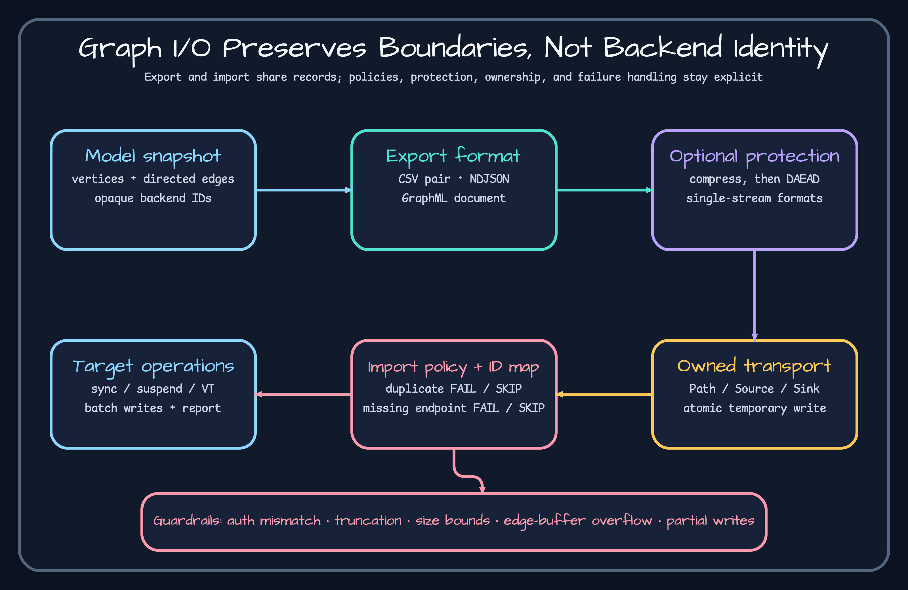

# Formats and external IDs



| Format | Boundary | Good fit | Evidence |
|---|---|---|---|
| CSV | paired vertex/edge files | tabular exchange and inspection | [`CsvRoundTripTest.kt`](https://github.com/bluetape4k/bluetape4k-graph/blob/a405300799b36d4d6edb7267ad07ff34d4ad3afe/graph-io/csv/src/test/kotlin/io/bluetape4k/graph/io/csv/CsvRoundTripTest.kt) |
| Jackson 2 NDJSON | single record stream | Jackson 2 applications | [`Jackson2RoundTripTest.kt`](https://github.com/bluetape4k/bluetape4k-graph/blob/a405300799b36d4d6edb7267ad07ff34d4ad3afe/graph-io/jackson2/src/test/kotlin/io/bluetape4k/graph/io/jackson2/Jackson2RoundTripTest.kt) |
| Jackson 3 NDJSON | single record stream | Jackson 3 applications | [`Jackson3RoundTripTest.kt`](https://github.com/bluetape4k/bluetape4k-graph/blob/a405300799b36d4d6edb7267ad07ff34d4ad3afe/graph-io/jackson3/src/test/kotlin/io/bluetape4k/graph/io/jackson3/Jackson3RoundTripTest.kt) |
| GraphML | XML graph document | interoperable graph tooling | [`GraphMlRoundTripTest.kt`](https://github.com/bluetape4k/bluetape4k-graph/blob/a405300799b36d4d6edb7267ad07ff34d4ad3afe/graph-io/graphml/src/test/kotlin/io/bluetape4k/graph/io/graphml/GraphMlRoundTripTest.kt) |

External IDs are import correlation keys, not backend `GraphElementId` promises. The importer maps source IDs to created vertex IDs so edges can be resolved; see [`GraphIoExternalIdMap.kt`](https://github.com/bluetape4k/bluetape4k-graph/blob/a405300799b36d4d6edb7267ad07ff34d4ad3afe/graph-io/core/src/main/kotlin/io/bluetape4k/graph/io/support/GraphIoExternalIdMap.kt) and its [`tests`](https://github.com/bluetape4k/bluetape4k-graph/blob/a405300799b36d4d6edb7267ad07ff34d4ad3afe/graph-io/core/src/test/kotlin/io/bluetape4k/graph/io/support/GraphIoExternalIdMapTest.kt).

Before transfer, define property-type normalization, duplicate external-ID policy, edge ordering, charset, and malformed-record handling. After transfer, compare report counts, sampled properties, unresolved endpoints, and a cross-format round trip. NDJSON buffers edges that arrive before vertices, so size limits and overflow failures matter; release evidence is in [`Jackson3EdgeBufferOverflowTest.kt`](https://github.com/bluetape4k/bluetape4k-graph/blob/a405300799b36d4d6edb7267ad07ff34d4ad3afe/graph-io/jackson3/src/test/kotlin/io/bluetape4k/graph/io/jackson3/Jackson3EdgeBufferOverflowTest.kt).

## Build and inspect a two-file import

`vertices.csv`:

```csv
id,label,name
u1,Person,Alice
u2,Person,Bob
```

`edges.csv`:

```csv
id,label,from,to,since
e1,KNOWS,u1,u2,2024
```

```kotlin
val source = CsvGraphImportSource(
    GraphImportSource.PathSource(Paths.get("vertices.csv")),
    GraphImportSource.PathSource(Paths.get("edges.csv")),
)
val report = CsvGraphBulkImporter().importGraph(
    source,
    ops,
    GraphImportOptions(
        onDuplicateVertexId = DuplicateVertexPolicy.SKIP,
        onMissingEdgeEndpoint = MissingEndpointPolicy.FAIL,
        preserveExternalIdProperty = "sourceId",
    ),
)
check(report.verticesCreated == 2L && report.edgesCreated == 1L)
```

## Observe output and diagnose bad records

Export with `CsvGraphBulkExporter().exportGraph(CsvGraphExportSink(...), ops, GraphExportOptions(setOf("Person"), setOf("KNOWS")))`; inspect headers and expect two/one written counts. Duplicate `u1` produces `PARTIAL` plus `skippedVertices` under `SKIP`; change edge `to` to `missing` and `FAIL` produces a failure at `READ_EDGE`. With NDJSON, place more early edges than `maxEdgeBufferSize`: expect the buffer-overflow failure rather than unbounded memory. Diagnose record policy and phase before retrying; preserve external IDs so already-created vertices can be reconciled.
