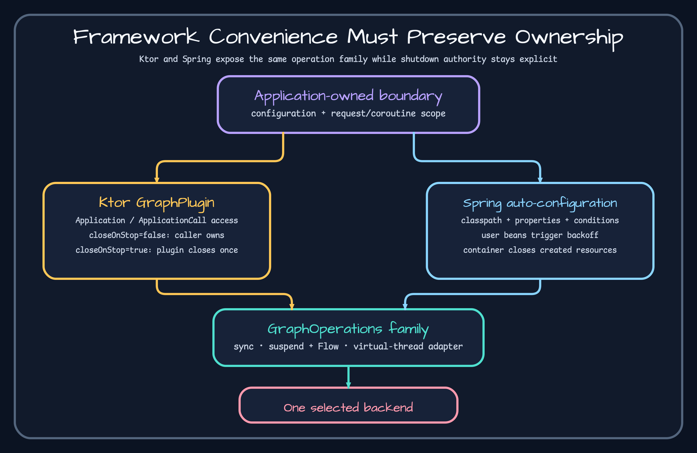

# Spring Boot 연동



`GraphAutoConfiguration`은 `GraphProperties`를 연결하고 백엔드별 설정 순서를 잡는다. 이 클래스가 graph bean을 직접 만들지는 않는다. 백엔드 설정은 별도로 등록되며 classpath, property, 기존 bean 조건에 따라 켜진다. 기준 소스는 [`GraphAutoConfiguration.kt`](https://github.com/bluetape4k/bluetape4k-graph/blob/a405300799b36d4d6edb7267ad07ff34d4ad3afe/spring-boot/graph-spring-boot/src/main/kotlin/io/bluetape4k/graph/spring/boot/autoconfigure/GraphAutoConfiguration.kt)다.

생태계 BOM과 버전 없는 `bluetape4k-graph-spring-boot` 좌표를 쓴다. 의도한 백엔드 하나를 설정하고, bean이 없거나 여러 개면 condition report를 먼저 확인한다. 백엔드별 예는 [`GraphNeo4jAutoConfiguration.kt`](https://github.com/bluetape4k/bluetape4k-graph/blob/a405300799b36d4d6edb7267ad07ff34d4ad3afe/spring-boot/graph-spring-boot/src/main/kotlin/io/bluetape4k/graph/spring/boot/autoconfigure/GraphNeo4jAutoConfiguration.kt), [`GraphAgeAutoConfiguration.kt`](https://github.com/bluetape4k/bluetape4k-graph/blob/a405300799b36d4d6edb7267ad07ff34d4ad3afe/spring-boot/graph-spring-boot/src/main/kotlin/io/bluetape4k/graph/spring/boot/autoconfigure/GraphAgeAutoConfiguration.kt)에 있다.

Spring이 만든 bean은 컨테이너가 관리한다. 외부에서 주입한 자원은 선언된 소유권을 유지한다. property binding, 사용자 bean이 있을 때의 backoff, 백엔드 선택, 종료는 [`GraphNeo4jAutoConfigurationTest.kt`](https://github.com/bluetape4k/bluetape4k-graph/blob/a405300799b36d4d6edb7267ad07ff34d4ad3afe/spring-boot/graph-spring-boot/src/test/kotlin/io/bluetape4k/graph/spring/boot/autoconfigure/GraphNeo4jAutoConfigurationTest.kt) 같은 집중 테스트로 확인한다.

condition 평가, 선택된 백엔드, pool 상태, 종료 순서를 관찰한다. context가 뜬다는 사실만으로 운영 서버 연결까지 검증되지는 않는다.

## 의존성과 property를 정한다

```kotlin
dependencies {
    implementation(platform("io.github.bluetape4k:bluetape4k-dependencies:<ecosystem-version>"))
    implementation("io.github.bluetape4k:bluetape4k-graph-spring-boot")
    implementation("io.github.bluetape4k:bluetape4k-graph-neo4j")
}
```

```yaml
bluetape4k:
  graph:
    backend: neo4j
    neo4j:
      uri: bolt://localhost:7687
      username: neo4j
      password: ${NEO4J_PASSWORD:}
      database: neo4j
```

```kotlin
@Service
class PeopleService(private val graph: GraphSuspendOperations) {
    suspend fun count(): Long = graph.countVertices("Person")
}
```

## bean과 종료를 확인한다

기본 설정이면 `Driver`, `GraphOperations`, `GraphSuspendOperations`, `GraphVirtualThreadOperations`가 생겨야 한다. 사용자 `Driver` bean을 하나 등록했을 때 auto-configuration이 새 Driver를 만들지 않고 재사용하는지도 확인한다.

```bash
./gradlew :bluetape4k-graph-spring-boot:test --tests '*GraphNeo4jAutoConfigurationTest'
```

service bean이 없으면 `--debug`로 condition report를 열고 backend property, 필요한 class, 기존 `GraphOperations` bean, backend property 상세 순서로 본다. 자동 생성 Driver에는 `destroyMethod="close"`가 있으므로 context 종료 뒤 close 검증을 확인한다. 사용자가 만든 Driver는 그 bean에 선언한 종료 계약을 따른다. graph 라이브러리가 소유권을 임의로 가져간다고 가정하지 않는다.
