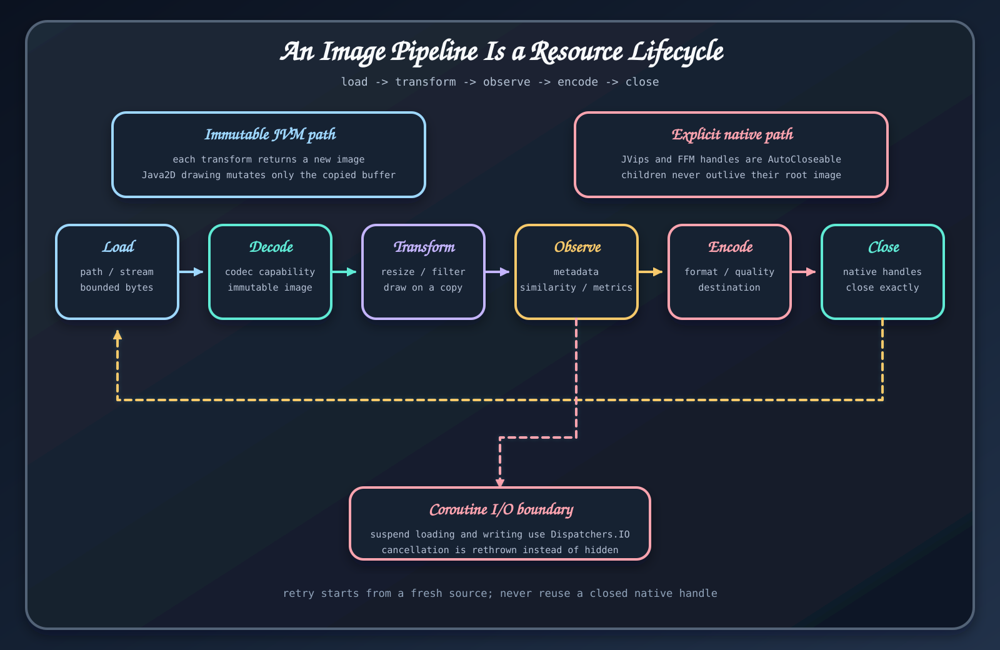

# 런타임 경계

이미지 처리는 힙, 파일, 네트워크, 네이티브 메모리 경계를 오간다. API 호출이 성공했다고 해서 자원 소유권까지 올바른 것은 아니다.

## JVM 이미지 경계

<code>ImmutableImage</code> 연산은 새 값을 반환한다. 다만 입력 스트림, Okio 소스, 임시 파일과 출력 싱크는 도우미가 종료를 명시하지 않는 한 호출자가 관리한다. 전체 픽셀 버퍼를 할당하기 전에 이미지 크기와 인코딩된 입력의 최대 크기를 제한해야 한다.

## Native libvips 경계

<code>VipsImage</code>는 <code>AutoCloseable</code>을 구현한다. 읽어 온 이미지와 연산으로 만든 네이티브 이미지는 모두 닫아야 하며, 보통 <code>use</code>로 범위를 묶는다. 선택한 <code>VipsRuntime</code>은 프로세스에서 한 번 초기화하고, 이미지와 작업 실행이 모두 끝난 뒤 종료한다.

호환성을 위해 <code>java21</code> 모듈 이름으로 배포하는 JVips JNI 구현은 JDK 25, JVips/JNI와 시스템 libvips가 필요하다. FFM 구현도 JDK 25, 시스템 libvips와 <code>--enable-native-access=ALL-UNNAMED</code>이 필요하다. 자세한 내용은 [native 자원 수명 주기](../guides/native-resource-lifecycle.md)를 참고한다.

## OCR 경계

OCR은 Tess4J와 실행 환경의 Tesseract를 쓴다. 프로세스에서 네이티브 엔진과 요청한 traineddata 파일을 찾을 수 있어야 한다. <code>OcrOptions</code>에 언어 이름을 넣어도 해당 데이터가 설치되어 있지 않으면 실행되지 않는다. 기본 엔진은 호출마다 Tesseract 인스턴스를 만들어 변경 가능한 네이티브 상태를 공유하지 않지만, 동시 실행 제한과 타임아웃은 애플리케이션이 정해야 한다.

## 프레임워크와 스토리지 경계

Ktor 라우트 도우미는 애플리케이션의 JSON이나 오류 처리 정책을 대신 설치하지 않는다. Spring Boot 자동 구성은 설정에 따라 저장소, 상태 점검, 메트릭과 선택적 CDN 구성 요소를 만들지만, 자격 증명, 파일 권한, S3 버킷 정책, CloudFront 키, 업로드 제한과 종료 순서는 애플리케이션 책임이다.

## 운영에서 답해야 할 질문

각 경로마다 다음을 문서로 남긴다.

1. 어느 코드가 자원을 열고 닫는가
2. 디코딩 전에 어떤 제한을 적용하는가
3. 배포 환경이 어떤 네이티브 패키지와 데이터 파일을 제공하는가
4. 취소, 부분 쓰기와 종료를 어느 테스트가 검증하는가

## 근거 소스

- [VipsImage 수명 주기 계약](https://github.com/bluetape4k/bluetape4k-image/blob/ea5175b083babf8880f53cf80c9a264a0c61777e/images-vips-api/src/main/kotlin/io/bluetape4k/images/vips/VipsImage.kt)
- [OCR 엔진 구현](https://github.com/bluetape4k/bluetape4k-image/blob/ea5175b083babf8880f53cf80c9a264a0c61777e/images-ocr/src/main/kotlin/io/bluetape4k/images/ocr/TesseractOcrEngine.kt)
