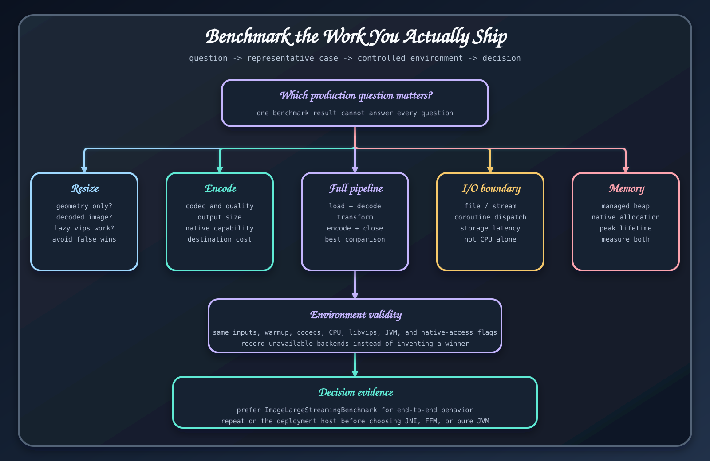

# 벤치마크 결과 해석

벤치마크 프로젝트는 실행 가능한 근거 자료이며 배포 의존성이 아니다. 0.4.0에서 제공하는 Scrimage와 libvips 처리, I/O와 메모리 할당 경계를 비교한다.

## 무엇을 측정했는지 확인하기

리사이즈, 인코딩, 필터, 연산 순서, 파일 I/O, 대용량 스트리밍, 메모리 프로파일은 서로 다른 질문에 답한다. 차트의 숫자를 쓰기 전에 벤치마크 클래스와 테스트 이미지를 읽는다. 인코딩 행에는 코덱 비용이 들어가지만 리사이즈 행에는 없을 수 있다. 처리량은 높을수록 좋지만 평균 시간은 낮을수록 좋다.

## 실행 환경을 함께 남기기

JDK, 운영체제, CPU, libvips 버전, 선택한 <code>vips.impl</code>, 이미지 크기와 내용, 코덱 품질, 워밍업, 반복 횟수, 포크, 지표 단위를 기록한다. 저장소 보고서는 문서에 적힌 로컬 환경의 측정값이다. 클라우드 인스턴스, 컨테이너, 동시 요청의 성능까지 증명하지는 않는다.

## 보고서를 선택으로 연결하기

1. 대상 연산과 가장 가까운 보고서를 찾는다.
2. 사용할 JDK와 네이티브 백엔드에서 태스크를 재현한다.
3. 애플리케이션을 대표하는 테스트 이미지를 추가하거나 교체한다.
4. 저장소와 프레임워크 경계를 포함한다.
5. 지연 시간 백분위수, 처리량, JVM 힙, 네이티브 메모리와 출력 크기를 측정한다.
6. 목표를 만족하는 가장 단순한 백엔드를 고른다.

대용량 스트리밍과 메모리 보고서는 특히 조심해서 읽는다. 관리 힙 할당량은 네이티브 메모리 전체를 포함하지 않는다. 또한 Okio API를 쓴다고 디코딩한 픽셀까지 스트리밍 상태로 유지되는 것은 아니다.

## 재현 방법

현재 벤치마크 모듈은 JDK 25에서 실행하고 <code>-Pvips.impl</code> 값으로 백엔드를 선택한다. 동결된 릴리스 근거에는 과거 Java 21 행이 남을 수 있으므로 label과 실행 환경 설명은 보존하되 현재 런타임 기준으로 제시하지 않는다. 릴리스 안내서의 집중 측정 태스크를 실행하고 원본 JSON과 환경 설명을 함께 보관한다. 변경된 `develop` 소스의 결과를 동결한 매뉴얼의 주장에 섞으면 안 된다.

## 근거 소스

- [벤치마크 모듈 안내](https://github.com/bluetape4k/bluetape4k-image/blob/ea5175b083babf8880f53cf80c9a264a0c61777e/benchmark/images-benchmark/README.ko.md)
- [0.4.0 보고서와 raw 자료](https://github.com/bluetape4k/bluetape4k-image/tree/ea5175b083babf8880f53cf80c9a264a0c61777e/benchmark/images-benchmark/docs)
