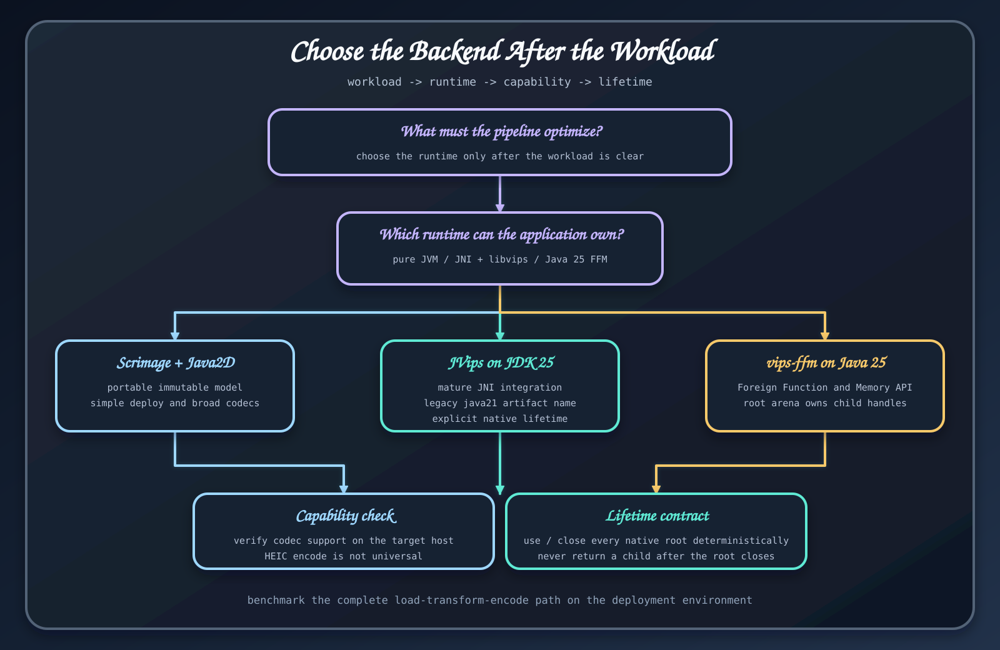

# 백엔드 선택

네이티브 코드가 언제나 빠를 거라는 기대만으로 백엔드를 고르면 안 된다. 배포 조건과 실제 작업을 측정한 결과로 결정한다.

| 경로 | 잘 맞는 작업 | 런타임 조건 | 자원 소유 |
|---|---|---|---|
| <code>bluetape4k-images</code> | 이식 가능한 필터, 변환, 분석, JVM 서비스 | JDK 25, libvips 불필요 | JVM 값과 호출자가 관리하는 스트림 |
| JDK 25 JVips JNI (legacy <code>java21</code> artifact) | JDK 25에서 네이티브 리사이즈, 썸네일, 자르기, 인코딩 | 시스템 libvips와 JNI | 모든 <code>VipsImage</code>를 닫음 |
| JDK 25 FFM | JDK 25 배포 환경의 네이티브 처리 | 시스템 libvips와 native-access 옵션 | 이미지와 런타임 종료를 관리 |

## Scrimage가 맞는 경우

불변 이미지 도우미, Java2D 그리기, 필터 DSL, 유사도 알고리즘, OCR 입력이 필요하거나 네이티브 패키지를 설치할 수 없다면 Scrimage 경로를 쓴다. 첫 구현을 만들기도 가장 쉽다. [기본 처리 워크숍](../modules/basic-processing.md)도 이 경로를 사용한다.

## libvips가 맞는 경우

리사이즈, 자르기, 썸네일이나 인코딩이 작업의 대부분을 차지하고 서비스에서 libvips를 설치하고 관측할 수 있다면 검토한다. 대상 실행 환경에서 실제 코덱을 확인해야 한다. 라이브러리 API가 포맷을 안다는 사실과 설치된 libvips가 그 포맷을 처리한다는 사실은 다르다.

시스템 libvips와 JNI 바인딩을 사용할 수 있으면 [JDK 25 JVips JNI](../native/java21-jni.md)를 고른다. JDK 25와 <code>--enable-native-access=ALL-UNNAMED</code>을 배포 계약에 넣을 수 있으면 [JDK 25 FFM](../native/java25-ffm.md)을 고른다.

## 백엔드 둘을 무심코 배포하지 않기

편하다는 이유로 네이티브 구현 두 개를 일반 런타임 클래스패스에 함께 넣지 않는다. 컴파일에는 공통 [Vips API](../native/vips-api.md)를 쓰고 구현은 하나만 명시적으로 선택한다. 마이그레이션 검증이나 벤치마크에서는 둘을 비교할 수 있지만 운영 소유권은 하나로 정해야 한다.

## 측정해서 결정하기

저장소 벤치마크는 방향을 잡는 자료로 쓰고, 실제 서비스의 대표 이미지, 동시 실행 수, 파일과 네트워크 경계, 메모리를 다시 측정한다. [성능 선택](performance-selection.md)에 판단 절차를 정리했다.

## 근거 소스

- [릴리스 백엔드 개요](https://github.com/bluetape4k/bluetape4k-image/blob/ea5175b083babf8880f53cf80c9a264a0c61777e/README.ko.md#아키텍처)
- [벤치마크 문서](https://github.com/bluetape4k/bluetape4k-image/blob/ea5175b083babf8880f53cf80c9a264a0c61777e/benchmark/images-benchmark/README.ko.md)
