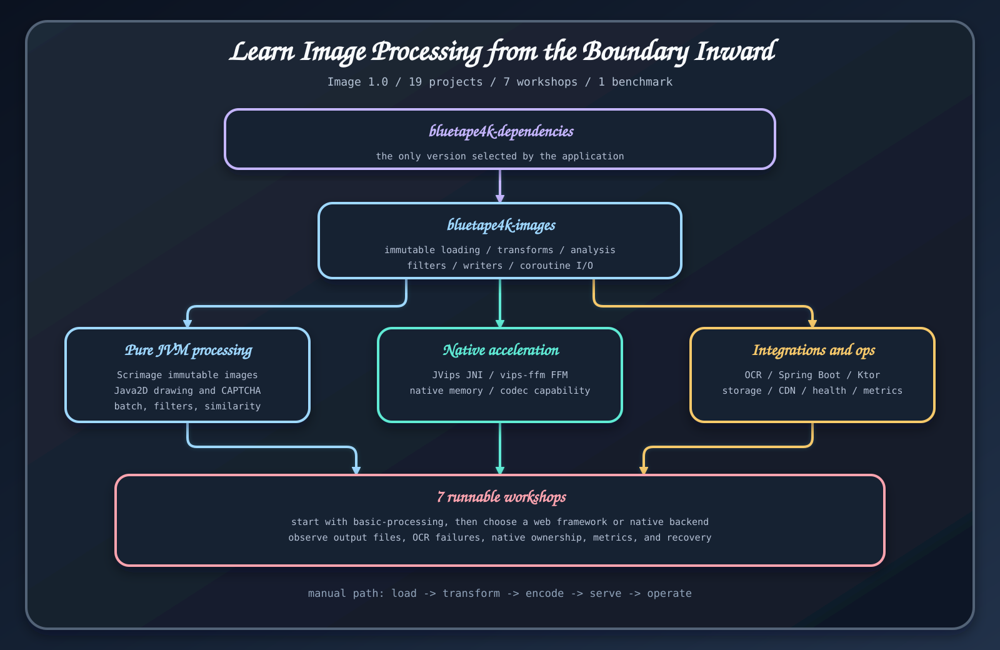

# 이미지 처리 학습 경로

이 매뉴얼에는 선택 기준과 API 설명, 실행 예제, 장애 진단과 운영 조건이 들어 있다. 프로젝트를 이름순으로 훑기보다 아직 결정하지 못한 지점에서 시작하자.

## 1. JVM 기본 처리 완성하기

[시작하기](../getting-started.md), [불변 이미지 모델](../core/immutable-image-model.md), [로드와 저장](../core/loading-and-writing.md)을 읽는다. [기본 이미지 처리 워크숍](../modules/basic-processing.md)을 실행해 이미지 하나를 읽고, 변환하고, 저장하는 경로를 끝까지 확인한다.

## 2. 필요한 기능만 더하기

[변환과 필터](../core/transforms-and-filters.md)나 [분석과 유사도](../core/analysis-and-similarity.md)로 이어간다. 서비스에서 챌린지나 문자 추출이 필요하면 [CAPTCHA](../integrations/captcha.md) 또는 [OCR](../integrations/ocr.md)을 추가한다. 두 기능은 각각 별도 의존성과 런타임 조건을 갖는다.

## 3. 애플리케이션 경계 고르기

[Spring Boot와 Ktor 비교](spring-vs-ktor.md)를 읽고 프레임워크 예제 하나를 완성한다.

- 썸네일과 CAPTCHA 라우트는 [Ktor 이미지 API](../modules/ktor-image-api.md)
- 저장, 업로드와 다운로드는 [Spring Boot 이미지 API](../modules/spring-boot-image-api.md)
- 실행 환경에 Tesseract를 준비한 뒤에는 [Ktor OCR](../modules/ktor-ocr-api.md) 또는 [Spring Boot OCR](../modules/spring-boot-ocr-api.md)

## 4. 이유가 있을 때 native 처리로 옮기기

[백엔드 선택](backend-selection.md), [Vips API](../native/vips-api.md), [native 자원 수명 주기](native-resource-lifecycle.md)를 읽는다. 네이티브 패키지 조건에 맞춰 JDK 25 JVips JNI(legacy `java21` artifact) 또는 JDK 25 FFM을 고른다. 연산으로 만든 이미지도 빠짐없이 닫는다.

## 5. 운영 경계 검증하기

마지막으로 [테스트와 운영](testing-and-operations.md), [실패 진단](failure-diagnosis.md), [성능 선택](performance-selection.md)을 읽는다. 입력 제한, 네이티브 선행 조건, 자원 소유권, 스토리지 정책과 백엔드 선택을 뒷받침하는 벤치마크나 부하 테스트를 기록한다.

여기까지 마치면 어떤 백엔드가 각 작업을 맡는지, 자원을 누가 닫는지, 디코딩 전에 어떤 입력을 거부하는지, 배포 경계를 어느 테스트가 증명하는지 답할 수 있어야 한다.

## 근거 소스

- [릴리스 실행 예제](https://github.com/bluetape4k/bluetape4k-image/tree/ea5175b083babf8880f53cf80c9a264a0c61777e/examples)
- [릴리스 모듈 안내](https://github.com/bluetape4k/bluetape4k-image/blob/ea5175b083babf8880f53cf80c9a264a0c61777e/README.ko.md#모듈-구성)
