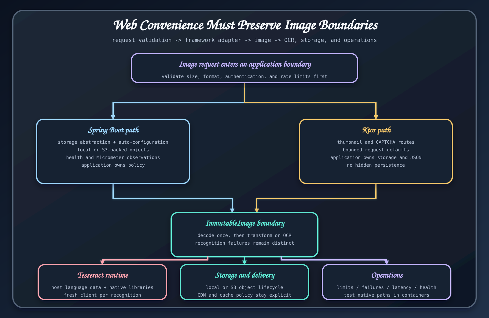

# OCR 연동

<code>bluetape4k-images-ocr</code>는 핵심 <code>ImmutableImage</code> 모델에 Tesseract 문자 추출을 더한다. OCR에는 일반 이미지 처리에 필요 없는 네이티브 패키지, 언어 데이터, 지연 시간과 운영 실패 유형이 따라오므로 별도 모듈로 분리되어 있다.

## API 모델

<code>OcrOptions</code>에서 언어와 엔진 동작을 고른다. <code>OcrResult</code>는 인식한 텍스트와 결과 데이터를 담는다. <code>TesseractOcrEngine</code>이 엔진을 구현하며 기존 이미지 값에서는 <code>ImmutableImage.extractText</code>로 바로 호출할 수 있다.

통제된 배포 환경에서는 언어와 데이터 경로를 명시한다. 입력 정규화나 리사이즈는 처리할 문서 종류에서 실제로 인식률을 높일 때만 적용한다. 강한 필터는 잡음뿐 아니라 글자 획도 지울 수 있다.

## 서비스 설계

업로드 바이트, 디코딩 크기, OCR 동시 실행 수와 요청 시간을 제한한다. 큰 문서나 처리 시간이 일정하지 않은 경우 작업 대기열이 더 잘 맞는다. 원본 이미지와 추출한 텍스트에는 같은 개인정보와 보존 정책을 적용한다. 텍스트는 이미지보다 검색하기 쉬워 노출 범위가 더 커질 수 있다.

설정 실패, 엔진 실패, 빈 인식 결과와 요청 검증 실패를 구분한다. 잘못된 포맷이나 지원하지 않는 입력을 무한 재시도하지 않는다.

## 실행 예제로 익히기

[OCR 설정](../guides/ocr-setup.md)을 먼저 끝낸다. 이후 [Ktor OCR](../modules/ktor-ocr-api.md)이나 [Spring Boot OCR](../modules/spring-boot-ocr-api.md) 워크숍을 실행하고 애플리케이션 코드와 테스트를 함께 읽는다.

## 근거 소스

- [OCR 계약](https://github.com/bluetape4k/bluetape4k-image/tree/ea5175b083babf8880f53cf80c9a264a0c61777e/images-ocr/src/main/kotlin/io/bluetape4k/images/ocr)
- [OCR 모듈 문서](../modules/bluetape4k-images-ocr.md)
