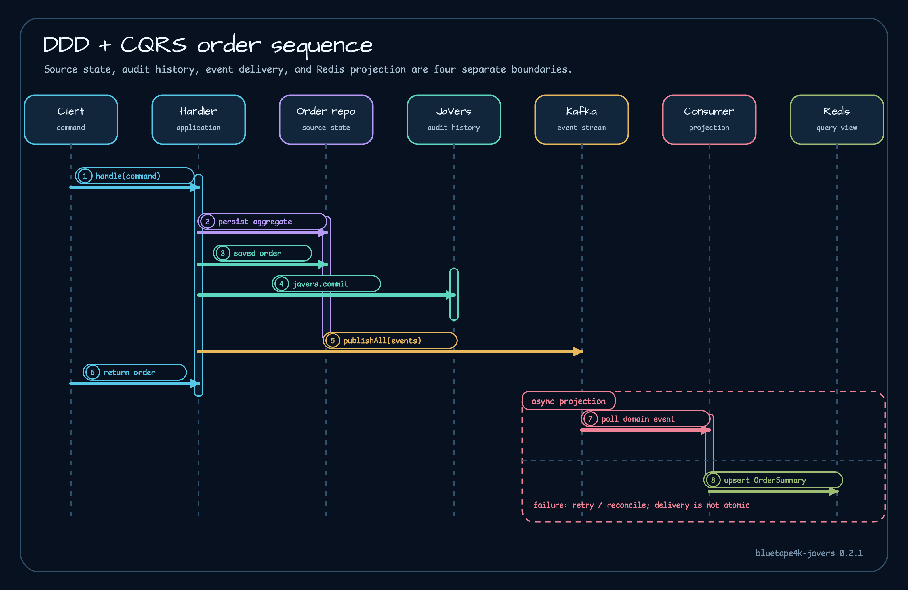

# DDD and CQRS

The 0.3.0 example answers one concrete question: in what order does a command-side service save business state, record audit history, publish an event, and update a query projection?

`AggregateRepository.save` executes:

1. subclass `persist(aggregate)` writes the domain source of truth;
2. `javers.commit(author, saved, eventProperties)` stores the audit commit;
3. `DomainEventPublisher.publishAll` publishes events in iteration order;
4. a Kafka consumer later applies the event to `RedisOrderSummaryProjection`.

The sequence is proven by [`AggregateRepository.kt`](https://github.com/bluetape4k/bluetape4k-javers/blob/978d0490fc438570e7520643aed50e20614772d1/javers-ddd/src/main/kotlin/io/bluetape4k/javers/ddd/AggregateRepository.kt), the example [`OrderRepository.kt`](https://github.com/bluetape4k/bluetape4k-javers/blob/978d0490fc438570e7520643aed50e20614772d1/examples/javers-exposed-ddd/src/main/kotlin/io/bluetape4k/javers/examples/exposedddd/persistence/OrderRepository.kt), and [`OrderProjectionFlowTest.kt`](https://github.com/bluetape4k/bluetape4k-javers/blob/978d0490fc438570e7520643aed50e20614772d1/examples/javers-exposed-ddd/src/test/kotlin/io/bluetape4k/javers/examples/exposedddd/OrderProjectionFlowTest.kt).

The example teaches responsibility and ordering. It does not make the database writes and Kafka send atomic. If domain persistence succeeds and the JaVers commit fails, current state can exist without audit history. If both succeed and publication fails, no projection event is delivered. If the consumer fails after Redis changes but before offset progress, it may apply the event again. `OrderMarkedPaid` also requires an existing summary, so missing or reordered `OrderPlaced` fails instead of repairing automatically.

Production systems should add a transactional outbox or equivalent recovery record, stable event IDs, idempotent projection writes, controlled offset commits, dead-letter/retry policy, replay tools, and reconciliation between domain state, audit history, and Redis. `javers-ddd` helps this JaVers workflow; it is not the generic DDD contract owner for bluetape4k.

Continue with [failure contracts](../operations/failure-contracts.md) and [testing](testing.md).
