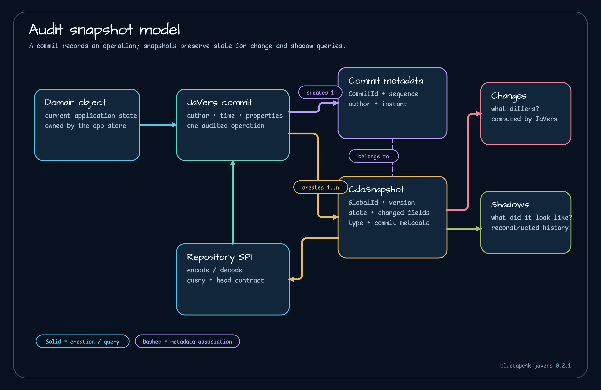

# 감사 모델

JaVers 감사 기록은 업무 테이블을 한 번 더 복사한 데이터가 아닙니다. 커밋은 한 번의 감사 작업을 설명하고, 스냅샷은 그 커밋 시점의 객체 상태를 담습니다. 변경 내역은 두 상태의 차이를 보여 주며, 섀도는 스냅샷에서 과거 객체를 복원합니다.

## Commit과 스냅샷

`javers.commit(author, object, properties)`를 호출하면 커밋 메타데이터와 `CdoSnapshot`이 생깁니다. 메타데이터에는 커밋 ID, 작성자, 시각, 문자열 속성이 들어갑니다. [`CommitMetadataExtensions.kt`](https://github.com/bluetape4k/bluetape4k-javers/blob/6648b73333cb665ecba0340588dbc3556c308a52/javers-core/src/main/kotlin/io/bluetape4k/javers/commit/CommitMetadataExtensions.kt)는 커밋 ID의 주 번호와 부 번호, epoch 밀리초 시각을 제공합니다.

스냅샷에는 `GlobalId`, 버전, 상태, 변경된 프로퍼티 이름, 유형, 커밋 메타데이터가 들어갑니다. `loadSnapshots`는 같은 GlobalId의 스냅샷을 최신순으로 돌려줍니다. 다만 일반 JQL 조회도 내부에서 모든 키와 스냅샷을 메모리에 올린 뒤 걸러냅니다. 키가 10,000개를 넘으면 경고하지만 SQL 조건으로 밀어 넣지는 않습니다.

## 변경 내역과 섀도

변경 내역은 “무엇이 달라졌나”에 답하고, 섀도는 “그때 객체가 어떤 모습이었나”에 답합니다. 섀도는 현재 엔티티가 아닙니다. [`SnapshotToShadowTest.kt`](https://github.com/bluetape4k/bluetape4k-javers/blob/6648b73333cb665ecba0340588dbc3556c308a52/javers-core/src/test/kotlin/io/bluetape4k/javers/SnapshotToShadowTest.kt)가 이 복원을 검증합니다. [`ShadowProvider.kt`](https://github.com/bluetape4k/bluetape4k-javers/blob/6648b73333cb665ecba0340588dbc3556c308a52/javers-core/src/main/kotlin/io/bluetape4k/javers/ShadowProvider.kt)는 JaVers 내부 `typeMapper`를 리플렉션으로 읽으므로 JaVers 내부 구조가 바뀌면 `IllegalStateException`이 날 수 있습니다.

## Codec과 저장소 계약

`JaversCodec<T>`는 JaVers `JsonObject`를 저장 형식으로 바꿉니다. 문자열, 압축 문자열, 바이너리, 압축 바이너리, 맵 코덱은 [`JaversCodecs.kt`](https://github.com/bluetape4k/bluetape4k-javers/blob/6648b73333cb665ecba0340588dbc3556c308a52/javers-core/src/main/kotlin/io/bluetape4k/javers/codecs/JaversCodecs.kt)에 있습니다. 디코딩 실패를 `null`로 돌려주는 코덱도 있어 손상된 스냅샷이 조회 결과에서 빠질 수 있습니다. 다음은 [저장소 조합](repository-composition.md)입니다.
