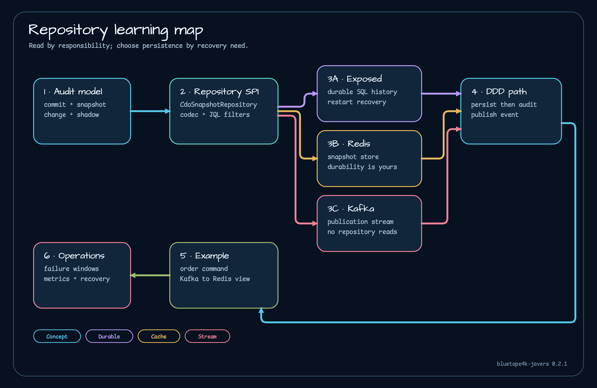

# bluetape4k-javers 0.2 매뉴얼

애플리케이션의 현재 상태, 감사 이력, 조회용 프로젝션을 한 저장소의 역할로 묶으면 장애 복구 기준이 흐려집니다. `bluetape4k-javers` 0.3.0은 Exposed, Redis, Kafka를 JaVers에 연결하지만 세 방식이 맡는 일은 서로 다릅니다. 이 매뉴얼은 기능 목록보다 먼저 그 경계를 설명합니다.

## 핵심 기능

- **감사 스냅샷과 변경 비교:** [감사 모델](architecture/audit-model.md)에서 JaVers 커밋, 스냅샷, 변경 내역, 섀도와 이를 이용한 조회 규칙을 설명합니다.
- **DDD 애그리게이트 이력:** [javers-ddd](modules/javers-ddd.md)와 [DDD·CQRS 가이드](guides/ddd-and-cqrs.md)가 애그리게이트 명령과 도메인 이벤트를 명시적인 JaVers 커밋으로 연결합니다.
- **관계형 영속성:** [Exposed 영속 방식](persistence/exposed.md)은 복구 가능한 CDO 스냅샷을 JDBC 데이터베이스에 저장하되 애플리케이션의 Exposed 저장소를 대신하지 않습니다.
- **Redis·Kafka 어댑터:** [Redis](persistence/redis.md)는 캐시와 조회 모델 경로를, [Kafka](persistence/kafka.md)는 하위 소비자를 위한 감사 레코드 발행을 맡습니다. 어느 쪽도 업무 원본으로 암묵적으로 바뀌지 않습니다.
- **실패와 관측성 계약:** [실패 계약](operations/failure-contracts.md)과 [관측성](operations/observability.md)에서 부분 쓰기, 재시도, 지연, 복구 신호를 정합니다.
- **실행 예제와 비교 자료:** [Exposed DDD 예제](examples/javers-exposed-ddd.md)와 [JaVers·Exposed DDD·Envers 비교](benchmarks/exposed-ddd-envers.md)를 통해 추상화가 실제 코드와 측정 근거로 어떻게 이어지는지 확인할 수 있습니다.

설명 기준은 `0.3.0` 릴리스와 커밋 `978d0490fc438570e7520643aed50e20614772d1`입니다. Ktor 연동, Spring Boot 4 자동 구성과 예제, 전용 Gradle 벤치마크 모듈은 0.3.0 뒤에 추가됐으므로 0.2 기능으로 다루지 않습니다.

## 릴리스 구성 한눈에 보기

아래 그림은 `0.3.0` 배포 커밋의 README 자산을 직접 불러옵니다. 이 매뉴얼 버전에서 사용할 수 있는 구조만 보여 주며, 이후 Snapshot에 추가된 모듈과 연결 관계는 일부러 넣지 않았습니다. 미리보기를 누르면 같은 배포 커밋의 SVG 원본이 열립니다.

## 학습 지도

## 어디서 시작할까

- [시작하기](getting-started.md): 생태계 버전 하나로 의존성을 맞추고 Exposed 기반 감사 저장소를 구성합니다.
- [저장소 지도](architecture/repository-map.md): 모듈마다 맡는 책임과 맡지 않는 책임을 구분합니다.
- [영속 방식 선택](persistence/selection-guide.md): 복구와 조회 요구를 기준으로 Exposed, Redis, Kafka를 고릅니다.
- [학습 경로](guides/learning-path.md): 개발자, 연동 담당자, 운영자에게 맞는 읽기 순서를 안내합니다.

JaVers 데이터 구조가 먼저 궁금하면 [감사 모델](architecture/audit-model.md)을 읽으세요. 여러 저장 경로를 엮는다면 [저장소 조합](architecture/repository-composition.md)과 [실패 계약](operations/failure-contracts.md)을 먼저 확인해야 합니다. 명령에서 Redis 프로젝션까지 이어지는 흐름은 [DDD와 CQRS](guides/ddd-and-cqrs.md)에 있습니다.

## 구조, 영속 방식, 운영

- [감사 모델](architecture/audit-model.md)은 커밋, 스냅샷, 변경 내역, 섀도의 차이를 설명합니다.
- [저장소 조합](architecture/repository-composition.md)은 업무 원본과 각 어댑터의 책임 경계를 다룹니다.
- [영속 방식 선택](persistence/selection-guide.md)은 Exposed, Redis, Kafka의 복구 계약을 비교합니다.
- [Exposed](persistence/exposed.md), [Redis](persistence/redis.md), [Kafka](persistence/kafka.md) 문서에서는 각 어댑터의 구현과 운영 기준을 더 자세히 설명합니다.
- [실패 계약](operations/failure-contracts.md)과 [관측성](operations/observability.md)은 장애를 감지하고 복구하는 기준을 정리합니다.

## 모듈과 실행 예제

- 기반 모듈: [Javers BOM](modules/bluetape4k-javers-bom.md), [javers-core](modules/javers-core.md), [javers-ddd](modules/javers-ddd.md)
- 영속 모듈: [javers-exposed](modules/javers-exposed.md), [javers-persistence-redis](modules/javers-persistence-redis.md), [javers-persistence-kafka](modules/javers-persistence-kafka.md)
- 예제: [JaVers + Exposed DDD 주문 처리 흐름](examples/javers-exposed-ddd.md)
- 벤치마크: [측정 결과를 읽는 방법](benchmarks/overview.md), [JaVers·Exposed DDD·Envers 비교](benchmarks/exposed-ddd-envers.md)
- 생태계 확장: [Exposed와 애플리케이션 구조로 이어지는 경로](guides/cross-repository-paths.md)

동작 기준은 릴리스 소스입니다. 출발점은 [`CdoSnapshotRepository`](https://github.com/bluetape4k/bluetape4k-javers/blob/978d0490fc438570e7520643aed50e20614772d1/javers-core/src/main/kotlin/io/bluetape4k/javers/repository/CdoSnapshotRepository.kt), [`AggregateRepository`](https://github.com/bluetape4k/bluetape4k-javers/blob/978d0490fc438570e7520643aed50e20614772d1/javers-ddd/src/main/kotlin/io/bluetape4k/javers/ddd/AggregateRepository.kt), [`javers-exposed-ddd` 예제](https://github.com/bluetape4k/bluetape4k-javers/tree/0.3.0/examples/javers-exposed-ddd)입니다.
