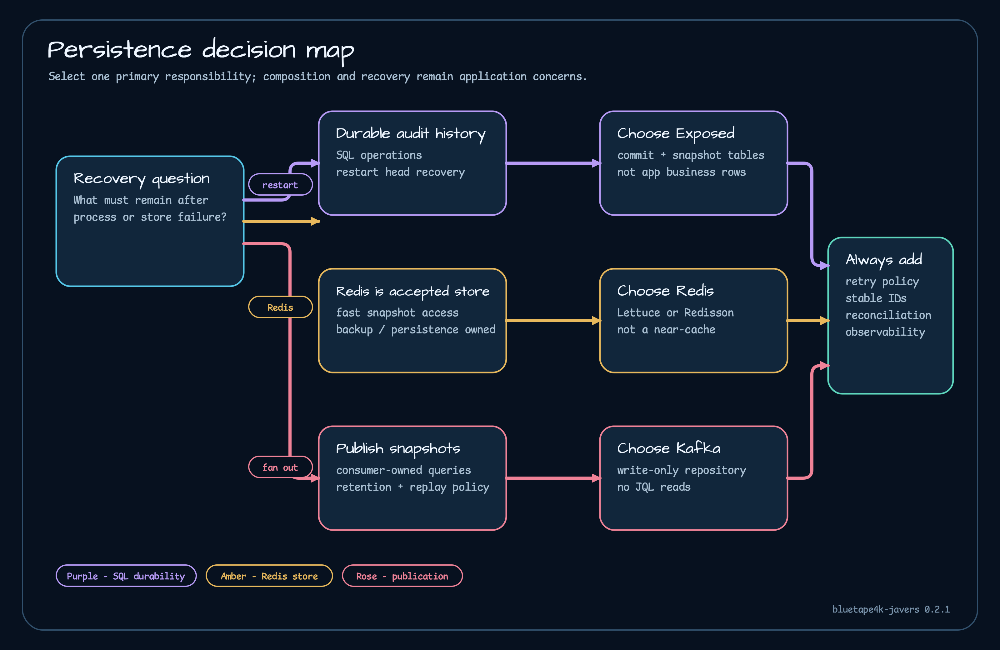

# 영속 방식 선택

평상시 응답 속도보다 장애 뒤 어떤 질문에 답해야 하는지를 기준으로 저장소를 고릅니다.

| 기준 | Exposed | Redis | Kafka 저장소 |
| --- | --- | --- | --- |
| 주 역할 | SQL 기반 감사 이력 | Redis 기반 스냅샷 이력 | 스냅샷 발행 스트림 |
| 조회 | JaVers 조회, 일부는 메모리 필터 | Redis 키와 목록을 읽은 뒤 JaVers 조회 | 읽기 불가, 빈 값 반환 |
| 순서 | 스냅샷 버전과 커밋 순서 | 목록 순서와 커밋 순서 | producer/partition 범위 |
| 재처리 | DB 복원·조회, 이벤트 재생 엔진은 아님 | Redis 영속 설정 또는 외부 재구축 | 보존된 레코드를 소비자가 재생 가능 |
| 운영 책임 | DB와 스키마 운영자 | Redis 내구성·backup 운영자 | producer, topic, 소비자, 프로젝션 운영자 |

감사 이력을 DB에 오래 남겨야 하면 [Exposed](exposed.md), Redis를 스냅샷 저장소로 운영할 준비가 돼 있으면 [Redis](redis.md)를 선택합니다. [Kafka](kafka.md)는 인코딩한 스냅샷 발행이 목적이고 별도 소비자와 조회 모델을 운영할 때만 고릅니다.

세 방식 모두 종단 간 exactly-once를 보장하지 않습니다. Exposed는 여러 트랜잭션으로 나뉘고, Redis는 스냅샷과 순서 구조를 따로 갱신하며, Kafka는 전송 결과를 최대 30초 기다립니다. 재시도와 보정은 GlobalId, 스냅샷 버전, 커밋 ID, 애그리거트 ID, 소비자 오프셋을 기준으로 설계하세요.

여러 방식을 섞기 전에는 [저장소 조합](../architecture/repository-composition.md)과 [실패 계약](../operations/failure-contracts.md)을 확인해야 합니다.
