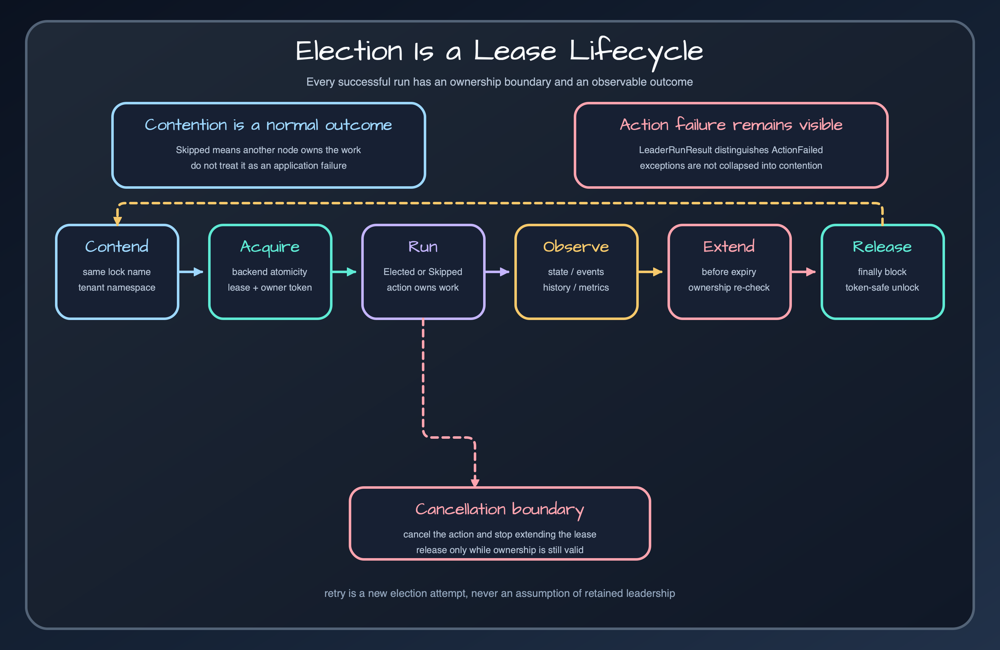

# Runtime model

Trace one election from contender entry through ownership, action execution, observation, and release.

## The critical path

An elector validates the lock name, waits up to `waitTime`, and asks its backend to acquire ownership atomically. A failed acquire publishes a skipped signal and returns `null` or `LeaderRunResult.Skipped`. A successful acquire creates a scoped lock handle, publishes elected, runs the action, records completion or failure, then releases only with matching ownership.

## Lease is not a transaction

Leadership prevents another compliant contender from entering the guarded section during the valid lease. It does not roll back external writes and it cannot stop work after a process pause or network partition. The action must therefore be idempotent, and destructive downstream systems should validate a fencing token where available.

## Observation is best effort

`state(lockName)` and event streams help operators understand the system, but they are snapshots. Never read state and then decide that acquisition is safe; only the backend's atomic acquire path owns that decision. `leaseUntil` can be absent or approximate depending on the backend.

## Release sources

- [`leader-core/src/main/kotlin/io/bluetape4k/leader/LeaderElector.kt`](../../../../leader-core/src/main/kotlin/io/bluetape4k/leader/LeaderElector.kt)
- [`leader-core/src/main/kotlin/io/bluetape4k/leader/LeaderState.kt`](../../../../leader-core/src/main/kotlin/io/bluetape4k/leader/LeaderState.kt)
- [`leader-core/src/main/kotlin/io/bluetape4k/leader/LeaderLease.kt`](../../../../leader-core/src/main/kotlin/io/bluetape4k/leader/LeaderLease.kt)

## Continue learning

- [Bluetape4k Leader manual](../index.md)
- [Lease lifecycle](../guides/lease-lifecycle.md)
- [Result semantics](../core/result-semantics.md)
