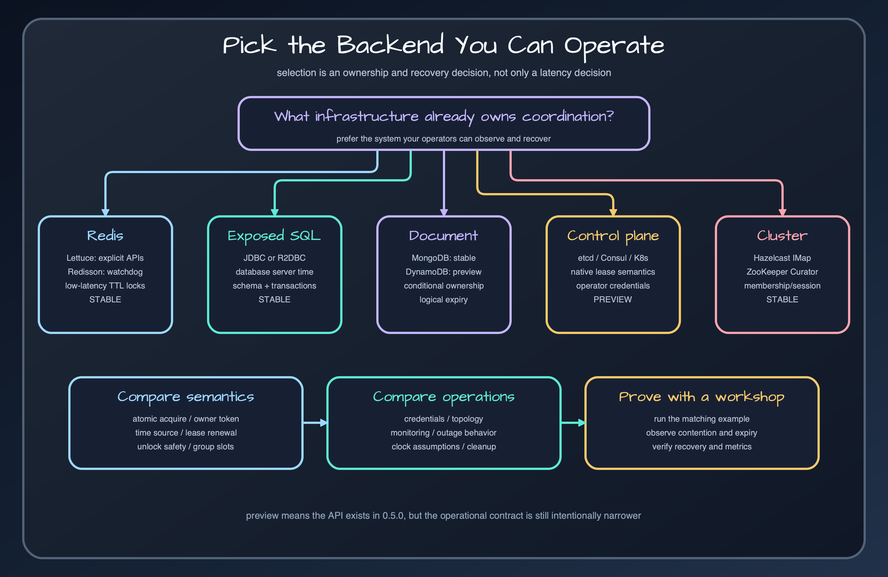

# Choose a backend

Prefer infrastructure you already operate, then compare ownership, clock, and failure semantics.

## Selection order

First ask which durable service is already mandatory for the application. Redis is a strong low-latency default. Exposed JDBC/R2DBC keeps election state with application SQL data. MongoDB and DynamoDB fit document/key-value estates. etcd, Consul, Kubernetes Lease, and ZooKeeper fit control-plane coordination. Hazelcast fits an existing Hazelcast cluster without requiring its CP subsystem.

## Semantics to compare

Check atomic acquire and owner-conditional release, the source of expiry time, session versus TTL ownership, group support, suspend support, and auto-extension support. Also check whether a state query can report owner and expiry precisely. These differences affect operations even when `runIfLeader()` has the same API.

## Avoid infrastructure by benchmark

The bundled JMH results are same-machine comparison evidence, not a universal ranking. Network topology, durability settings, connection pools, and failure recovery dominate production behavior. Choose by operational fit, then benchmark your own action and environment.

## Release sources

- [`README.md`](../../../../README.md)
- [`benchmark/README.md`](../../../../benchmark/README.md)
- [`docs/benchmarks/2026-05-21-leader-cross-backend-baseline.md`](../../../benchmarks/2026-05-21-leader-cross-backend-baseline.md)

## Continue learning

- [Bluetape4k Leader manual](../index.md)
- [Redis backends](../backends/redis.md)
- [etcd, Consul, and Kubernetes Lease](../backends/control-plane-leases.md)
- [Testing leader election](testing.md)
