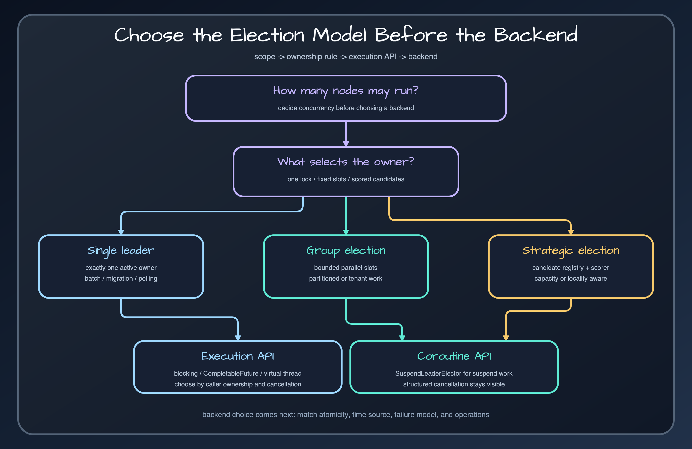

# Choose an election model

Select single, bounded group, or strategic election from the work's concurrency and placement rules.

## Single leader

Use `LeaderElector` or `SuspendLeaderElector` when at most one instance may execute a named action. Scheduled settlement, migration gates, and control-plane reconciliation are typical cases. The lock name is the concurrency boundary.

## Leader group

Use `LeaderGroupElector` when up to `maxLeaders` workers may run concurrently. Each winner owns a slot. This is a distributed semaphore, not work distribution: the application still needs a queue or partitioning rule so two elected workers do not process the same item.

## Strategic election

Use strategic election when the winner should be selected by candidate information rather than whoever acquires a lock first. FIFO, deterministic random, scored, and weighted scoring are available. Candidate registration and selection introduce freshness requirements; stale candidate data can choose an unsuitable node.

## Decision rule

Start with single leader. Move to a group only when measured throughput requires bounded parallelism. Choose strategic election only when placement quality is itself a requirement and you can maintain candidate health data.

## Release sources

- [`leader-core/src/main/kotlin/io/bluetape4k/leader/LeaderElector.kt`](../../../../leader-core/src/main/kotlin/io/bluetape4k/leader/LeaderElector.kt)
- [`leader-core/src/main/kotlin/io/bluetape4k/leader/LeaderGroupElector.kt`](../../../../leader-core/src/main/kotlin/io/bluetape4k/leader/LeaderGroupElector.kt)
- [`leader-core/src/main/kotlin/io/bluetape4k/leader/StrategicLeaderElector.kt`](../../../../leader-core/src/main/kotlin/io/bluetape4k/leader/StrategicLeaderElector.kt)

## Continue learning

- [Bluetape4k Leader manual](../index.md)
- [Single, group, and strategic contracts](../core/single-group-strategic.md)
- [Choose an execution API](execution-model-selection.md)
