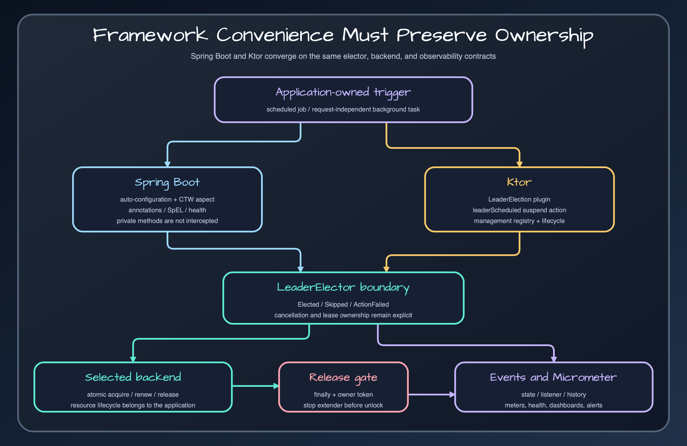

# Spring Boot or Ktor

Choose integration from the host framework's lifecycle and invocation model, not feature count.

## Spring Boot

Use the Spring module when electors should be auto-configured and methods guarded declaratively with `@LeaderElection` or `@LeaderGroupElection`. Release 0.5.0 uses AspectJ compile-time weaving, not proxy-only interception. It supports synchronous, suspend, Mono, Flux, and Flow shapes with stream-specific lease rules.

## Ktor

Use the Ktor plugin when the service already owns coroutine scheduling and wants an application-scoped `SuspendLeaderElector`. `leaderScheduled()` binds the periodic job to Ktor lifecycle and cancels it on `ApplicationStopped`.

## Boundary

Neither integration turns leader election into a scheduler or durable queue. Spring's annotation wraps an invocation; Ktor's helper launches a periodic coroutine. Misfire recovery, durable work state, retries, and idempotency still belong to the application or a job framework.

## Release sources

- [`leader-spring-boot/README.md`](../../../../leader-spring-boot/README.md)
- [`leader-ktor/README.md`](../../../../leader-ktor/README.md)
- [`examples/ktor-app/src/main/kotlin/io/bluetape4k/leader/examples/ktor/KtorAppMain.kt`](../../../../examples/ktor-app/src/main/kotlin/io/bluetape4k/leader/examples/ktor/KtorAppMain.kt)

## Continue learning

- [Bluetape4k Leader manual](../index.md)
- [Spring Boot integration](../frameworks/spring-boot.md)
- [Ktor integration](../frameworks/ktor.md)
- [Migrate a scheduled job](scheduled-job-migration.md)
