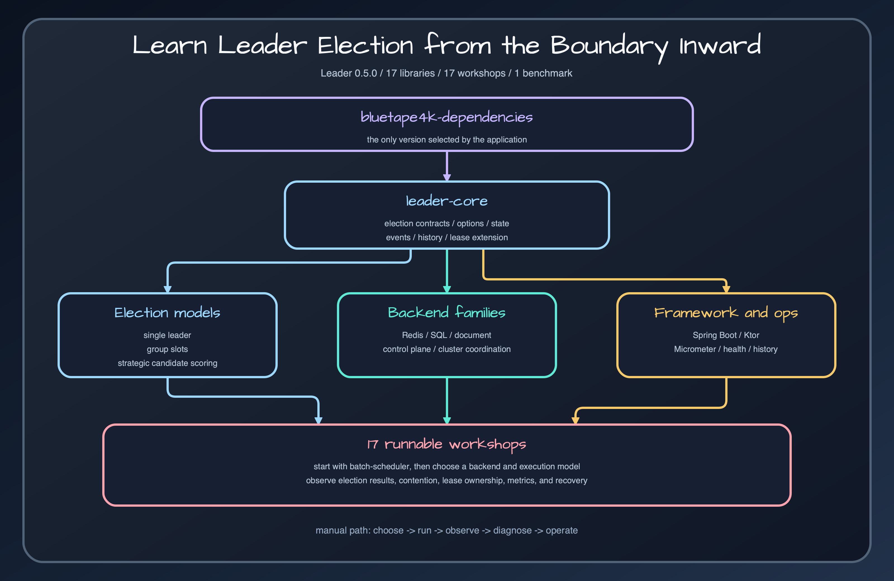

# Bluetape4k Leader manual

A release-faithful guide to choosing, running, and operating distributed leader election with bluetape4k-leader 0.5.0.

## Core capabilities

- **Election models:** [Single, group, and strategic election](core/single-group-strategic.md) support one global leader, bounded parallel leaders, and policy-driven ownership.
- **Execution APIs:** [Blocking, future, virtual-thread, and coroutine APIs](core/execution-apis.md) preserve the same election result semantics across application execution models.
- **Lease lifecycle:** [Lease extension](core/lease-extension.md) and the [lease lifecycle guide](guides/lease-lifecycle.md) define wait time, lease time, minimum hold, renewal, release, and loss behavior.
- **Distributed backends:** The [backend selection guide](guides/backend-selection.md) covers Redis, SQL, document stores, cluster coordination systems, and control-plane leases without changing the core contract.
- **Framework integration:** [Spring Boot](frameworks/spring-boot.md), [Ktor](frameworks/ktor.md), and [Micrometer](frameworks/micrometer.md) modules connect configuration, lifecycle, and metrics to the host application.
- **Operations and workshops:** [Observability and operations](guides/observability-and-operations.md) plus runnable scheduler, migration, and dashboard examples turn election behavior into deployable runbooks.

## Start with the decision, not the backend

Leader election is useful when every service instance can see the same work but only one, or a bounded number, should execute it. This manual starts with execution semantics and failure boundaries before it asks you to choose Redis, SQL, MongoDB, or a control-plane lease.

The central contract is deliberate: ordinary contention is not an error. `runIfLeader()` executes the action when elected and returns `null` when another contender owns the lease. Use the result APIs when the action itself may return `null`.

## Recommended route

1. Follow [Getting started](getting-started.md) with a local elector.
2. Choose [single, group, or strategic election](guides/election-model-selection.md).
3. Match the API to [blocking, future, virtual-thread, or coroutine execution](guides/execution-model-selection.md).
4. Select a [backend](guides/backend-selection.md) from infrastructure you already operate.
5. Define the [lease lifecycle](guides/lease-lifecycle.md), then add [metrics and runbooks](guides/observability-and-operations.md).

## Reference by task

- Learn the shared contract in [Leader core](modules/bluetape4k-leader-core.md).
- Compare [Lettuce](modules/bluetape4k-leader-redis-lettuce.md) and [Redisson](modules/bluetape4k-leader-redis-redisson.md) for Redis.
- Choose [Exposed JDBC](modules/bluetape4k-leader-exposed-jdbc.md) or [Exposed R2DBC](modules/bluetape4k-leader-exposed-r2dbc.md) for SQL-backed election.
- Integrate with [Spring Boot](modules/bluetape4k-leader-spring-boot.md), [Ktor](modules/bluetape4k-leader-ktor.md), or [Micrometer](modules/bluetape4k-leader-micrometer.md).
- Start from a runnable scenario such as the [batch scheduler](modules/batch-scheduler.md), [migration gate](modules/migration-gate.md), or [Prometheus dashboard](modules/prometheus-dashboard.md).

## Release boundary

Every behavior and source link in this manual targets release `0.5.0` at commit `721a9a3808f67489d2bdb8177734325981c24977`. Examples are learning projects, not published artifacts. Application builds should normally import `io.github.bluetape4k:bluetape4k-dependencies` and omit versions from individual leader modules.

## Release sources

- [`README.md`](../../../README.md)
- [`leader-core/README.md`](../../../leader-core/README.md)
- [`settings.gradle.kts`](../../../settings.gradle.kts)

## Continue learning

- [Bluetape4k Leader manual](index.md)
- [Learning path](guides/learning-path.md)
- [Runtime model](architecture/runtime-model.md)
