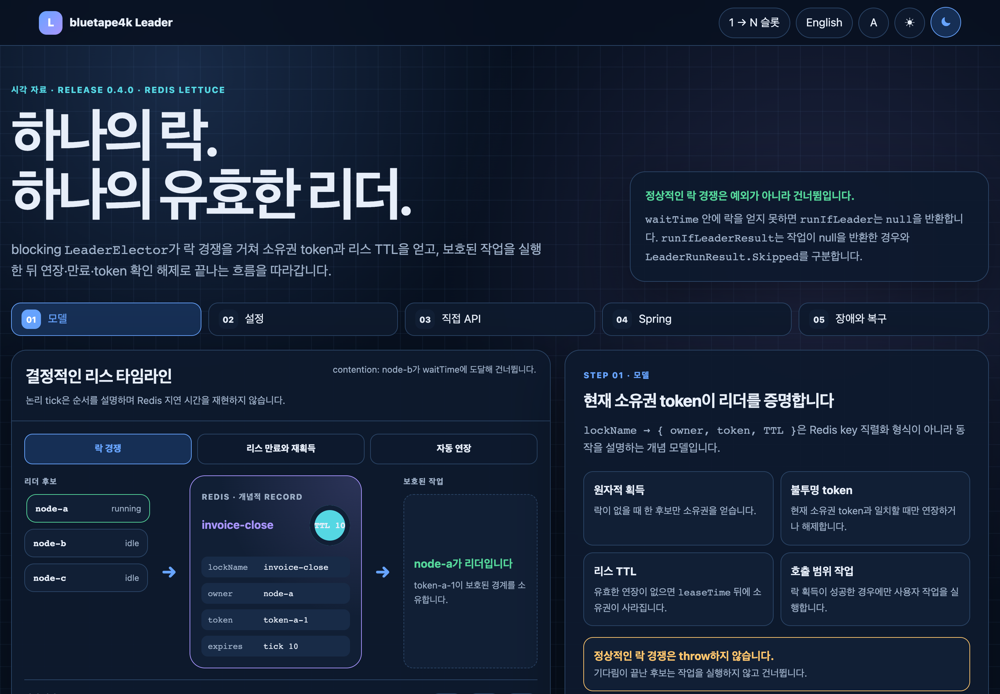
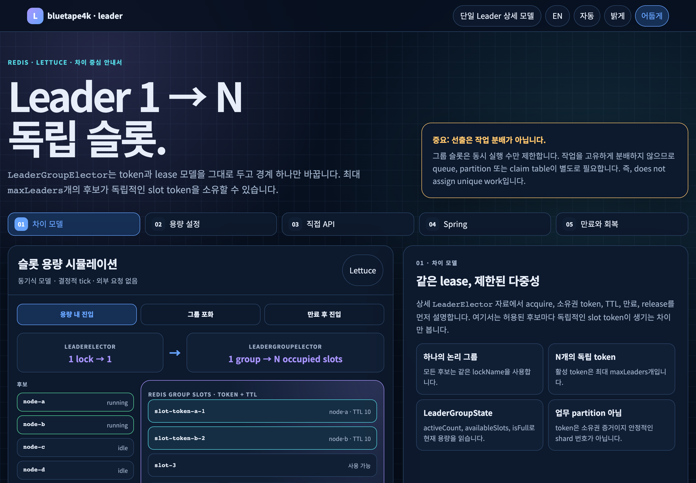

# Spring Boot 연동

elector를 자동 구성하고 AspectJ compile-time weaving으로 메서드 호출을 보호합니다.

## 대화형 시각화 자료

[`LeaderElector` 상세 흐름](/ko/visual-companions/bluetape4k-leader/leader-elector/)은 lock, token, TTL, 리스 만료, `autoExtend`, 직접 API, `@LeaderElection`을 연결해 설명합니다. [`LeaderGroupElector` 차이 안내](/ko/visual-companions/bluetape4k-leader/leader-group-elector/)는 단일 리더 모델을 반복하지 않고 제한된 `maxLeaders` 슬롯과 `@LeaderGroupElection` 제약을 보강합니다.

[](/ko/visual-companions/bluetape4k-leader/leader-elector/)

[](/ko/visual-companions/bluetape4k-leader/leader-group-elector/)

## Weaving 방식

0.5.0은 Freefair post-compile AspectJ weaving을 사용합니다. `@EnableAspectJAutoProxy`를 추가하지 않으며 Kotlin 메서드를 `open`으로 만들 필요도 없습니다. private 메서드는 가로채지 못하므로 startup validation이 잘못된 선언을 알려 줍니다. 단순 unit test만 보지 말고 weaving된 애플리케이션 artifact를 검증합니다.

## Annotation 규칙

`@LeaderElection`은 nullable 동기·suspend 결과와 Mono, Flux, Flow를 지원합니다. 오래 실행되는 stream에는 `autoExtend=true`가 필요합니다. 리스 안에 끝난다고 보장할 수 있을 때만 `streamBounded=true`를 사용합니다. `@LeaderGroupElection`은 동기, suspend, Mono를 지원하지만 slot별 stream 연장 의미가 없어 Flux와 Flow는 거부합니다.

## 설정 안전성

SpEL은 `"'prefix-' + #param"`처럼 유효한 식으로 작성합니다. 잘못된 식과 성립하지 않는 group 설정은 validation에서 실패합니다. 자동 구성은 elector, AOP factory, Micrometer, aspect 순으로 적용되어 계측과 실행 경계가 일치합니다.

## Group DB server time (0.6.0+ develop)

현재 `develop` Spring 연동은 공통 속성과 그룹 annotation을 통해 Exposed
그룹의 `LeaderGroupElectionOptions.useDbTime` 정책을 노출합니다.

```yaml
bluetape4k:
  leader:
    group:
      use-db-time: true
```

공통 속성의 기본값은 `false`입니다. 메서드별 opt-in은
`@LeaderGroupElection(..., useDbTime = true)`로 지정합니다. 실제 적용값은
`commonProperty || annotationValue`이므로 공통 속성이 `true`이면 모든 그룹
annotation이 활성화되고 Boolean annotation으로 메서드별 `false` 재정의를
할 수는 없습니다. 이 flag는 Exposed JDBC와 Exposed R2DBC 그룹 elector만
사용하며 다른 그룹 backend는 무시합니다.

flag를 켜면 Exposed가 소유권과 활성 슬롯 만료를 database server clock으로
판정합니다. timestamp query를 사용할 수 없으면 Exposed 경로는 fail-closed로
유지되어 슬롯을 차지하지 않습니다. AOP 호출에서는 `failure-mode`가 backend
오류 처리(`RETHROW`, `SKIP`, `FAIL_OPEN_RUN`)를 계속 결정합니다. 모든 참여자를
하나의 권위 DB clock으로 라우팅하고 provider별 timestamp 정밀도와 JDBC/R2DBC
pool에 추가되는 timestamp query 비용을 고려하세요.

## Readiness와 최근 획득 실패

opt-in `leaderElectionReadiness` contributor는 JVM-local lock-name registry만 조회합니다. backend 획득 실패를 bounded하게 관찰하려면 다음과 같이 window를 설정합니다.

```yaml
bluetape4k:
  leader:
    observability:
      health:
        enabled: true
        acquisition-failure-window: 5m
```

기본 window는 `5m`이고 timestamp는 최대 `1024`개까지 보관합니다. AOP의 `BACKEND_ERROR` skip만 집계하며 `CONTENTION`과 `FAIL_OPEN_FORCED`는 의도적으로 제외합니다. readiness detail에는 `recentAcquisitionFailures`, `lastAcquisitionFailureAt`, `acquisitionFailureWindow`, `acquisitionFailureWindowCapacity`, `acquisitionFailureWindowOverflowed`가 표시됩니다. window가 overflow되면 count는 하한값이며, 보관된 실패가 모두 만료되면 `lastAcquisitionFailureAt`은 `null`이 됩니다.

이 recorder는 best-effort aggregate입니다. 최근 실패만으로 contributor 상태(`UP`, `OUT_OF_SERVICE`, `DOWN`, `UNKNOWN`)가 바뀌지 않으며 detail에 lock name이나 exception message를 저장하지 않습니다. Actuator endpoint를 보호하고, health 평가마다 등록된 이름별로 backend 상태를 한 번 조회하므로 동적 lock-name 등록도 bounded하게 유지하세요.

## 릴리스 소스

- [`leader-spring-boot/README.ko.md`](../../../../leader-spring-boot/README.ko.md)
- [`leader-core/src/main/kotlin/io/bluetape4k/leader/annotation/LeaderElection.kt`](../../../../leader-core/src/main/kotlin/io/bluetape4k/leader/annotation/LeaderElection.kt)
- [`leader-core/src/main/kotlin/io/bluetape4k/leader/annotation/LeaderGroupElection.kt`](../../../../leader-core/src/main/kotlin/io/bluetape4k/leader/annotation/LeaderGroupElection.kt)

## 이어서 읽기

- [Bluetape4k Leader 매뉴얼](../index.md)
- [Spring Boot와 Ktor 선택](../guides/spring-vs-ktor.md)
- [Micrometer 연동](micrometer.md)
