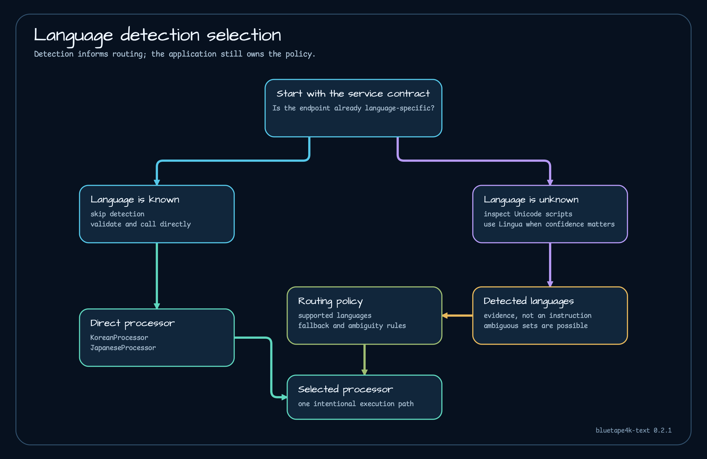

# Mixed-language processing

Mixed text requires an explicit routing policy. A set of detected languages is evidence for that policy, not a command to run every processor.



## Start with the service contract

If an endpoint is already language-specific, validate and call that processor. Detection adds cost and ambiguity without changing the route. Use detection when input language is unknown, when multiple language processors are supported, or when the product needs language metadata.

## Use script evidence for fast routing

```kotlin
import io.bluetape4k.lingua.UnicodeDetector
import java.util.Locale

val unicode = UnicodeDetector()
val hasKorean = unicode.containsAny("Hello 안녕하세요", Locale.KOREAN)
val hasJapanese = unicode.containsAny("Hello こんにちは", Locale.JAPANESE)
```

This detects character ranges, not language. It is reliable for the narrow script question and cheap enough for an early gate.

## Use a restricted statistical detector

```kotlin
import com.github.pemistahl.lingua.api.Language
import io.bluetape4k.lingua.detectAllLanguagesOf
import io.bluetape4k.lingua.languageDetectorOf

val detector = languageDetectorOf(
    languages = setOf(Language.ENGLISH, Language.KOREAN, Language.JAPANESE),
    minimumRelativeDistance = 0.0,
    isEveryLanguageModelPreloaded = true,
    isLowAccuracyModeEnabled = false,
)

val detected = detector.detectAllLanguagesOf("Hello. 안녕하세요. こんにちは。")
```

Restricting the language set expresses product support and reduces unnecessary model scope. Reuse this detector.

## Define ambiguity behavior

A practical route table might be:

| Evidence | Action |
|---|---|
| Korean only | call `KoreanProcessor` |
| Japanese only | call `JapaneseProcessor` |
| Korean and Japanese | split only if product rules define a safe segmentation strategy; otherwise return mixed/unsupported |
| Latin language only | keep as metadata or use a separate processor outside this repository |
| empty or ambiguous | return unknown, request a language hint, or apply a documented fallback |

Do not concatenate outputs from several processors and call that a single analysis unless offsets and ownership remain clear.

## Preserve original text and offsets

Script-filtered substrings are useful for evidence but lose the full context. Keep the original input for trusted processing while avoiding it in error logs. If exact keyword offsets matter, run `text-search` on the original text or maintain an explicit mapping after segmentation.

## Test real mixtures

Include punctuation, numbers, short Latin tokens, Korean/Japanese sentences, and a no-language case. Assert the supported set and route decision separately. That keeps a future detector improvement from silently changing processor behavior.

Continue with the [Lingua example](../examples/lingua-examples.md), [runtime boundaries](../architecture/runtime-boundaries.md), and [failure contracts](../operations/failure-contracts.md).
