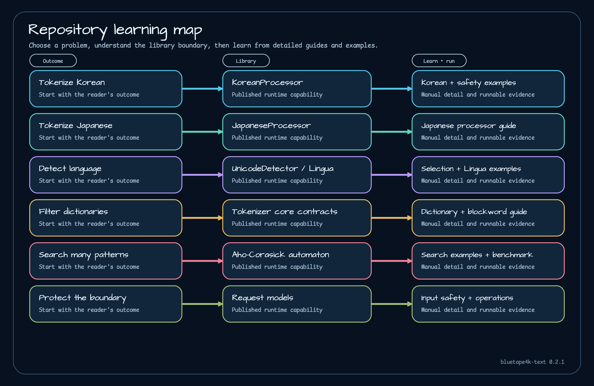

# bluetape4k-text 0.2 Manual

`bluetape4k-text` is a Kotlin/JVM toolkit for Korean and Japanese tokenization, language detection, dictionary-backed filtering, and multi-pattern text search. This manual documents the stable `1.0.0` release and organizes the library by the problem you need to solve rather than by repository directory alone.

## Core capabilities

| I need to… | Start with | Learn by running |
|---|---|---|
| normalize, tokenize, stem, or extract phrases from Korean | [Korean tokenizer](modules/tokenizer-korean.md) | [Tokenizer safety example](examples/tokenizer-safety-examples.md) |
| tokenize Japanese and inspect parts of speech | [Japanese tokenizer](modules/tokenizer-japanese.md) | [Tokenizer safety example](examples/tokenizer-safety-examples.md) |
| detect one or several languages in a text | [Lingua](modules/lingua.md) | [Lingua example](examples/lingua-examples.md) |
| remove domain-specific blockwords with managed dictionaries | [Dictionaries and blockwords](guides/dictionaries-and-blockwords.md) | [Tokenizer safety example](examples/tokenizer-safety-examples.md) |
| find many keywords in one pass | [Text search](modules/text-search.md) | [Text search example](examples/text-search-examples.md) |
| build a custom tokenizer or request boundary | [Tokenizer core](modules/tokenizer-core.md) | [Input safety](guides/input-safety.md) |
| align every Text artifact version | [Text BOM](modules/bluetape4k-text-bom.md) | [Getting started](getting-started.md) |

If you are not sure which path applies, use the [capability selection guide](guides/capability-selection.md). It compares detection, tokenization, filtering, and search as separate capabilities that can be composed when needed.

## Build

The shortest route to a working program is [Getting started](getting-started.md). It shows dependency management through `bluetape4k-dependencies`, the Text-only BOM alternative, and a small Korean tokenization example.

The repository contains six published artifacts. The BOM aligns five runtime libraries; it does not provide runtime classes itself. See the [repository map](architecture/repository-map.md) before selecting dependencies for a larger service.

## Learn

The [learning path](guides/learning-path.md) is more than a list of links. Each stage explains what to learn, which runnable example to execute, what result to inspect, and when to continue:

1. build and call one processor;
2. choose between script filtering and statistical language detection;
3. understand Korean and Japanese processor boundaries;
4. build an immutable Aho-Corasick automaton;
5. add request, memory, and failure controls.

Detailed module pages include the smallest useful code, result interpretation, selection rules, constraints, and links to stable source. The three example pages explain how to modify the repository examples instead of merely pointing at their directories.

## Operate

Text processing is not free. Language models, tokenizer dictionaries, and search automatons have different startup and memory profiles. Read [runtime boundaries](architecture/runtime-boundaries.md), [startup and memory](operations/startup-and-memory.md), and [failure contracts](operations/failure-contracts.md) before placing them behind an HTTP endpoint.

The [quality gates](quality/quality-gates.md) page separates deterministic repository evidence from claims the release does not make. The [Aho-Corasick benchmark](quality/aho-corasick-benchmarks.md) records the exact local run conditions and explains why those values are comparison snapshots, not production rankings.

## Version and source

This manual covers minor line `0.2` and is pinned to stable release `1.0.0` at commit `59256aea7011d3f9073d74470459a13363150153`. Source links point to that release, so future development does not silently change the contract described here.

- [Release README](https://github.com/bluetape4k/bluetape4k-text/blob/1.0.0/README.md)
- [Release settings](https://github.com/bluetape4k/bluetape4k-text/blob/1.0.0/settings.gradle.kts)
