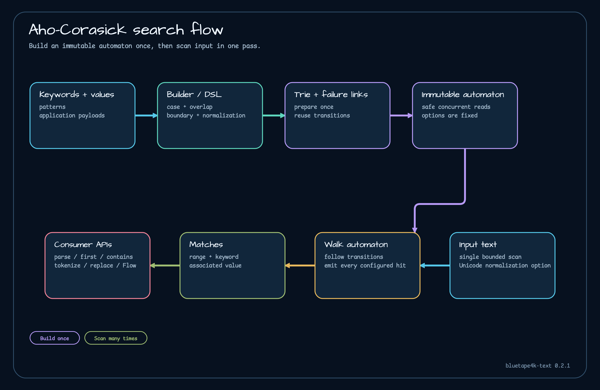

# Multi-pattern text search library

`text-search` implements an immutable generic Aho-Corasick automaton. It searches many keywords in one pass and associates each match with an application value. Options cover case handling, overlaps, word boundaries, Unicode normalization, and early-match behavior.



## What it provides

- mutable builder and Kotlin DSL, producing an immutable automaton;
- `parseText`, `firstMatch`, `containsMatch`, `tokenize`, and `replaceAll`;
- generic match values and original-text offsets;
- `NONE`, `LATIN_ALPHA`, and `WHITESPACE_SEPARATED` boundary modes;
- NFC/NFKC normalization with offset mapping;
- `matchesAsFlow` for coroutine collection.

## Add the dependency

```kotlin
dependencies {
    implementation("io.github.bluetape4k.text:text-search:0.3.0")
    implementation("org.jetbrains.kotlinx:kotlinx-coroutines-core:<compatible-version>") // Flow calls only
}
```

## Smallest useful example

```kotlin
import io.bluetape4k.text.search.AhoCorasickAutomaton
import io.bluetape4k.text.search.SearchOptions

val automaton = AhoCorasickAutomaton.builder<String>()
    .add("password reset", "ACCOUNT_TAKEOVER")
    .add("card declined", "PAYMENT_RISK")
    .options(SearchOptions(ignoreCase = true, allowOverlaps = false))
    .build()

val matches = automaton.parseText("Password reset before card declined")
println(matches.map { it.value })
// [ACCOUNT_TAKEOVER, PAYMENT_RISK]
```

The builder is the configuration phase. After `build()`, share the automaton as an immutable snapshot.

## Choose a result operation

| Operation | Use it when |
|---|---|
| `parseText` | all matches and offsets are needed now |
| `firstMatch` | the leftmost-longest match is sufficient |
| `containsMatch` | only a Boolean decision is needed |
| `tokenize` | matched and unmatched fragments must be rendered separately |
| `replaceAll` | each accepted match becomes replacement text |
| `matchesAsFlow` | the surrounding coroutine pipeline benefits from collection and cancellation |

`tokenize` always returns a non-overlapping sequence. `allowOverlaps = false` resolves competing matches before other operations consume them.

## Boundaries and normalization

`LATIN_ALPHA` avoids matching a keyword inside a larger alphabetic word. `WHITESPACE_SEPARATED` is useful for phrases that must be surrounded by whitespace. Unicode normalization enables canonically or compatibility-equivalent input, but it adds measurable work; the 0.3.0 NFKC benchmark is much slower than the raw no-match path.

## Flow collection

```kotlin
import io.bluetape4k.text.search.flow.matchesAsFlow
import kotlinx.coroutines.flow.take
import kotlinx.coroutines.flow.toList

val firstAlert = automaton.matchesAsFlow("critical login before card declined")
    .take(1)
    .toList()
```

The Flow extension runs through `channelFlow` on `Dispatchers.Default`. Bounded collection prevents retaining unnecessary results, but the automaton still performs CPU work over the supplied text.

## Constraints and failure behavior

Define the keyword snapshot and option policy before publication. Rebuilding on every request repeats setup work. Match offsets refer to the original text even when normalization is enabled, which is why the implementation maintains offset mapping. Treat benchmark values as local comparisons under their recorded environment.

## Continue learning

- [Text search runnable example](../examples/text-search-examples.md)
- [Aho-Corasick benchmarks](../quality/aho-corasick-benchmarks.md)
- [Testing](../guides/testing.md)

## Source evidence

- [AhoCorasickAutomaton](https://github.com/bluetape4k/bluetape4k-text/blob/0.3.0/text-search/src/main/kotlin/io/bluetape4k/text/search/AhoCorasickAutomaton.kt)
- [SearchOptions](https://github.com/bluetape4k/bluetape4k-text/blob/0.3.0/text-search/src/main/kotlin/io/bluetape4k/text/search/SearchOptions.kt)
- [Flow extension](https://github.com/bluetape4k/bluetape4k-text/blob/0.3.0/text-search/src/main/kotlin/io/bluetape4k/text/search/flow/AhoCorasickFlowExtensions.kt)

<!-- release-readme-diagrams:start -->
## Release diagrams {#release-diagrams}

These diagrams are loaded directly from README assets published with the `0.3.0` release and pinned to its immutable commit. They describe this manual's released structure and runtime flows, not later Snapshot changes. Select a preview to open the SVG at the same release commit.

### Processing Flow diagram

[](https://github.com/bluetape4k/bluetape4k-text/blob/aead213d2d25307d7d3684226943a5f95c7411f2/docs/images/readme-diagrams/text-search-architecture-03.svg)

_Release README: [`text-search/README.md`](https://github.com/bluetape4k/bluetape4k-text/blob/aead213d2d25307d7d3684226943a5f95c7411f2/text-search/README.md)_

### text search Class Structure diagram

[](https://github.com/bluetape4k/bluetape4k-text/blob/aead213d2d25307d7d3684226943a5f95c7411f2/docs/images/readme-diagrams/text-search-class-01.svg)

_Release README: [`text-search/README.md`](https://github.com/bluetape4k/bluetape4k-text/blob/aead213d2d25307d7d3684226943a5f95c7411f2/text-search/README.md)_

### Search Pipeline diagram

[](https://github.com/bluetape4k/bluetape4k-text/blob/aead213d2d25307d7d3684226943a5f95c7411f2/docs/images/readme-diagrams/text-search-sequence-02.svg)

_Release README: [`text-search/README.md`](https://github.com/bluetape4k/bluetape4k-text/blob/aead213d2d25307d7d3684226943a5f95c7411f2/text-search/README.md)_

<!-- release-readme-diagrams:end -->
