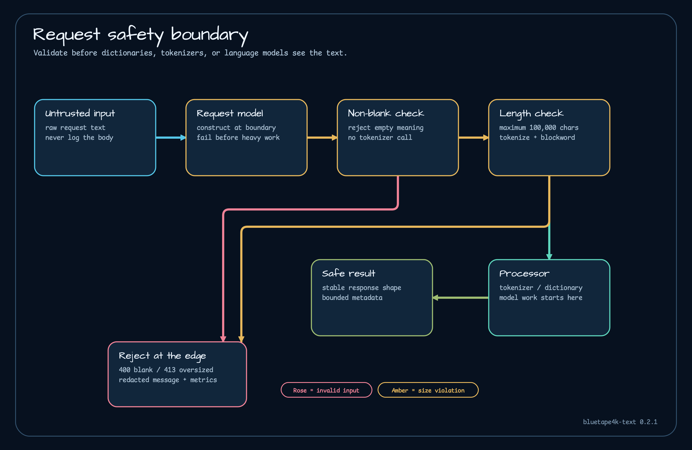

# 입력 안전성

신뢰할 수 없는 텍스트는 토크나이저, 사전, 언어 모델을 호출하기 전에 검증한다. 1.0.0 요청 모델은 토큰화와 금칙어 텍스트를 `100_000`자로 제한하고 빈 입력을 거부한다.



## 경계 오류를 명시적으로 변환하기

```kotlin
import io.bluetape4k.tokenizer.model.MAX_TOKENIZE_TEXT_LENGTH
import io.bluetape4k.tokenizer.model.tokenizeRequestOf

fun tokenizeStatus(text: String): Int =
    when {
        text.isBlank() -> 400
        text.length > MAX_TOKENIZE_TEXT_LENGTH -> 413
        else -> {
            tokenizeRequestOf(text)
            200
        }
    }
```

adapter는 모델과 같은 공개 상수를 사용한다. adapter를 거치지 않는 호출이 있더라도 모델 검증이 마지막 방어선으로 남는다.

## 제출한 텍스트를 돌려주지 않기

잘못된 입력에는 credential, 메시지, 규제 대상 데이터가 포함될 수 있다. 오류 응답과 로그에는 다음 정보만 넣는다.

- 실패 분류
- 실제 문자 길이
- 설정된 최대 길이
- 애플리케이션 정책을 따르는 request 또는 trace id

저장소 안전 예제도 원문 대신 메타데이터만 보고한다.

## 잘못된 입력과 프로세서 실패 구분하기

| 상황 | 권장 HTTP 상태 | 안전한 메시지 |
|---|---:|---|
| 빈 텍스트 | 400 | `text is blank` |
| 최대 길이 초과 | 413 | `text too long: <length> chars (max <limit>)` |
| 예상하지 못한 프로세서 예외 | 500 | `processor error` |

한 종류의 재시도 오류로 합치지 않는다. 400과 413은 호출자가 입력을 고칠 수 있지만 프로세서 실패는 서비스 진단이 필요하다.

## Coroutine과 취소

suspend 경계에서 처리한다면 넓은 예외 처리보다 먼저 `CancellationException`을 다시 던진다. 1.0.0 실행 예제는 동기 프로세서를 `runCatching`으로 감싸지만 suspend 호출에 그대로 복사하면 취소 신호를 삼킬 수 있다.

## 애플리케이션 제한을 더 작게 둘 때

라이브러리 최대값은 안전 상한이지 성능 목표가 아니다. endpoint의 지연 시간과 메모리에 맞춰 더 작은 제한을 둘 수 있다. transport parsing 단계의 byte 제한과 decoding 뒤 character 제한을 함께 적용한다.

## 경계 검증하기

빈 입력, 공백 입력, 정확히 최대 길이, 한 글자 초과, 프로세서 예외, 정제된 응답을 테스트한다. [토크나이저 안전 예제](../examples/tokenizer-safety-examples.md)가 실행 가능한 출발점이다.

## 소스 근거

- [TokenizeRequest 제한](https://github.com/bluetape4k/bluetape4k-text/blob/1.0.0/tokenizer-core/src/main/kotlin/io/bluetape4k/tokenizer/model/TokenizeRequest.kt)
- [BlockwordRequest 제한](https://github.com/bluetape4k/bluetape4k-text/blob/1.0.0/tokenizer-core/src/main/kotlin/io/bluetape4k/tokenizer/model/BlockwordRequest.kt)
- [안전 예제](https://github.com/bluetape4k/bluetape4k-text/blob/1.0.0/examples/tokenizer-safety-examples/src/main/kotlin/io/bluetape4k/text/examples/tokenizer/TokenizerSafetyExamples.kt)
