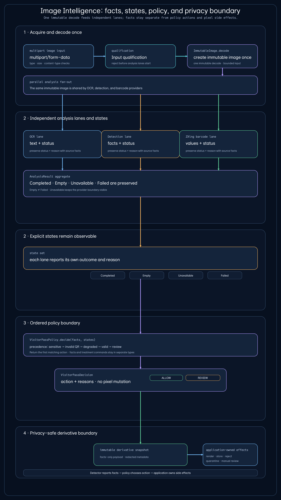
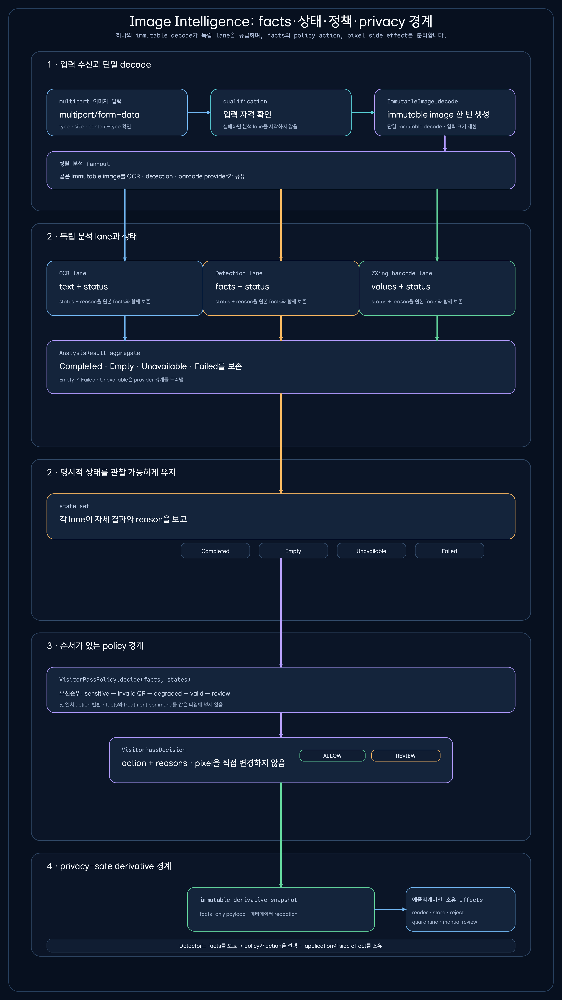
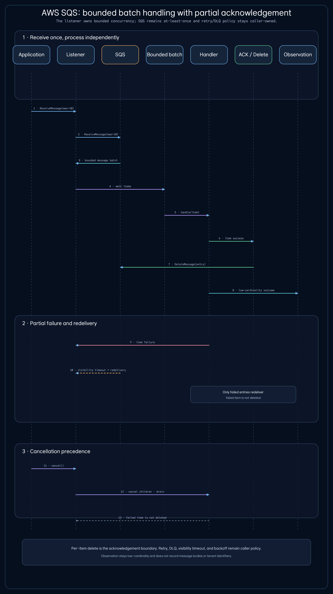
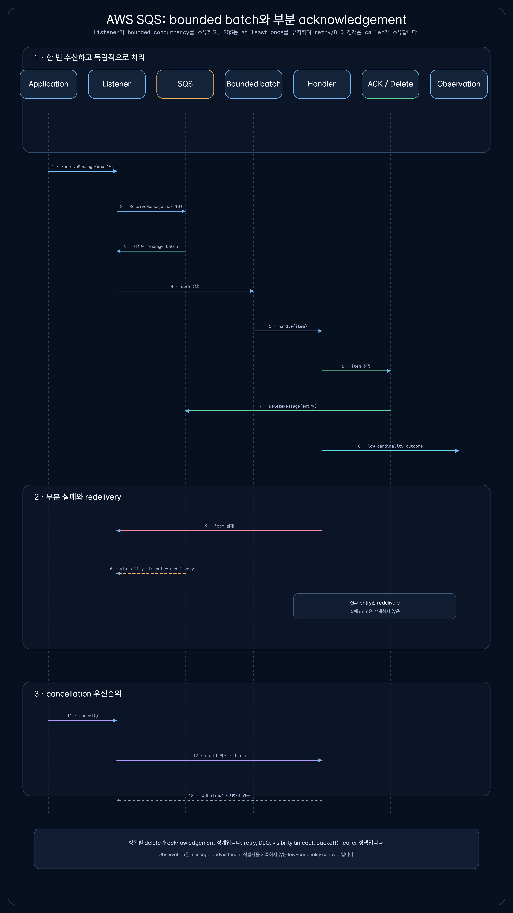
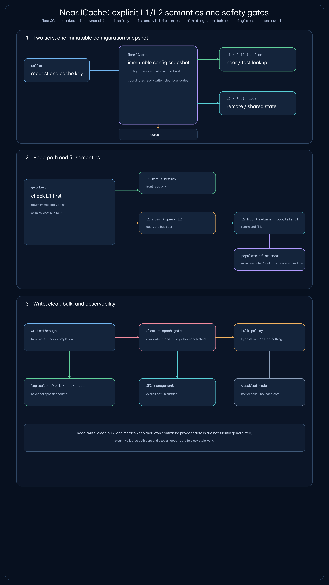
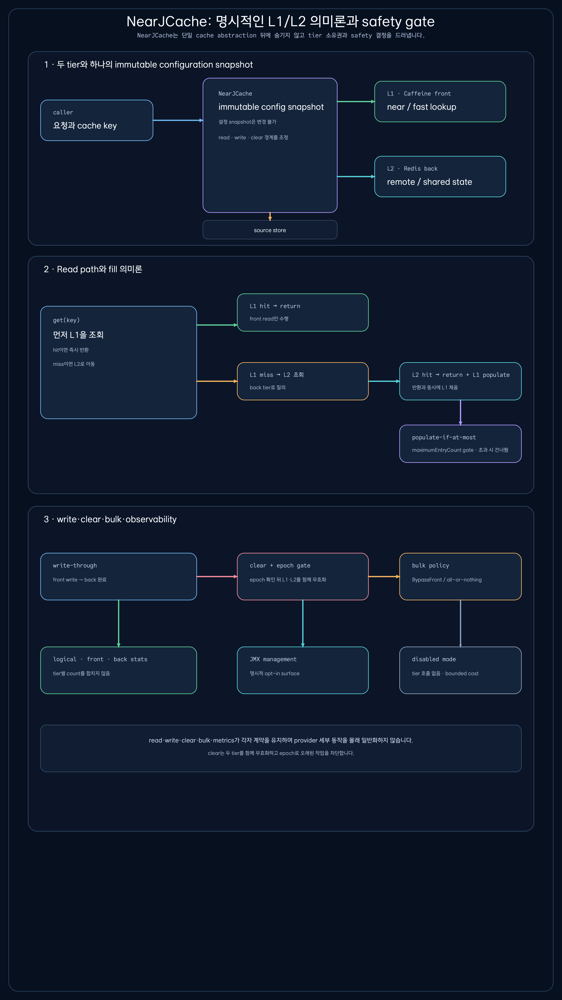

# bluetape4k 2.0 stable — wave 1 visual assets

The paired PNG assets are the published render authority for the first-wave visual companions. SVG files remain available as editable source; pages embed PNG only.

Source-backed site page: `/visual-companions/bluetape4k-2-0-wave1/` and `/ko/visual-companions/bluetape4k-2-0-wave1/`.
