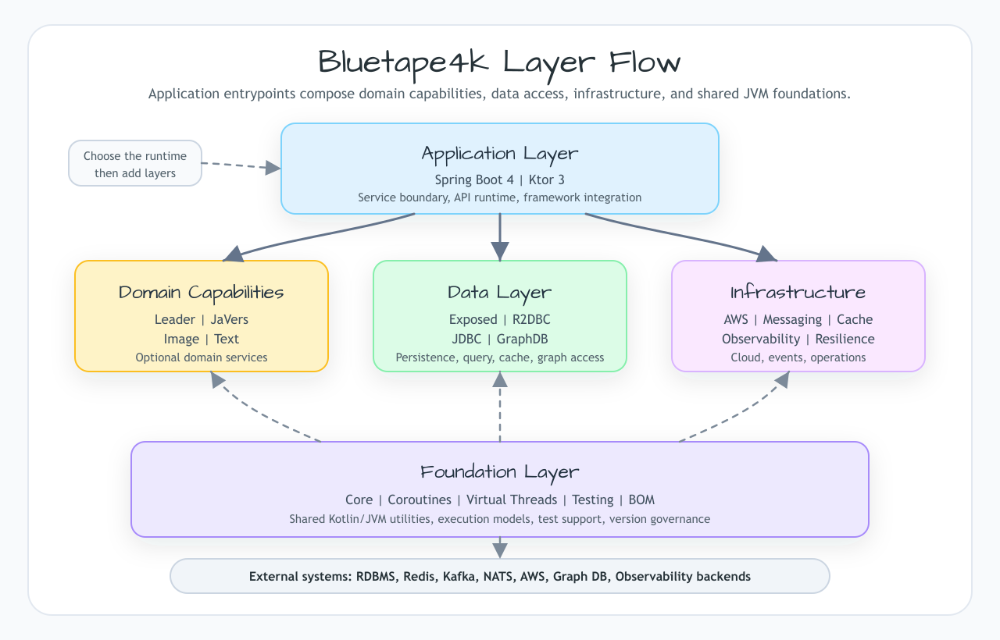

## Posts

  <a class="bt4k-blog-card" href="/blog/introduction-bluetape4k-part1-ecosystem/">
    
    

      <strong>Introduction to the Bluetape4k Ecosystem</strong>
      Part 1 of the Bluetape4k introduction series: application, domain capability, data, infrastructure, and foundation layers.
    

  </a>

  <a class="bt4k-blog-card" href="/blog/ai-collaboration-environment/">
    
    

      <strong>Turning AI Collaboration Into Infrastructure</strong>
      How AGENTS.md, bluetape4k skills, qmd, memory, and hooks help Codex and Claude work with the same standards.
    

  </a>

  <a class="bt4k-blog-card" href="/blog/ai-assisted-library-development/">
    
    

      <strong>Building a Large Kotlin Library Ecosystem with AI in Three Months</strong>
      How Claude Code and Codex helped with automation, documentation, tests, research, examples, cross-repository consistency, and workflow discipline.
    

  </a>

